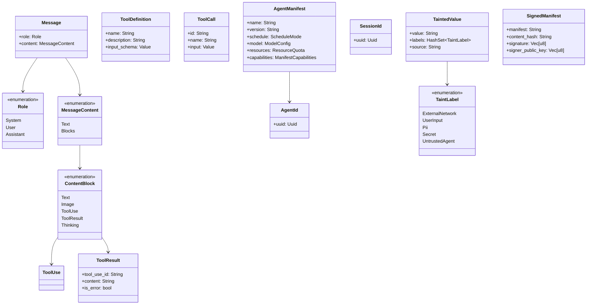

# 第 3 节：核心类型系统

## 学习目标

- [x] 理解核心类型定义（AgentId、Message、Tool 等）
- [x] 掌握类型关系
- [x] 理解 taint tracking 机制
- [x] 理解 Ed25519 manifest signing

---

## 模块结构

```
openfang-types/src/
├── lib.rs           # 模块导出 + 工具函数
├── agent.rs         # Agent 身份、Manifest、调度配置
├── message.rs       # LLM 对话消息类型
├── tool.rs          # 工具定义、调用、结果
├── capability.rs    # 能力权限系统
├── config.rs        # 内核配置（最大文件）
├── taint.rs         # 信息流污点追踪
├── manifest_signing.rs  # Ed25519 签名
├── memory.rs        # 记忆、向量、知识图谱
├── event.rs         # 事件总线类型
├── approval.rs      # 审批门控
├── media.rs         # 媒体处理类型
├── model_catalog.rs # 模型目录
└── ...
```

---

## 核心类型详解

### 1. 身份标识类型

所有 ID 类型都基于 UUID，实现了 `Display` 和 `FromStr`：

```rust
// 用户 ID
#[derive(Debug, Clone, Copy, PartialEq, Eq, Hash, Serialize, Deserialize)]
pub struct UserId(pub Uuid);

// Agent ID
#[derive(Debug, Clone, Copy, PartialEq, Eq, Hash, Serialize, Deserialize)]
pub struct AgentId(pub Uuid);

// 会话 ID
#[derive(Debug, Clone, Copy, PartialEq, Eq, Hash, Serialize, Deserialize)]
pub struct SessionId(pub Uuid);
```

**特点**：
- 使用 newtype 模式（tuple struct）包装 `Uuid`
- 强类型：不能混淆 `AgentId` 和 `SessionId`
- 支持序列化/反序列化

---

### 2. Message — LLM 消息类型

```rust
/// LLM 对话中的消息
#[derive(Debug, Clone, Serialize, Deserialize)]
pub struct Message {
    pub role: Role,
    pub content: MessageContent,
}

/// 消息发送者的角色
#[derive(Debug, Clone, Copy, PartialEq, Eq, Serialize, Deserialize)]
#[serde(rename_all = "lowercase")]
pub enum Role {
    System,    // 系统提示
    User,      // 人类用户
    Assistant, // AI 助手
}

/// 消息内容 — 可以是简单文本或结构化块
#[derive(Debug, Clone, Serialize, Deserialize)]
#[serde(untagged)]
pub enum MessageContent {
    Text(String),              // 简单文本
    Blocks(Vec<ContentBlock>), // 结构化内容块
}
```

#### ContentBlock — 内容块类型

```rust
#[derive(Debug, Clone, Serialize, Deserialize)]
#[serde(tag = "type")]
pub enum ContentBlock {
    /// 文本块
    Text { text: String, provider_metadata: Option<Value> },

    /// 内联 Base64 图片
    Image { media_type: String, data: String },

    /// 工具调用请求（Assistant 发出）
    ToolUse { id: String, name: String, input: Value },

    /// 工具执行结果
    ToolResult { tool_use_id: String, content: String, is_error: bool },

    /// 模型推理 trace（extended thinking）
    Thinking { thinking: String },

    /// 未知类型（向前兼容）
    Unknown,
}
```

**设计亮点**：
- `#[serde(untagged)]`：自动匹配 JSON 格式
- `#[serde(tag = "type")]`：使用 `type` 字段区分变体
- `provider_metadata`： provider 特定元数据（如 Gemini 的 `thoughtSignature`）

---

### 3. Tool — 工具定义

```rust
/// 工具定义
#[derive(Debug, Clone, Serialize, Deserialize)]
pub struct ToolDefinition {
    pub name: String,           // 工具名称
    pub description: String,    // 人类可读描述
    pub input_schema: Value,    // JSON Schema 输入参数
}

/// 工具调用请求
#[derive(Debug, Clone, Serialize, Deserialize)]
pub struct ToolCall {
    pub id: String,             // 工具调用实例 ID
    pub name: String,           // 工具名称
    pub input: Value,           // 输入参数
}

/// 工具执行结果
#[derive(Debug, Clone, Serialize, Deserialize)]
pub struct ToolResult {
    pub tool_use_id: String,    // 对应的 ToolCall ID
    pub content: String,        // 输出内容
    pub is_error: bool,         // 是否执行出错
}
```

#### 工具标准化

```rust
// 为不同 LLM provider 标准化 JSON Schema
pub fn normalize_schema_for_provider(
    schema: &Value,
    provider: &str,
) -> Value {
    // Anthropic 原生支持 anyOf — 无需标准化
    if provider == "anthropic" {
        return schema.clone();
    }
    normalize_schema_recursive(schema)
}
```

**处理的问题**：
- Gemini/Groq 拒绝 `anyOf`
- 某些 provider 不接受 `$schema` 字段
- 递归处理 `properties` 和 `items`

---

### 4. AgentManifest — Agent 配置清单

```rust
/// 完整的 Agent Manifest — 定义 agent 的一切
#[derive(Debug, Clone, Serialize, Deserialize)]
#[serde(default)]
pub struct AgentManifest {
    pub name: String,                       // 人类可读名称
    pub version: String,                    // 语义版本
    pub description: String,                // 功能描述
    pub author: String,                     // 作者
    pub module: String,                     // WASM/Python 模块路径
    pub schedule: ScheduleMode,             // 调度模式
    pub model: ModelConfig,                 // LLM 模型配置
    pub resources: ResourceQuota,           // 资源配额
    pub priority: Priority,                 // 优先级
    pub capabilities: ManifestCapabilities, // 能力授权
    pub profile: Option<ToolProfile>,       // 工具预设
    pub skills: Vec<String>,                // 安装的技能
    pub tags: Vec<String>,                  // 标签用于发现
    pub routing: Option<ModelRoutingConfig>,// 模型路由配置
    pub autonomous: Option<AutonomousConfig>, // 自主代理配置
    // ... 更多字段
}
```

#### ScheduleMode — 调度模式

```rust
#[derive(Debug, Clone, Default, Serialize, Deserialize)]
#[serde(rename_all = "snake_case")]
pub enum ScheduleMode {
    #[default]
    Reactive,                      // 事件/消息触发
    Periodic { cron: String },     // Cron 定时触发
    Proactive { conditions: Vec<String> }, // 条件满足时触发
    Continuous { check_interval_secs: u64 }, // 持续轮询
}
```

#### ResourceQuota — 资源配额

```rust
#[derive(Debug, Clone, Serialize, Deserialize)]
#[serde(default)]
pub struct ResourceQuota {
    pub max_memory_bytes: u64,                    // 256 MB 默认
    pub max_cpu_time_ms: u64,                     // 30 秒默认
    pub max_tool_calls_per_minute: u32,           // 60 每分钟
    pub max_llm_tokens_per_hour: u64,             // 0 = 无限
    pub max_network_bytes_per_hour: u64,          // 100 MB
    pub max_cost_per_hour_usd: f64,               // 0 = 无限
    pub max_cost_per_day_usd: f64,
    pub max_cost_per_month_usd: f64,
}
```

#### Priority — 优先级

```rust
#[derive(Debug, Clone, Copy, Default, PartialEq, Eq, PartialOrd, Ord, Serialize, Deserialize)]
pub enum Priority {
    Low = 0,
    #[default]
    Normal = 1,
    High = 2,
    Critical = 3,
}
```

#### ToolProfile — 工具预设

```rust
#[derive(Debug, Clone, Default, PartialEq, Eq, Serialize, Deserialize)]
#[serde(rename_all = "snake_case")]
pub enum ToolProfile {
    Minimal,      // file_read, file_list
    Coding,       // + file_write, shell_exec, web_fetch
    Research,     // + web_search
    Messaging,    // agent_send, agent_list, memory_*
    Automation,   // 组合
    #[default]
    Full,         // 所有工具
    Custom,       // 自定义
}
```

---

### 5. Taint Tracking — 污点追踪

用于防止 prompt injection 和数据泄露。

#### TaintLabel — 污点标签

```rust
#[derive(Debug, Clone, PartialEq, Eq, Hash, Serialize, Deserialize)]
pub enum TaintLabel {
    ExternalNetwork,  // 来自外部网络
    UserInput,        // 来自用户输入
    Pii,              // 个人敏感信息
    Secret,           // 密钥/令牌
    UntrustedAgent,   // 来自不可信 agent
}
```

#### TaintedValue — 带污点的数据

```rust
#[derive(Debug, Clone, Serialize, Deserialize)]
pub struct TaintedValue {
    pub value: String,           // 实际数据
    pub labels: HashSet<TaintLabel>, // 污点标签集合
    pub source: String,          // 来源描述
}

impl TaintedValue {
    /// 创建带污点的值
    pub fn new(value: impl Into<String>, labels: HashSet<TaintLabel>, source: impl Into<String>) -> Self;

    /// 创建干净的值
    pub fn clean(value: impl Into<String>, source: impl Into<String>) -> Self;

    /// 合并污点（并集）
    pub fn merge_taint(&mut self, other: &TaintedValue);

    /// 检查是否可以流入指定 sink
    pub fn check_sink(&self, sink: &TaintSink) -> Result<(), TaintViolation>;
}
```

#### TaintSink — 数据流出点

```rust
pub struct TaintSink {
    pub name: String,              // Sink 名称
    pub blocked_labels: HashSet<TaintLabel>, // 被禁止的标签
}

// 示例：系统命令执行禁止带有 ExternalNetwork 或 UserInput 污点的数据
let sink = TaintSink {
    name: "shell_exec".to_string(),
    blocked_labels: hashset!{
        TaintLabel::ExternalNetwork,
        TaintLabel::UserInput,
    },
};
```

**使用场景**：
```
用户输入 → [UserInput 污点] → 尝试 shell_exec → ❌ 被阻止
网络数据 → [ExternalNetwork 污点] → 尝试系统调用 → ❌ 被阻止
```

---

### 6. Manifest Signing — Ed25519 签名

用于验证 agent manifest 的完整性和来源。

#### SignedManifest — 签名信封

```rust
#[derive(Debug, Clone, Serialize, Deserialize)]
pub struct SignedManifest {
    pub manifest: String,           // 原始 TOML 内容
    pub content_hash: String,       // hex-encoded SHA-256
    pub signature: Vec<u8>,         // Ed25519 签名 (64 bytes)
    pub signer_public_key: Vec<u8>, // 公钥 (32 bytes)
    pub signer_id: String,          // 签名者标识
}
```

#### 签名流程

```rust
// 1. 计算 SHA-256
pub fn hash_manifest(manifest: &str) -> String {
    let mut hasher = Sha256::new();
    hasher.update(manifest.as_bytes());
    hex::encode(hasher.finalize())
}

// 2. Ed25519 签名
pub fn sign(
    manifest: impl Into<String>,
    signing_key: &SigningKey,
    signer_id: impl Into<String>,
) -> SignedManifest {
    let manifest = manifest.into();
    let content_hash = hash_manifest(&manifest);
    let signature = signing_key.sign(content_hash.as_bytes());
    let verifying_key = signing_key.verifying_key();

    SignedManifest {
        manifest,
        content_hash,
        signature: signature.to_bytes().to_vec(),
        signer_public_key: verifying_key.to_bytes().to_vec(),
        signer_id: signer_id.into(),
    }
}
```

#### 验证流程

```rust
impl SignedManifest {
    pub fn verify(&self) -> Result<(), String> {
        // 1. 验证内容哈希
        let recomputed = hash_manifest(&self.manifest);
        if recomputed != self.content_hash {
            return Err("content hash mismatch".into());
        }

        // 2. 重建公钥
        let pk_bytes: [u8; 32] = self.signer_public_key.as_slice().try_into()?;
        let verifying_key = VerifyingKey::from_bytes(&pk_bytes)?;

        // 3. 重建签名
        let sig_bytes: [u8; 64] = self.signature.as_slice().try_into()?;
        let signature = Signature::from_bytes(sig_bytes);

        // 4. 验证签名
        verifying_key.verify(self.content_hash.as_bytes(), &signature)?;
        Ok(())
    }
}
```

---

## 类型关系图



---

## 完成检查清单

- [x] 理解核心类型定义（AgentId、Message、Tool 等）
- [x] 掌握类型关系
- [x] 理解 taint tracking 机制
- [x] 理解 Ed25519 manifest signing

---

## 下一步

前往 [第 4 节：Agent 运行循环](./04-startup-flow.md)

---

*创建时间：2026-03-14*
*OpenFang v0.4.0*
