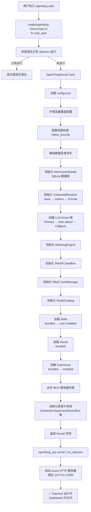

# 第 4 节：启动流程分析

> **版本**: v0.4.4 (2026-03-15)
> **核心文件**: `crates/openfang-kernel/src/kernel.rs`

## 学习目标

- [ ] 理解 CLI 入口到 Kernel 启动的完整流程
- [ ] 掌握配置文件加载和环境变量覆盖机制
- [ ] 理解各子系统的初始化顺序
- [ ] 掌握 LLM Driver 自动检测和 Fallback 机制
- [ ] 理解 Skill/Hand/Extension 注册表加载逻辑

---

## 启动流程图



---

## 1. CLI 入口 — cmd_start

### 文件位置
`crates/openfang-cli/src/main.rs:126`

### 核心逻辑

```rust
fn cmd_start(config: Option<PathBuf>) {
    // 1. 检查是否已有 daemon 在运行
    if let Some(base) = find_daemon() {
        ui::error_with_fix("Daemon already running", ...);
        std::process::exit(1);
    }

    ui::banner();

    let rt = tokio::runtime::Runtime::new().unwrap();
    rt.block_on(async {
        // 2. 启动内核
        let kernel = match OpenFangKernel::boot(config.as_deref()) {
            Ok(k) => k,
            Err(e) => { boot_kernel_error(&e); std::process::exit(1); }
        };

        // 3. 获取配置信息
        let listen_addr = kernel.config.api_listen.clone();
        let provider = kernel.config.default_model.provider.clone();
        let model = kernel.config.default_model.model.clone();

        ui::success(&format!("Kernel booted ({provider}/{model})"));

        // 4. 启动 API 服务器
        openfang_api::server::run_daemon(kernel, &listen_addr, ...)
    });
}
```

### 关键点

| 步骤 | 说明 |
|------|------|
| Daemon 检查 | 防止重复启动，占用端口 |
| 异步运行时 | 创建 tokio Runtime 执行异步代码 |
| 内核启动 | `OpenFangKernel::boot()` 是核心 |
| API 服务器 | 使用 `run_daemon` 启动 HTTP 服务 |

---

## 2. Kernel boot_with_config — 核心流程

### 文件位置
`crates/openfang-kernel/src/kernel.rs:511`

### 2.1 环境变量覆盖配置

```rust
// kernel.rs:514-529
// OPENFANG_LISTEN 覆盖 API 监听地址
if let Ok(listen) = std::env::var("OPENFANG_LISTEN") {
    config.api_listen = listen;
}

// OPENFANG_API_KEY 覆盖 API 认证密钥（配置文件优先级更高）
if config.api_key.trim().is_empty() {
    if let Ok(key) = std::env::var("OPENFANG_API_KEY") {
        let key = key.trim().to_string();
        if !key.is_empty() {
            info!("Using API key from OPENFANG_API_KEY environment variable");
            config.api_key = key;
        }
    }
}
```

**用途**：
- Docker 容器中可以通过环境变量覆盖配置文件
- 开发环境快速切换配置

### 2.2 配置范围检查

```rust
// kernel.rs:532
config.clamp_bounds();
```

**作用**：防止零值或未绑定配置导致的问题，例如：
- `max_iterations` 不能为 0
- `budget` 不能为负数

### 2.3 模式检查

```rust
// kernel.rs:534-544
match config.mode {
    KernelMode::Stable => {
        info!("Booting OpenFang kernel in STABLE mode — conservative defaults enforced");
    }
    KernelMode::Dev => {
        warn!("Booting OpenFang kernel in DEV mode — experimental features enabled");
    }
    KernelMode::Default => {
        info!("Booting OpenFang kernel...");
    }
}
```

---

## 3. Memory Substrate 初始化

### 文件位置
`crates/openfang-kernel/src/kernel.rs:557-565`

```rust
// 确定数据库路径
let db_path = config
    .memory
    .sqlite_path
    .clone()
    .unwrap_or_else(|| config.data_dir.join("openfang.db"));

// 初始化记忆数据库
let memory = Arc::new(
    MemorySubstrate::open(&db_path, config.memory.decay_rate)
        .map_err(|e| KernelError::BootFailed(format!("Memory init failed: {e}")))?,
);
```

**说明**：
- 默认数据库路径：`~/.openfang/data/openfang.db`
- `decay_rate` 用于记忆衰减计算

---

## 4. Credential Resolver — 凭证解析链

### 文件位置
`crates/openfang-kernel/src/kernel.rs:568-590`

```rust
let credential_resolver = {
    // 1. 尝试加载加密 vault
    let vault_path = config.home_dir.join("vault.enc");
    let vault = if vault_path.exists() {
        let mut v = openfang_extensions::vault::CredentialVault::new(vault_path);
        match v.unlock() {
            Ok(()) => {
                info!("Credential vault unlocked ({} entries)", v.len());
                Some(v)
            }
            Err(e) => {
                warn!("Credential vault exists but could not unlock: {e} — falling back to env vars");
                None
            }
        }
    } else {
        None
    };

    // 2. 创建解析链：Vault → Dotenv → EnvVar
    let dotenv_path = config.home_dir.join(".env");
    openfang_extensions::credentials::CredentialResolver::new(
        vault,
        Some(&dotenv_path),
    )
};
```

**优先级链**：
1. **Vault**（加密存储，最安全）
2. **Dotenv**（`~/.openfang/.env` 文件）
3. **EnvVar**（系统环境变量）

---

## 5. LLM Driver 创建链 — 自动检测和 Fallback

### 文件位置
`crates/openfang-kernel/src/kernel.rs:592-714`

这是启动流程中最复杂的部分，实现了三级回退机制：

### 5.1 第一级：Primary Driver

```rust
// kernel.rs:595-604
let default_api_key = {
    // 确定 API Key 环境变量名称
    let env_var = if !config.default_model.api_key_env.is_empty() {
        config.default_model.api_key_env.clone()
    } else {
        config.resolve_api_key_env(&config.default_model.provider)
    };
    // 通过 CredentialResolver 解析
    credential_resolver
        .resolve(&env_var)
        .map(|z: zeroize::Zeroizing<String>| z.to_string())
};

// 创建 DriverConfig
let driver_config = DriverConfig {
    provider: config.default_model.provider.clone(),
    api_key: default_api_key,
    base_url: config.default_model.base_url.clone()
        .or_else(|| config.provider_urls.get(&config.default_model.provider).cloned()),
    skip_permissions: true,
};

// 尝试创建主 Driver
let primary_result = drivers::create_driver(&driver_config);
```

### 5.2 第二级：Auto-detect

```rust
// kernel.rs:617-656
let mut driver_chain: Vec<Arc<dyn LlmDriver>> = Vec::new();

match &primary_result {
    Ok(d) => driver_chain.push(d.clone()),
    Err(e) => {
        warn!(
            provider = %config.default_model.provider,
            error = %e,
            "Primary LLM driver init failed — trying auto-detect"
        );

        // 自动检测：扫描环境变量中是否有可用的 provider key
        if let Some((provider, model, env_var)) = drivers::detect_available_provider() {
            let auto_config = DriverConfig {
                provider: provider.to_string(),
                api_key: credential_resolver.resolve(env_var)
                    .map(|z: zeroize::Zeroizing<String>| z.to_string()),
                base_url: config.provider_urls.get(provider).cloned(),
                skip_permissions: true,
            };

            match drivers::create_driver(&auto_config) {
                Ok(d) => {
                    info!(
                        provider = %provider,
                        model = %model,
                        "Auto-detected provider from {} — using as default",
                        env_var
                    );
                    driver_chain.push(d);
                    // 更新运行时配置
                    config.default_model.provider = provider.to_string();
                    config.default_model.model = model.to_string();
                    config.default_model.api_key_env = env_var.to_string();
                }
                Err(e2) => {
                    warn!(provider = %provider, error = %e2, "Auto-detected provider also failed");
                }
            }
        }
    }
}
```

### 5.3 第三级：Fallback Providers

```rust
// kernel.rs:659-700
let mut model_chain: Vec<(Arc<dyn LlmDriver>, String)> = Vec::new();

// 添加主 Driver 到链（空 model 名表示使用请求中的 model 字段）
for d in &driver_chain {
    model_chain.push((d.clone(), String::new()));
}

// 添加配置的 Fallback providers
for fb in &config.fallback_providers {
    let fb_api_key = {
        let env_var = if !fb.api_key_env.is_empty() {
            fb.api_key_env.clone()
        } else {
            config.resolve_api_key_env(&fb.provider)
        };
        credential_resolver.resolve(&env_var)
            .map(|z: zeroize::Zeroizing<String>| z.to_string())
    };

    let fb_config = DriverConfig {
        provider: fb.provider.clone(),
        api_key: fb_api_key,
        base_url: fb.base_url.clone()
            .or_else(|| config.provider_urls.get(&fb.provider).cloned()),
        skip_permissions: true,
    };

    match drivers::create_driver(&fb_config) {
        Ok(d) => {
            info!(
                provider = %fb.provider,
                model = %fb.model,
                "Fallback provider configured"
            );
            driver_chain.push(d.clone());
            model_chain.push((d, fb.model.clone()));
        }
        Err(e) => {
            warn!(
                provider = %fb.provider,
                error = %e,
                "Fallback provider init failed — skipped"
            );
        }
    }
}
```

### 5.4 构建最终 Driver 链

```rust
// kernel.rs:703-714
let driver: Arc<dyn LlmDriver> = if driver_chain.len() > 1 {
    // 多个 drivers → FallbackDriver（自动切换）
    Arc::new(openfang_runtime::drivers::fallback::FallbackDriver::with_models(
        model_chain,
    ))
} else if let Some(single) = driver_chain.into_iter().next() {
    // 单个 driver
    single
} else {
    // 全部失败 → StubDriver（返回配置错误提示）
    warn!("No LLM drivers available — agents will return errors until a provider is configured");
    Arc::new(StubDriver) as Arc<dyn LlmDriver>
};
```

**FallbackDriver 工作原理**：
- 按顺序尝试每个 driver
- 当前一个失败时自动切换到下一个
- 每个 fallback 可以指定不同的 model 名称（跨 provider 兼容）

---

## 6. 其他核心子系统初始化

### 6.1 Metering Engine — 成本计量

```rust
// kernel.rs:717-719
let metering = Arc::new(MeteringEngine::new(Arc::new(
    openfang_memory::usage::UsageStore::new(memory.usage_conn()),
)));
```

**说明**：
- 与 Memory 共享 SQLite 连接
- 追踪每个 Agent 的 token 使用和成本

### 6.2 WASM Sandbox — 沙箱隔离

```rust
// kernel.rs:725-726
let wasm_sandbox = WasmSandbox::new()
    .map_err(|e| KernelError::BootFailed(format!("WASM sandbox init failed: {e}")))?;
```

**说明**：
- 所有 WASM 技能都在沙箱中运行
- 初始化失败会导致启动失败（关键组件）

### 6.3 RBAC AuthManager — 权限管理

```rust
// kernel.rs:728-732
let auth = AuthManager::new(&config.users);
if auth.is_enabled() {
    info!("RBAC enabled with {} users", auth.user_count());
}
```

**说明**：
- 基于配置文件的 `users` 配置
- 启用时会在 API 层进行身份验证

### 6.4 Model Catalog — 模型目录

```rust
// kernel.rs:735-756
let mut model_catalog = openfang_runtime::model_catalog::ModelCatalog::new();
model_catalog.detect_auth();  // 检测哪些 provider 有 API key

// 应用配置中的 URL 覆盖
if !config.provider_urls.is_empty() {
    model_catalog.apply_url_overrides(&config.provider_urls);
    info!("applied {} provider URL override(s)", config.provider_urls.len());
}

// 加载用户自定义模型
let custom_models_path = config.home_dir.join("custom_models.json");
model_catalog.load_custom_models(&custom_models_path);

let available_count = model_catalog.available_models().len();
let total_count = model_catalog.list_models().len();
let local_count = model_catalog.list_providers()
    .iter()
    .filter(|p| !p.key_required)
    .count();
info!(
    "Model catalog: {total_count} models, {available_count} available from configured providers ({local_count} local)"
);
```

---

## 7. Skill Registry — 技能注册表

### 文件位置
`crates/openfang-kernel/src/kernel.rs:758-782`

```rust
// 1. 创建技能目录
let skills_dir = config.home_dir.join("skills");
let mut skill_registry = openfang_skills::registry::SkillRegistry::new(skills_dir);

// 2. 加载 bundled skills（编译时嵌入）
let bundled_count = skill_registry.load_bundled();
if bundled_count > 0 {
    info!("Loaded {bundled_count} bundled skill(s)");
}

// 3. 加载用户安装的 skills（覆盖同名的 bundled skills）
match skill_registry.load_all() {
    Ok(count) => {
        if count > 0 {
            info!("Loaded {count} user skill(s) from skill registry");
        }
    }
    Err(e) => {
        warn!("Failed to load skill registry: {e}");
    }
}

// 4. Stable 模式下冻结注册表（防止运行时修改）
if config.mode == KernelMode::Stable {
    skill_registry.freeze();
}
```

**加载顺序**：
1. Bundled（内置）
2. User-installed（用户安装，覆盖内置）

---

## 8. Hand Registry — 自主代理注册表

### 文件位置
`crates/openfang-kernel/src/kernel.rs:784-789`

```rust
let hand_registry = openfang_hands::registry::HandRegistry::new();
let hand_count = hand_registry.load_bundled();
if hand_count > 0 {
    info!("Loaded {hand_count} bundled hand(s)");
}
```

**说明**：
- Hands 是预配置的自主 Agent 包
- 包含 HAND.toml、SKILL.md、工具白名单等

---

## 9. Extension Registry — 扩展注册表

### 文件位置
`crates/openfang-kernel/src/kernel.rs:791-808`

```rust
let mut extension_registry =
    openfang_extensions::registry::IntegrationRegistry::new(&config.home_dir);

// 1. 加载 bundled 模板
let ext_bundled = extension_registry.load_bundled();

// 2. 加载用户安装的集成
match extension_registry.load_installed() {
    Ok(count) => {
        if count > 0 {
            info!("Loaded {count} installed integration(s)");
        }
    }
    Err(e) => {
        warn!("Failed to load installed integrations: {e}");
    }
}

info!(
    "Extension registry: {ext_bundled} templates available, {} installed",
    extension_registry.installed_count()
);
```

---

## 10. API 服务器启动

### 文件位置
`crates/openfang-api/src/server.rs`

```rust
// 启动 Axum HTTP 服务器
pub fn run_daemon(kernel: Arc<OpenFangKernel>, listen_addr: &str, ...) {
    // 1. 创建 AppState（桥接 kernel 和 routes）
    let app_state = AppState {
        kernel,
        // ... 其他状态
    };

    // 2. 构建 Axum 应用
    let app = Router::new()
        // 注册所有 REST/WS/SSE 端点
        .route("/api/health", get(routes::health))
        .route("/api/agents", get(routes::list_agents))
        // ... 140+ 端点
        .layer(CorsLayer::permissive());

    // 3. 绑定地址并启动
    let listener = TcpListener::bind(listen_addr).await.unwrap();
    info!("API server listening on {}", listen_addr);

    axum::serve(listener, app).await.unwrap();
}
```

---

## 初始化顺序总览

| 顺序 | 子系统 | 说明 |
|------|--------|------|
| 1 | Memory Substrate | SQLite 持久化 |
| 2 | Credential Resolver | 凭证解析链 |
| 3 | LLM Driver Chain | 主/自动检测/Fallback |
| 4 | Metering Engine | 成本计量 |
| 5 | WASM Sandbox | 沙箱隔离 |
| 6 | RBAC AuthManager | 权限管理 |
| 7 | Model Catalog | 模型目录 |
| 8 | Skill Registry | 技能注册表 |
| 9 | Hand Registry | 自主代理注册表 |
| 10 | Extension Registry | 扩展注册表 |
| 11 | API Server | HTTP 服务 |

---

## 关键设计模式

### 1. 三级回退（Three-level Fallback）

```
Primary → Auto-detect → Fallback → Stub
```

**优点**：
- 最大化可用性
- 用户友好（自动检测环境中的 API key）
- 即使全部失败也能启动（Dashboard 可访问）

### 2. 凭证解析链

```
Vault（加密） → Dotenv（文件） → EnvVar（环境变量）
```

**优点**：
- 安全性优先
- 灵活性高
- 向后兼容

### 3. 注册表分层加载

```
Bundled（内置） → User-installed（用户安装）
```

**优点**：
- 内置功能开箱即用
- 用户可覆盖/扩展
- Stable 模式可冻结防止意外修改

---

## 完成检查清单

- [ ] 理解 CLI 入口到 Kernel 启动的完整流程
- [ ] 掌握配置文件加载和环境变量覆盖机制
- [ ] 理解各子系统的初始化顺序
- [ ] 掌握 LLM Driver 自动检测和 Fallback 机制
- [ ] 理解 Skill/Hand/Extension 注册表加载逻辑

---

## 下一步

前往 [第 5 节：Agent 循环 — 主流程](./05-agent-loop-main.md)

---

*创建时间：2026-03-15*
*OpenFang v0.4.4*
