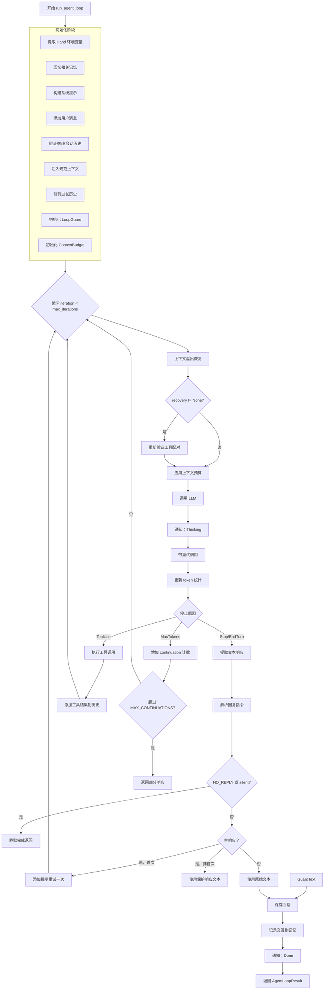

# 第 5 节：Agent 循环 — 主流程

> **版本**: v0.4.4 (2026-03-15)
> **核心文件**: `crates/openfang-runtime/src/agent_loop.rs`

## 学习目标

- [ ] 理解 `run_agent_loop` 函数签名和参数含义
- [ ] 掌握主循环的初始化阶段
- [ ] 理解迭代控制和状态流转
- [ ] 掌握三种停止原因的处理逻辑
- [ ] 理解 NO_REPLY 静默完成机制

---

## 1. 函数签名详解

### 文件位置
`crates/openfang-runtime/src/agent_loop.rs:115`

```rust
pub async fn run_agent_loop(
    manifest: &AgentManifest,           // Agent 配置清单
    user_message: &str,                 // 用户输入消息
    session: &mut Session,              // 可变会话状态
    memory: &MemorySubstrate,           // 记忆数据库引用
    driver: Arc<dyn LlmDriver>,         // LLM 驱动 trait 对象
    available_tools: &[ToolDefinition], // 可用工具定义列表
    kernel: Option<Arc<dyn KernelHandle>>, // 内核句柄（agent 间通信）
    skill_registry: Option<&SkillRegistry>, // 技能注册表
    mcp_connections: Option<&tokio::sync::Mutex<Vec<McpConnection>>>,
    web_ctx: Option<&WebToolsContext>,  // Web 搜索上下文
    browser_ctx: Option<&BrowserManager>, // 浏览器自动化上下文
    embedding_driver: Option<&(dyn EmbeddingDriver + Send + Sync)>,
    workspace_root: Option<&Path>,      // 工作空间根目录
    on_phase: Option<&PhaseCallback>,   // 生命周期回调
    media_engine: Option<&MediaEngine>, // 媒体理解引擎
    tts_engine: Option<&TtsEngine>,     // 文本转语音引擎
    docker_config: Option<&DockerSandboxConfig>,
    hooks: Option<&HookRegistry>,       // Hook 注册表
    context_window_tokens: Option<usize>, // 上下文窗口大小
    process_manager: Option<&ProcessManager>,
    user_content_blocks: Option<Vec<ContentBlock>>, // 多模态内容
) -> OpenFangResult<AgentLoopResult>
```

### 参数分类

| 分类 | 参数 | 说明 |
|------|------|------|
| **核心输入** | `manifest`, `user_message`, `session` | Agent 配置、用户消息、会话状态 |
| **LLM 相关** | `driver`, `available_tools`, `context_window_tokens` | LLM 驱动、工具列表、上下文窗口 |
| **记忆系统** | `memory`, `embedding_driver` | 记忆存储、向量嵌入 |
| **扩展能力** | `web_ctx`, `browser_ctx`, `media_engine`, `tts_engine` | Web 搜索、浏览器、媒体、TTS |
| **系统集成** | `kernel`, `skill_registry`, `mcp_connections` | 内核通信、技能、MCP |
| **生命周期** | `on_phase`, `hooks` | 阶段回调、Hook 系统 |
| **多模态** | `user_content_blocks` | 文本 + 图片等多模态输入 |

---

## 2. 初始化阶段

### 2.1 提取 Hand 环境变量

```rust
// agent_loop.rs:140-145
let hand_allowed_env: Vec<String> = manifest
    .metadata
    .get("hand_allowed_env")
    .and_then(|v| serde_json::from_value(v.clone()).ok())
    .unwrap_or_default();
```

**说明**：从 Agent 配置的 metadata 中提取 Hand 设置允许的环境变量列表。

### 2.2 回忆相关记忆

```rust
// agent_loop.rs:148-192
let memories = if let Some(emb) = embedding_driver {
    // 有 embedding driver：使用向量相似度搜索
    match emb.embed_one(user_message).await {
        Ok(query_vec) => {
            debug!("Using vector recall (dims={})", query_vec.len());
            memory
                .recall_with_embedding_async(
                    user_message,
                    5,
                    Some(MemoryFilter {
                        agent_id: Some(session.agent_id),
                        ..Default::default()
                    }),
                    Some(&query_vec),
                )
                .await
                .unwrap_or_default()
        }
        Err(e) => {
            warn!("Embedding recall failed, falling back to text search: {e}");
            memory
                .recall(user_message, 5, ...).await
                .unwrap_or_default()
        }
    }
} else {
    // 无 embedding driver：使用文本搜索
    memory.recall(user_message, 5, ...).await.unwrap_or_default()
};
```

**回忆策略**：
1. **优先向量搜索**（更准确，基于语义相似度）
2. **降级文本搜索**（embedding 不可用时的 fallback）

### 2.3 构建系统提示

```rust
// agent_loop.rs:211-219
let mut system_prompt = manifest.model.system_prompt.clone();
if !memories.is_empty() {
    let mem_pairs: Vec<(String, String)> = memories
        .iter()
        .map(|m| (String::new(), m.content.clone()))
        .collect();
    system_prompt.push_str("\n\n");
    system_prompt.push_str(&crate::prompt_builder::build_memory_section(&mem_pairs));
}
```

**说明**：将回忆的记忆追加到系统提示末尾。

### 2.4 添加用户消息到会话

```rust
// agent_loop.rs:224-228
if let Some(blocks) = user_content_blocks {
    // 多模态输入（文本 + 图片等）
    session.messages.push(Message::user_with_blocks(blocks));
} else {
    // 纯文本输入
    session.messages.push(Message::user(user_message));
}
```

### 2.5 验证和修复会话历史

```rust
// agent_loop.rs:232-240
let llm_messages: Vec<Message> = session
    .messages
    .iter()
    .filter(|m| m.role != Role::System)
    .cloned()
    .collect();

// 验证和修复工具调用配对
let mut messages = crate::session_repair::validate_and_repair(&llm_messages);
```

**修复内容**：
- 删除孤立的 `ToolResult`（没有对应的 `ToolUse`）
- 为孤立的 `ToolUse` 添加 synthetic `ToolResult`

### 2.6 注入规范上下文

```rust
// agent_loop.rs:244-252
if let Some(cc_msg) = manifest
    .metadata
    .get("canonical_context_msg")
    .and_then(|v| v.as_str())
{
    if !cc_msg.is_empty() {
        messages.insert(0, Message::user(cc_msg));
    }
}
```

**说明**：规范上下文作为第一条用户消息（不在系统提示中），用于 provider prompt 缓存优化。

### 2.7 修剪过长历史

```rust
// agent_loop.rs:260-273
if messages.len() > MAX_HISTORY_MESSAGES {
    let trim_count = messages.len() - MAX_HISTORY_MESSAGES;
    warn!(
        "Trimming old messages to prevent context overflow"
    );
    messages.drain(..trim_count);
    // 修剪后重新验证：drain 可能拆分 ToolUse/ToolResult 配对
    messages = crate::session_repair::validate_and_repair(&messages);
}
```

**默认阈值**：`MAX_HISTORY_MESSAGES = 20`

---

## 3. 循环保护机制

### 3.1 确定最大迭代次数

```rust
// agent_loop.rs:276-280
let max_iterations = manifest
    .autonomous
    .as_ref()
    .map(|a| a.max_iterations)
    .unwrap_or(MAX_ITERATIONS);
```

**说明**：
- 优先使用 Agent 配置中的 `autonomous.max_iterations`
- 默认 `MAX_ITERATIONS = 50`

### 3.2 LoopGuard — 循环保护器

```rust
// agent_loop.rs:283-290
let loop_guard_config = {
    let mut cfg = LoopGuardConfig::default();
    // 自主 Agent 放大断路器阈值
    if max_iterations > cfg.global_circuit_breaker {
        cfg.global_circuit_breaker = max_iterations * 3;
    }
    cfg
};
let mut loop_guard = LoopGuard::new(loop_guard_config);
let mut consecutive_max_tokens: u32 = 0;
```

**作用**：
- 追踪工具调用循环次数
- 触发断路器防止无限循环

### 3.3 ContextBudget — 上下文预算

```rust
// agent_loop.rs:294-296
let ctx_window = context_window_tokens.unwrap_or(DEFAULT_CONTEXT_WINDOW);
let context_budget = ContextBudget::new(ctx_window);
let mut any_tools_executed = false;
```

---

## 4. 主循环逻辑

### 4.1 循环框架

```rust
// agent_loop.rs:298
for iteration in 0..max_iterations {
    debug!(iteration, "Agent loop iteration");

    // 1. 上下文溢出恢复
    let recovery = recover_from_overflow(&mut messages, &system_prompt, available_tools, ctx_window);
    if recovery == RecoveryStage::FinalError {
        warn!("Context overflow unrecoverable — suggest /reset or /compact");
    }

    // 2. 重新验证工具调用配对
    if recovery != RecoveryStage::None {
        messages = crate::session_repair::validate_and_repair(&messages);
    }

    // 3. 应用上下文预算（修剪过大的工具结果）
    apply_context_guard(&mut messages, &context_budget, available_tools);

    // 4. 调用 LLM
    let api_model = strip_provider_prefix(&manifest.model.model, &manifest.model.provider);
    let request = CompletionRequest {
        model: api_model,
        messages: messages.clone(),
        tools: available_tools.to_vec(),
        max_tokens: manifest.model.max_tokens,
        temperature: manifest.model.temperature,
        system: Some(system_prompt.clone()),
        thinking: None,
    };

    // 通知阶段：Thinking
    if let Some(cb) = on_phase {
        cb(LoopPhase::Thinking);
    }

    // 5. 调用 LLM（带重试）
    let mut response = call_with_retry(&*driver, request, Some(provider_name), None).await?;
    total_usage.input_tokens += response.usage.input_tokens;
    total_usage.output_tokens += response.usage.output_tokens;

    // 6. 处理响应
    match response.stop_reason {
        // ... 处理停止原因
    }
}
```

---

## 5. 三种停止原因处理

### 5.1 Stop/EndTurn — 自然停止

```rust
// agent_loop.rs:372-538
match response.stop_reason {
    StopReason::EndTurn | StopReason::StopSequence => {
        // 1. 提取文本响应
        let text = response.text();

        // 2. 解析回复指令（reply_to, thread 等）
        let (cleaned_text, parsed_directives) = parse_directives(&text);

        // 3. 处理 NO_REPLY（静默完成）
        if text.trim() == "NO_REPLY" || parsed_directives.silent {
            session.messages.push(Message::assistant("[no reply needed]".to_string()));
            memory.save_session_async(session).await?;
            return Ok(AgentLoopResult {
                response: String::new(),
                silent: true,
                ...
            });
        }

        // 4. 空响应重试（一次性）
        if text.trim().is_empty() && response.tool_calls.is_empty() {
            let is_silent_failure = response.usage.input_tokens == 0 && response.usage.output_tokens == 0;
            if iteration == 0 || is_silent_failure {
                warn!("Empty response, retrying once");
                if is_silent_failure {
                    messages = validate_and_repair(&messages);
                }
                messages.push(Message::assistant("[no response]".to_string()));
                messages.push(Message::user("Please provide your response.".to_string()));
                continue;
            }
        }

        // 5. 空响应保护（最终 fallback）
        let text = if text.trim().is_empty() {
            if any_tools_executed {
                "[Task completed — the agent executed tools but did not produce a text summary.]"
            } else {
                "[The model returned an empty response. This usually means the model is overloaded...]"
            }
        } else {
            text
        };

        // 6. 保存会话
        session.messages.push(Message::assistant(text));
        memory.save_session_async(session).await?;

        // 7. 记录交互到记忆
        let interaction_text = format!("User asked: {}\nI responded: {}", user_message, final_response);
        if let Some(emb) = embedding_driver {
            match emb.embed_one(&interaction_text).await {
                Ok(vec) => {
                    memory.remember_with_embedding_async(..., Some(&vec)).await?;
                }
                Err(e) => {
                    memory.remember(...).await?;
                }
            }
        } else {
            memory.remember(...).await?;
        }

        // 8. 返回结果
        return Ok(AgentLoopResult { response: final_response, total_usage, ... });
    }
}
```

### 5.2 ToolUse — 工具调用

```rust
// agent_loop.rs:540-...
StopReason::ToolUse => {
    // 重置 MaxTokens 计数器
    consecutive_max_tokens = 0;
    any_tools_executed = true;

    // 1. 添加工具调用到会话历史
    session.messages.push(Message {
        role: Role::Assistant,
        content: MessageContent::Blocks(assistant_blocks.clone()),
    });
    messages.push(Message { ... });

    // 2. 构建允许的工具列表（用于 capability 检查）
    let allowed_tool_names: Vec<String> = ...;

    // 3. 执行所有工具调用
    for tool_call in response.tool_calls {
        // 检查工具是否在白名单内
        if !allowed_tool_names.contains(&tool_call.name) {
            warn!("Tool '{}' not in allowed list", tool_call.name);
            continue;
        }

        // 执行工具
        let result = execute_tool(tool_call.name, tool_call.input, ...).await?;

        // 添加工具结果到历史
        messages.push(Message {
            role: Role::Tool,
            content: MessageContent::Blocks(vec![ContentBlock::ToolResult {
                tool_use_id: tool_call.id,
                content: result.content,
                is_error: result.is_error,
            }]),
        });
    }

    // 继续下一次循环
    continue;
}
```

### 5.3 MaxTokens — 达到 token 上限

```rust
// 处理逻辑（在代码后续部分）
StopReason::MaxTokens => {
    consecutive_max_tokens += 1;
    if consecutive_max_tokens >= MAX_CONTINUATIONS {
        warn!("Max continuations reached, returning partial response");
        return Ok(AgentLoopResult { ... });
    }
    // 继续调用 LLM 以获取 continuation
}
```

**默认阈值**：`MAX_CONTINUATIONS = 5`

---

## 6. AgentLoopResult — 循环结果

```rust
pub struct AgentLoopResult {
    pub response: String,           // 最终文本响应
    pub total_usage: TokenUsage,    // 总 token 使用量
    pub iterations: u32,            // 循环迭代次数
    pub cost_usd: Option<f64>,      // 估计成本（内核填充）
    pub silent: bool,               // 是否静默完成（NO_REPLY）
    pub directives: ReplyDirectives, // 回复指令（reply_to, thread 等）
}
```

---

## 7. 主循环流程图



---

## 8. 关键设计点

### 8.1 记忆回忆策略

```
Vector Search (embedding) → Text Search (fallback)
```

**优点**：
- 有 embedding 时使用语义搜索（更准确）
- 无 embedding 时降级到文本搜索（向后兼容）

### 8.2 空响应保护

```
首次空响应 → 添加提示重试一次
非首次空响应 → 使用保护响应文本
```

**保护响应文本**：
- 工具已执行：`[Task completed — the agent executed tools but did not produce a text summary.]`
- 工具未执行：`[The model returned an empty response. This usually means the model is overloaded...]`

### 8.3 会话修复管道

```
初始验证 → 修剪后重新验证 → 溢出恢复后重新验证 → 空响应重试前重新验证
```

**修复内容**：
- 删除孤立的 `ToolResult`
- 为孤立的 `ToolUse` 添加 synthetic `ToolResult`

---

## 完成检查清单

- [ ] 理解 `run_agent_loop` 函数签名和参数含义
- [ ] 掌握主循环的初始化阶段
- [ ] 理解迭代控制和状态流转
- [ ] 掌握三种停止原因的处理逻辑
- [ ] 理解 NO_REPLY 静默完成机制

---

## 下一步

前往 [第 6 节：Agent 循环 — 上下文管理](./06-agent-loop-context.md)

---

*创建时间：2026-03-15*
*OpenFang v0.4.4*
