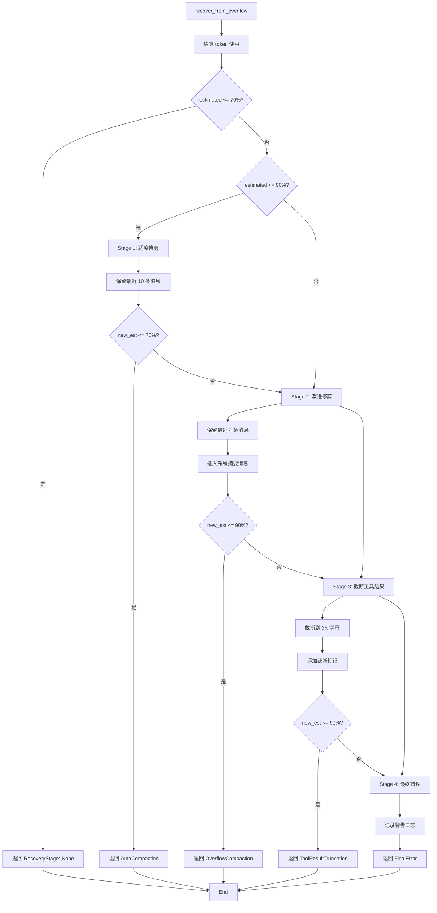

# 第 6 节：Agent 循环 — 上下文管理

> **版本**: v0.5.2 (2026-03-29)
> **核心文件**:
> - `crates/openfang-runtime/src/context_overflow.rs`
> - `crates/openfang-runtime/src/context_budget.rs` (v0.5.2 新增)
> - `crates/openfang-runtime/src/session_repair.rs`

## 学习目标

- [ ] 理解上下文溢出恢复的 4 个阶段
- [ ] 掌握 Session Repair 的验证和修复逻辑
- [ ] 理解工具结果修剪机制
- [ ] 掌握 ContextBudget 的工作原理

---

## 1. RecoveryStage — 恢复阶段枚举

### 文件位置
`crates/openfang-runtime/src/context_overflow.rs:16-28`

```rust
#[derive(Debug, Clone, PartialEq)]
pub enum RecoveryStage {
    /// 无需恢复
    None,
    /// Stage 1: 适度修剪（保留最近 10 条）
    AutoCompaction { removed: usize },
    /// Stage 2: 激进修剪（保留最近 4 条）
    OverflowCompaction { removed: usize },
    /// Stage 3: 截断工具结果
    ToolResultTruncation { truncated: usize },
    /// Stage 4: 无法恢复 — 建议 /reset 或 /compact
    FinalError,
}
```

---

## 2. recover_from_overflow — 4 阶段恢复管道

### 文件位置
`crates/openfang-runtime/src/context_overflow.rs:38`

### 阶段 0: 估算 token 并判断是否需要恢复

```rust
// context_overflow.rs:44-51
let estimated = estimate_tokens(messages, system_prompt, tools);
let threshold_70 = (context_window as f64 * 0.70) as usize;
let threshold_90 = (context_window as f64 * 0.90) as usize;

// 无需恢复
if estimated <= threshold_70 {
    return RecoveryStage::None;
}
```

**阈值设计**：
- **70%**：触发恢复的安全线
- **90%**：触发激进恢复的警告线

### 阶段 1: 适度修剪（Moderate Trim）

```rust
// context_overflow.rs:53-70
// Stage 1: Moderate trim — keep last 10 messages
if estimated <= threshold_90 {
    let keep = 10.min(messages.len());
    let remove = messages.len() - keep;
    if remove > 0 {
        debug!(
            estimated_tokens = estimated,
            removing = remove,
            "Stage 1: moderate trim to last {keep} messages"
        );
        messages.drain(..remove);

        // 重新检查
        let new_est = estimate_tokens(messages, system_prompt, tools);
        if new_est <= threshold_70 {
            return RecoveryStage::AutoCompaction { removed: remove };
        }
    }
}
```

**策略**：
- 保留最近 10 条消息
- 删除早期对话
- 如果仍然超出 70%，进入 Stage 2

### 阶段 2: 激进修剪（Aggressive Overflow Compaction）

```rust
// context_overflow.rs:72-95
// Stage 2: Aggressive trim — keep last 4 messages + summary marker
{
    let keep = 4.min(messages.len());
    let remove = messages.len() - keep;
    if remove > 0 {
        warn!(
            estimated_tokens = estimate_tokens(messages, system_prompt, tools),
            removing = remove,
            "Stage 2: aggressive overflow compaction to last {keep} messages"
        );

        // 添加系统摘要消息
        let summary = Message::user(format!(
            "[System: {} earlier messages were removed due to context overflow. \
             The conversation continues from here. Use /compact for smarter summarization.]",
            remove
        ));
        messages.drain(..remove);
        messages.insert(0, summary);

        let new_est = estimate_tokens(messages, system_prompt, tools);
        if new_est <= threshold_90 {
            return RecoveryStage::OverflowCompaction { removed: remove };
        }
    }
}
```

**策略**：
- 仅保留最近 4 条消息
- 插入系统摘要消息（解释删除了多少条）
- 如果仍然超出 90%，进入 Stage 3

### 阶段 3: 截断工具结果（Tool Result Truncation）

```rust
// context_overflow.rs:97-132
// Stage 3: Truncate all historical tool results to 2K chars
let tool_truncation_limit = 2000;
let mut truncated = 0;

for msg in messages.iter_mut() {
    if let MessageContent::Blocks(blocks) = &mut msg.content {
        for block in blocks.iter_mut() {
            if let ContentBlock::ToolResult { content, .. } = block {
                if content.len() > tool_truncation_limit {
                    let mut safe_keep = tool_truncation_limit.saturating_sub(80);
                    // 回退到有效的 char boundary
                    while safe_keep > 0 && !content.is_char_boundary(safe_keep) {
                        safe_keep -= 1;
                    }
                    *content = format!(
                        "{}\n\n[OVERFLOW RECOVERY: truncated from {} to {} chars]",
                        &content[..safe_keep],
                        content.len(),
                        safe_keep
                    );
                    truncated += 1;
                }
            }
        }
    }
}

if truncated > 0 {
    let new_est = estimate_tokens(messages, system_prompt, tools);
    if new_est <= threshold_90 {
        return RecoveryStage::ToolResultTruncation { truncated };
    }
    warn!(
        estimated_tokens = new_est,
        "Stage 3 truncated {} tool results but still over threshold", truncated
    );
}
```

**策略**：
- 将所有工具结果截断到 2K 字符
- 保留头部和尾部（80 字符缓冲区用于恢复标记）
- 添加截断标记说明

### 阶段 4: 最终错误（Final Error）

```rust
// context_overflow.rs:134-137
// Stage 4: Final error — nothing more we can do automatically
warn!("Stage 4: all recovery stages exhausted, context still too large");
RecoveryStage::FinalError
```

**用户建议**：
- 使用 `/reset` 清空会话
- 使用 `/compact` 触发 LLM 总结

---

## 3. Session Repair — 会话验证和修复

### 文件位置
`crates/openfang-runtime/src/session_repair.rs:49`

### RepairStats — 修复统计

```rust
// session_repair.rs:19-33
#[derive(Debug, Clone, Default, PartialEq, Eq)]
pub struct RepairStats {
    /// 删除的孤立 ToolResult 数量
    pub orphaned_results_removed: usize,
    /// 删除的空消息数量
    pub empty_messages_removed: usize,
    /// 合并的连续同角色消息数量
    pub messages_merged: usize,
    /// 重新排序的 ToolResult 数量
    pub results_reordered: usize,
    /// 插入的 synthetic error 结果数量
    pub synthetic_results_inserted: usize,
    /// 删除的重复 ToolResult 数量
    pub duplicates_removed: usize,
}
```

### Phase 1: 收集 ToolUse IDs

```rust
// session_repair.rs:52-65
let tool_use_ids: HashSet<String> = messages
    .iter()
    .flat_map(|m| match &m.content {
        MessageContent::Blocks(blocks) => blocks
            .iter()
            .filter_map(|b| match b {
                ContentBlock::ToolUse { id, .. } => Some(id.clone()),
                _ => None,
            })
            .collect::<Vec<_>>(),
        _ => vec![],
    })
    .collect();
```

### Phase 2: 过滤孤立 ToolResult 和空消息

```rust
// session_repair.rs:67-114
let mut cleaned: Vec<Message> = Vec::with_capacity(messages.len());
for msg in messages {
    let new_content = match &msg.content {
        MessageContent::Text(s) => {
            if s.is_empty() {
                stats.empty_messages_removed += 1;
                continue;
            }
            MessageContent::Text(s.clone())
        }
        MessageContent::Blocks(blocks) => {
            let original_len = blocks.len();
            let filtered: Vec<ContentBlock> = blocks
                .iter()
                .filter(|b| match b {
                    ContentBlock::ToolResult { tool_use_id, .. } => {
                        let keep = tool_use_ids.contains(tool_use_id);
                        if !keep {
                            stats.orphaned_results_removed += 1;
                        }
                        keep
                    }
                    _ => true,
                })
                .cloned()
                .collect();
            if filtered.is_empty() {
                if original_len > 0 {
                    debug!("Dropped message: all blocks filtered out");
                }
                stats.empty_messages_removed += 1;
                continue;
            }
            MessageContent::Blocks(filtered)
        }
    };
    cleaned.push(Message {
        role: msg.role,
        content: new_content,
    });
}
```

**修复内容**：
- 删除孤立的 `ToolResult`（没有对应的 `ToolUse`）
- 删除空消息

### Phase 2b: 重新排序错位的 ToolResult

```rust
// session_repair.rs:116-118
let reordered_count = reorder_tool_results(&mut cleaned);
stats.results_reordered = reordered_count;
```

**逻辑**（`reorder_tool_results` 函数）：
1. 构建 `tool_use_id → assistant message index` 映射
2. 对于每个包含 `ToolResult` 的 user 消息
3. 检查前一条消息是否是对应的 assistant 消息
4. 如果不是，将 `ToolResult` 移动到正确位置

### Phase 2c: 插入 Synthetic Error 结果

```rust
// session_repair.rs:120-122
let synthetic_count = insert_synthetic_results(&mut cleaned);
stats.synthetic_results_inserted = synthetic_count;
```

**逻辑**（`insert_synthetic_results` 函数）：
- 遍历所有 `ToolUse` 块
- 如果没有找到对应的 `ToolResult`
- 插入 synthetic error 结果：`"Tool execution was interrupted"`

### Phase 2d: 删除重复 ToolResult

```rust
// session_repair.rs:124-126
let dedup_count = deduplicate_tool_results(&mut cleaned);
stats.duplicates_removed = dedup_count;
```

**逻辑**（`deduplicate_tool_results` 函数）：
- 追踪已见过的 `tool_use_id`
- 删除重复的 `ToolResult`（保留第一个）

### Phase 3: 合并连续同角色消息

```rust
// session_repair.rs:143-163
let pre_merge_len = cleaned.len();
let mut merged: Vec<Message> = Vec::with_capacity(cleaned.len());
for msg in cleaned {
    if let Some(last) = merged.last_mut() {
        if last.role == msg.role {
            merge_content(&mut last.content, msg.content);
            stats.messages_merged += 1;
            continue;
        }
    }
    merged.push(msg);
}
```

**原因**：
- Anthropic API 要求消息角色交替（user/assistant 交替）
- 合并连续的同角色消息避免 API 错误

### merge_content — 合并内容

```rust
// session_repair.rs
fn merge_content(first: &mut MessageContent, second: MessageContent) {
    match (first, second) {
        (MessageContent::Text(s1), MessageContent::Text(s2)) => {
            *s1 = format!("{}\n{}", s1, s2);
        }
        (MessageContent::Blocks(blocks1), MessageContent::Blocks(blocks2)) => {
            blocks1.extend(blocks2);
        }
        _ => {}
    }
}
```

---

## 4. ContextBudget — 上下文预算

### 文件位置
`crates/openfang-runtime/src/context_budget.rs`（推断自代码使用）

```rust
pub struct ContextBudget {
    context_window: usize,     // 上下文窗口大小
    system_buffer: usize,      // 预留给系统提示
    tool_result_ratio: f32,    // 工具结果占比
}

impl ContextBudget {
    pub fn new(context_window: usize) -> Self {
        Self {
            context_window,
            system_buffer: context_window * 10 / 100,  // 10% 预留给系统提示
            tool_result_ratio: 0.5,  // 工具结果最多占 50%
        }
    }
}
```

### apply_context_guard — 应用上下文预算

```rust
// agent_loop.rs:315
pub fn apply_context_guard(
    messages: &mut Vec<Message>,
    budget: &ContextBudget,
    tools: &[ToolDefinition],
) {
    // 计算工具结果的 token 总数
    let mut tool_result_tokens = 0;
    let mut tool_result_indices = Vec::new();

    for (i, msg) in messages.iter().enumerate() {
        if let MessageContent::Blocks(blocks) = &msg.content {
            for block in blocks {
                if let ContentBlock::ToolResult { content, .. } = block {
                    tool_result_tokens += estimate_tokens_single(content);
                    tool_result_indices.push(i);
                }
            }
        }
    }

    // 计算可用预算
    let available_for_tool_results = budget.context_window - budget.system_buffer;
    let max_tool_tokens = (available_for_tool_results as f32 * budget.tool_result_ratio) as usize;

    // 如果工具结果超出预算，动态修剪
    if tool_result_tokens > max_tool_tokens {
        let reduction_ratio = max_tool_tokens as f32 / tool_result_tokens as f32;

        // 修剪每个工具结果
        for idx in tool_result_indices {
            if let MessageContent::Blocks(blocks) = &mut messages[idx].content {
                for block in blocks.iter_mut() {
                    if let ContentBlock::ToolResult { content, .. } = block {
                        let new_len = (content.len() as f32 * reduction_ratio) as usize;
                        if new_len < content.len() {
                            content.truncate(new_len);
                            content.push_str("...[truncated for context budget]");
                        }
                    }
                }
            }
        }
    }
}
```

---

## 5. 恢复流程图



---

## 6. validate_and_repair 调用时机

在主循环中的调用位置：

```rust
// 1. 初始化阶段：添加用户消息后
let mut messages = crate::session_repair::validate_and_repair(&llm_messages);

// 2. 修剪过长历史后
messages.drain(..trim_count);
messages = crate::session_repair::validate_and_repair(&messages);

// 3. 溢出恢复后
let recovery = recover_from_overflow(&mut messages, ...);
if recovery != RecoveryStage::None {
    messages = crate::session_repair::validate_and_repair(&messages);
}

// 4. 空响应重试前
if is_silent_failure {
    messages = crate::session_repair::validate_and_repair(&messages);
}
```

---

## 7. 关键设计点

### 7.1 渐进式恢复策略

```
Stage 1 (70%): 适度修剪 → Stage 2 (90%): 激进修剪 → Stage 3: 截断工具 → Stage 4: 报错
```

**优点**：
- 先尝试低成本恢复（删除消息）
- 再尝试中等成本恢复（截断工具结果）
- 最后才报错（用户体验最差）

### 7.2 会话修复多相位验证

```
Phase 1: 收集 ToolUse IDs
Phase 2: 过滤孤立 ToolResult + 空消息
Phase 2b: 重新排序错位 ToolResult
Phase 2c: 插入 Synthetic Error 结果
Phase 2d: 删除重复 ToolResult
Phase 3: 合并连续同角色消息
```

**优点**：
- 每个阶段解决一类问题
- 统计数据帮助调试
- 保证最终消息列表合法

### 7.3 Token 估算启发式

```rust
fn estimate_tokens(messages, system_prompt, tools) -> usize {
    crate::compactor::estimate_token_count(messages, Some(system_prompt), Some(tools))
}

// compactor.rs 中的实现（chars/4 启发式）
fn estimate_token_count(...) -> usize {
    let total_chars = ...;
    total_chars / 4  // 大约 4 字符 = 1 token
}
```

**优点**：
- 快速估算（无需调用 LLM）
- 足够准确用于触发恢复决策

---

## 完成检查清单

- [ ] 理解上下文溢出恢复的 4 个阶段
- [ ] 掌握 Session Repair 的验证和修复逻辑
- [ ] 理解工具结果修剪机制
- [ ] 掌握 ContextBudget 的工作原理

---

## 下一步

前往 [第 7 节：Agent 循环 — 错误处理](./07-agent-loop-errors.md)

---

*创建时间：2026-03-15*
*OpenFang v0.4.4*
