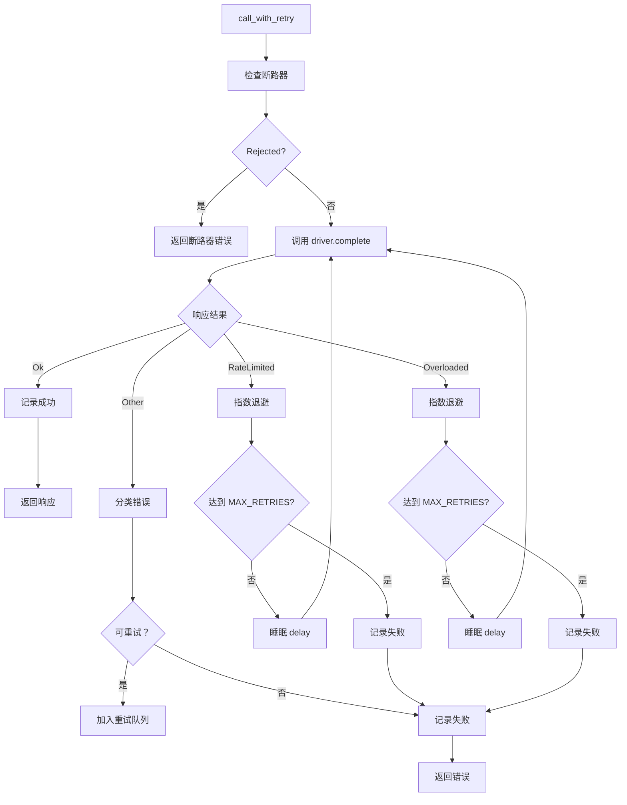
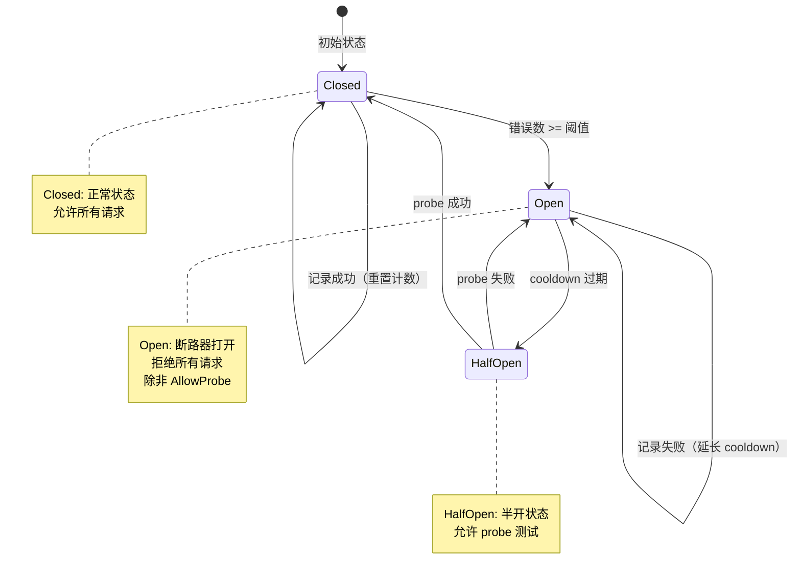

# 第 7 节：Agent 循环 — 错误处理

> **版本**: v0.4.9 (2026-03-19)
> **核心文件**:
> - `crates/openfang-runtime/src/llm_errors.rs`
> - `crates/openfang-runtime/src/auth_cooldown.rs`
> - `crates/openfang-runtime/src/agent_loop.rs` (retry logic)
> - `crates/openfang-api/src/routes.rs` (restart_agent endpoint)

## 学习目标

- [ ] 理解 LLM 错误分类的 8 个类别
- [ ] 掌握 `call_with_retry` 重试逻辑
- [ ] 理解 ProviderCooldown 断路器机制
- [ ] 掌握指数退避 + Jitter 延迟策略
- [ ] 了解 Agent 重启恢复机制 (v0.4.9 新增)

---

## 1. LlmErrorCategory — 8 个错误类别

### 文件位置
`crates/openfang-runtime/src/llm_errors.rs:19-37`

```rust
#[derive(Debug, Clone, Copy, PartialEq, Eq, Hash, Serialize)]
pub enum LlmErrorCategory {
    /// 429, quota exceeded, too many requests
    RateLimit,
    /// 503, overloaded, service unavailable, high demand
    Overloaded,
    /// Request timeout, deadline exceeded, ETIMEDOUT, ECONNRESET
    Timeout,
    /// 402, payment required, insufficient credits/balance
    Billing,
    /// 401/403, invalid API key, unauthorized, forbidden
    Auth,
    /// Context length exceeded, max tokens, context window
    ContextOverflow,
    /// Invalid request format, malformed tool_use, schema violation
    Format,
    /// Model not found, unknown model, NOT_FOUND
    ModelNotFound,
}
```

### 错误分类优先级

分类检查顺序（从高到低）：

1. **ContextOverflow** — 最先检查（高度特定）
2. **Billing** — 402 付费相关
3. **Auth** — 401/403 认证相关
4. **RateLimit** — 429 限流
5. **ModelNotFound** — 404 模型不存在
6. **Overloaded** — 503 服务过载
7. **Timeout** — 超时/连接重置
8. **Format** — 400 格式错误（兜底）

### 模式匹配表

```rust
// Context Overflow Patterns
const CONTEXT_OVERFLOW_PATTERNS: &[&str] = &[
    "context_length_exceeded", "context length", "context_length",
    "maximum context", "context window", "token limit",
    "too many tokens", "max_tokens_exceeded", "max tokens exceeded",
    "prompt is too long", "input too long", "context.length",
];

// Billing Patterns
const BILLING_PATTERNS: &[&str] = &[
    "payment required", "insufficient credits", "credit balance",
    "billing", "insufficient balance", "usage limit",
];

// Rate Limit Patterns
const RATE_LIMIT_PATTERNS: &[&str] = &[
    "rate limit", "rate_limit", "too many requests",
    "exceeded quota", "exceeded your quota", "resource exhausted",
    "resource_exhausted", "quota exceeded", "tokens per minute",
    "requests per minute", "tpm limit", "rpm limit",
];

// Overloaded Patterns
const OVERLOADED_PATTERNS: &[&str] = &[
    "overloaded", "overloaded_error", "service unavailable",
    "service_unavailable", "high demand", "capacity",
    "server_error", "high load", "temporarily unavailable",
];

// Timeout Patterns
const TIMEOUT_PATTERNS: &[&str] = &[
    "timeout", "timed out", "deadline exceeded",
    "ETIMEDOUT", "ECONNRESET", "connection reset",
    "connection timed out", "request timeout",
];

// Auth Patterns (specific to avoid false positives)
const AUTH_PATTERNS: &[&str] = &[
    "invalid api key", "invalid api_key", "invalid apikey",
    "incorrect api key", "invalid x-api-key", "invalid token",
    "unauthorized", "invalid_auth", "authentication_error",
    "authentication failed", "api key not found", "api key is missing",
    "invalid credentials", "not authenticated",
];

// Model Not Found Patterns
const MODEL_NOT_FOUND_PATTERNS: &[&str] = &[
    "model not found", "model_not_found", "unknown model",
    "does not exist", "not_found", "model unavailable",
    "model_unavailable", "no such model", "invalid model",
    "is not found",
];

// Format Patterns (catch-all for 400-class)
const FORMAT_PATTERNS: &[&str] = &[
    "invalid request", "invalid_request", "malformed",
    "tool_use", "schema", "validation error", "validation_error",
    "invalid parameter", "invalid_parameter", "missing required",
    "bad request", "bad_request",
];
```

---

## 2. ClassifiedError — 分类错误结构

### 文件位置
`crates/openfang-runtime/src/llm_errors.rs:40-54`

```rust
#[derive(Debug, Clone, Serialize)]
pub struct ClassifiedError {
    /// 错误分类
    pub category: LlmErrorCategory,
    /// 是否可重试 (RateLimit, Overloaded, Timeout 为 true)
    pub is_retryable: bool,
    /// 是否计费相关 (仅 Billing 为 true)
    pub is_billing: bool,
    /// 从错误消息解析的建议延迟
    pub suggested_delay_ms: Option<u64>,
    /// 用户友好的消息（无原始 API 详情）
    pub sanitized_message: String,
    /// 原始错误消息（用于日志）
    pub raw_message: String,
}
```

### classify_error — 分类函数

```rust
// llm_errors.rs
pub fn classify_error(error_msg: &str, status: Option<u16>) -> ClassifiedError {
    let error_lower = error_msg.to_lowercase();

    // 1. Context Overflow (highly specific)
    if matches_patterns(&error_lower, CONTEXT_OVERFLOW_PATTERNS) {
        return ClassifiedError {
            category: LlmErrorCategory::ContextOverflow,
            is_retryable: false,
            is_billing: false,
            suggested_delay_ms: None,
            sanitized_message: "Context length exceeded. Try reducing message length or use /compact.".to_string(),
            raw_message: error_msg.to_string(),
        };
    }

    // 2. Billing (402 or patterns)
    if status == Some(402) || matches_patterns(&error_lower, BILLING_PATTERNS) {
        return ClassifiedError {
            category: LlmErrorCategory::Billing,
            is_retryable: false,
            is_billing: true,
            suggested_delay_ms: None,
            sanitized_message: "Billing error: insufficient credits or payment required.".to_string(),
            raw_message: error_msg.to_string(),
        };
    }

    // 3. Auth (401/403 or patterns)
    if status == Some(401) || (status == Some(403) && !matches_patterns(&error_lower, FORBIDDEN_NON_AUTH_PATTERNS)) || matches_patterns(&error_lower, AUTH_PATTERNS) {
        return ClassifiedError {
            category: LlmErrorCategory::Auth,
            is_retryable: false,
            is_billing: false,
            suggested_delay_ms: None,
            sanitized_message: "Authentication failed. Check API key configuration.".to_string(),
            raw_message: error_msg.to_string(),
        };
    }

    // 4. Rate Limit (429 or patterns)
    if status == Some(429) || matches_patterns(&error_lower, RATE_LIMIT_PATTERNS) {
        let suggested = parse_retry_after(error_msg);
        return ClassifiedError {
            category: LlmErrorCategory::RateLimit,
            is_retryable: true,
            is_billing: false,
            suggested_delay_ms: suggested,
            sanitized_message: "Rate limit exceeded. Please wait and try again.".to_string(),
            raw_message: error_msg.to_string(),
        };
    }

    // 5. Model Not Found
    if status == Some(404) || matches_patterns(&error_lower, MODEL_NOT_FOUND_PATTERNS) {
        return ClassifiedError {
            category: LlmErrorCategory::ModelNotFound,
            is_retryable: false,
            is_billing: false,
            suggested_delay_ms: None,
            sanitized_message: "Model not found or unavailable.".to_string(),
            raw_message: error_msg.to_string(),
        };
    }

    // 6. Overloaded (503 or patterns)
    if status == Some(503) || matches_patterns(&error_lower, OVERLOADED_PATTERNS) {
        return ClassifiedError {
            category: LlmErrorCategory::Overloaded,
            is_retryable: true,
            is_billing: false,
            suggested_delay_ms: None,
            sanitized_message: "Model is temporarily overloaded. Please try again.".to_string(),
            raw_message: error_msg.to_string(),
        };
    }

    // 7. Timeout
    if matches_patterns(&error_lower, TIMEOUT_PATTERNS) {
        return ClassifiedError {
            category: LlmErrorCategory::Timeout,
            is_retryable: true,
            is_billing: false,
            suggested_delay_ms: None,
            sanitized_message: "Request timed out. Please try again.".to_string(),
            raw_message: error_msg.to_string(),
        };
    }

    // 8. Format (catch-all for 400-class)
    if status.map_or(false, |s| s >= 400 && s < 500) || matches_patterns(&error_lower, FORMAT_PATTERNS) {
        return ClassifiedError {
            category: LlmErrorCategory::Format,
            is_retryable: false,
            is_billing: false,
            suggested_delay_ms: None,
            sanitized_message: "Invalid request format.".to_string(),
            raw_message: error_msg.to_string(),
        };
    }

    // Default: Format (unknown errors)
    ClassifiedError {
        category: LlmErrorCategory::Format,
        is_retryable: false,
        is_billing: false,
        suggested_delay_ms: None,
        sanitized_message: "Unknown error occurred.".to_string(),
        raw_message: error_msg.to_string(),
    }
}
```

---

## 3. call_with_retry — 重试逻辑

### 文件位置
`crates/openfang-runtime/src/agent_loop.rs:851`

### 完整实现

```rust
// agent_loop.rs:851-958
async fn call_with_retry(
    driver: &dyn LlmDriver,
    request: CompletionRequest,
    provider: Option<&str>,
    cooldown: Option<&ProviderCooldown>,
) -> OpenFangResult<crate::llm_driver::CompletionResponse> {
    // 1. 检查断路器
    if let (Some(provider), Some(cooldown)) = (provider, cooldown) {
        match cooldown.check(provider) {
            CooldownVerdict::Reject {
                reason,
                retry_after_secs,
            } => {
                return Err(OpenFangError::LlmDriver(format!(
                    "Provider '{provider}' is in cooldown ({reason}). Retry in {retry_after_secs}s."
                )));
            }
            CooldownVerdict::AllowProbe => {
                debug!(provider, "Allowing probe request through circuit breaker");
            }
            CooldownVerdict::Allow => {}
        }
    }

    let mut last_error = None;

    // 2. 重试循环
    for attempt in 0..=MAX_RETRIES {
        match driver.complete(request.clone()).await {
            Ok(response) => {
                // 记录成功
                if let (Some(provider), Some(cooldown)) = (provider, cooldown) {
                    cooldown.record_success(provider);
                }
                return Ok(response);
            }

            // 3. 限流错误 — 指数退避
            Err(LlmError::RateLimited { retry_after_ms }) => {
                if attempt == MAX_RETRIES {
                    if let (Some(provider), Some(cooldown)) = (provider, cooldown) {
                        cooldown.record_failure(provider, false);
                    }
                    return Err(OpenFangError::LlmDriver(format!(
                        "Rate limited after {} retries", MAX_RETRIES
                    )));
                }
                let delay = std::cmp::max(retry_after_ms, BASE_RETRY_DELAY_MS * 2u64.pow(attempt));
                warn!(attempt, delay_ms = delay, "Rate limited, retrying after delay");
                tokio::time::sleep(std::time::Duration::from_millis(delay)).await;
                last_error = Some("Rate limited".to_string());
            }

            // 4. 过载错误 — 指数退避
            Err(LlmError::Overloaded { retry_after_ms }) => {
                if attempt == MAX_RETRIES {
                    if let (Some(provider), Some(cooldown)) = (provider, cooldown) {
                        cooldown.record_failure(provider, false);
                    }
                    return Err(OpenFangError::LlmDriver(format!(
                        "Model overloaded after {} retries", MAX_RETRIES
                    )));
                }
                let delay = std::cmp::max(retry_after_ms, BASE_RETRY_DELAY_MS * 2u64.pow(attempt));
                warn!(attempt, delay_ms = delay, "Model overloaded, retrying after delay");
                tokio::time::sleep(std::time::Duration::from_millis(delay)).await;
                last_error = Some("Overloaded".to_string());
            }

            // 5. 其他错误 — 使用分类器
            Err(e) => {
                let raw_error = e.to_string();
                let status = match &e {
                    LlmError::Api { status, .. } => Some(*status),
                    _ => None,
                };
                let classified = llm_errors::classify_error(&raw_error, status);
                warn!(
                    category = ?classified.category,
                    retryable = classified.is_retryable,
                    raw = %raw_error,
                    "LLM error classified: {}",
                    classified.sanitized_message
                );

                // 记录失败（计费错误触发更长 cooldown）
                if let (Some(provider), Some(cooldown)) = (provider, cooldown) {
                    cooldown.record_failure(provider, classified.is_billing);
                }

                // 格式错误包含原始详情以便调试
                let user_msg = if classified.category == llm_errors::LlmErrorCategory::Format {
                    format!("{} — raw: {}", classified.sanitized_message, raw_error)
                } else {
                    classified.sanitized_message
                };
                return Err(OpenFangError::LlmDriver(user_msg));
            }
        }
    }

    Err(OpenFangError::LlmDriver(
        last_error.unwrap_or_else(|| "Unknown error".to_string()),
    ))
}
```

### 重试配置

```rust
// agent_loop.rs
const MAX_RETRIES: u32 = 3;
const BASE_RETRY_DELAY_MS: u64 = 1000;
```

### 指数退避计算

```rust
let delay = std::cmp::max(retry_after_ms, BASE_RETRY_DELAY_MS * 2u64.pow(attempt));

// attempt 0: max(retry_after_ms, 1000 * 2^0) = max(retry_after_ms, 1000ms)
// attempt 1: max(retry_after_ms, 1000 * 2^1) = max(retry_after_ms, 2000ms)
// attempt 2: max(retry_after_ms, 1000 * 2^2) = max(retry_after_ms, 4000ms)
// attempt 3: max(retry_after_ms, 1000 * 2^3) = max(retry_after_ms, 8000ms)
```

---

## 4. ProviderCooldown — 断路器

### 文件位置
`crates/openfang-runtime/src/auth_cooldown.rs:167`

### 核心结构

```rust
// auth_cooldown.rs:167-170
pub struct ProviderCooldown {
    config: CooldownConfig,
    states: DashMap<String, ProviderState>,
}

// auth_cooldown.rs
pub struct ProviderState {
    error_count: u32,
    is_billing: bool,
    cooldown_start: Option<Instant>,
    cooldown_duration: Duration,
    last_probe: Option<Instant>,
    total_errors_in_window: u32,
    window_start: Option<Instant>,
}

pub struct CooldownConfig {
    base_cooldown_secs: u64,      // 基础 cooldown 时间
    billing_cooldown_secs: u64,   // 计费错误 cooldown（更长）
    max_errors_before_cooldown: u32,
    failure_window_secs: u64,      // 错误计数窗口
    probe_enabled: bool,
    probe_interval_secs: u64,
}
```

### check — 检查断路器状态

```rust
// auth_cooldown.rs:182-228
pub fn check(&self, provider: &str) -> CooldownVerdict {
    let state = match self.states.get(provider) {
        Some(s) => s,
        None => return CooldownVerdict::Allow,
    };

    let cooldown_start = match state.cooldown_start {
        Some(start) => start,
        None => return CooldownVerdict::Allow,
    };

    let elapsed = cooldown_start.elapsed();

    // Cooldown 未过期 — 电路打开
    if elapsed < state.cooldown_duration {
        let remaining = state.cooldown_duration - elapsed;

        // Probe 检查（半开状态）
        if self.config.probe_enabled {
            let probe_ok = match state.last_probe {
                Some(last) => {
                    last.elapsed() >= Duration::from_secs(self.config.probe_interval_secs)
                }
                None => true,
            };
            if probe_ok {
                debug!(provider, "circuit breaker: allowing probe request");
                return CooldownVerdict::AllowProbe;
            }
        }

        let reason = if state.is_billing {
            format!("billing cooldown ({} errors)", state.error_count)
        } else {
            format!("error cooldown ({} errors)", state.error_count)
        };

        return CooldownVerdict::Reject {
            reason,
            retry_after_secs: remaining.as_secs(),
        };
    }

    // Cooldown 已过期 — 半开状态，允许 probe
    debug!(provider, "circuit breaker: cooldown expired, half-open");
    CooldownVerdict::AllowProbe
}
```

### record_success — 记录成功

```rust
// auth_cooldown.rs:231-245
pub fn record_success(&self, provider: &str) {
    if let Some(mut state) = self.states.get_mut(provider) {
        if state.error_count > 0 {
            info!(provider, "circuit breaker: provider recovered, closing circuit");
        }
        state.error_count = 0;
        state.is_billing = false;
        state.cooldown_start = None;
        state.cooldown_duration = Duration::ZERO;
        state.last_probe = None;
    }
}
```

### record_failure — 记录失败

```rust
// auth_cooldown.rs:250-290
pub fn record_failure(&self, provider: &str, is_billing: bool) {
    let mut state = self
        .states
        .entry(provider.to_string())
        .or_insert_with(ProviderState::new);

    let now = Instant::now();

    // 错误窗口管理：如果窗口已过期，重置计数
    if let Some(ws) = state.window_start {
        if ws.elapsed() >= Duration::from_secs(self.config.failure_window_secs) {
            state.total_errors_in_window = 0;
            state.window_start = Some(now);
        }
    } else {
        state.window_start = Some(now);
    }

    state.error_count += 1;
    state.total_errors_in_window += 1;

    if is_billing {
        state.is_billing = true;
    }

    // 触发 cooldown
    if state.error_count >= self.config.max_errors_before_cooldown && state.cooldown_start.is_none() {
        state.cooldown_start = Some(now);
        state.cooldown_duration = if is_billing {
            Duration::from_secs(self.config.billing_cooldown_secs)
        } else {
            Duration::from_secs(self.config.base_cooldown_secs)
        };
        warn!(
            provider,
            errors = state.error_count,
            is_billing,
            "circuit breaker: provider entered cooldown"
        );
    }
}
```

---

## 5. CooldownVerdict — 断路器裁决

```rust
#[derive(Debug, Clone)]
pub enum CooldownVerdict {
    /// 允许请求
    Allow,
    /// 允许 probe 请求（半开状态测试）
    AllowProbe,
    /// 拒绝请求
    Reject {
        reason: String,
        retry_after_secs: u64,
    },
}
```

---

## 6. 错误处理流程图



---

## 7. 重试延迟计算表

| Attempt | 计算公式 | 延迟 |
|---------|----------|------|
| 0 | `max(retry_after_ms, 1000 * 2^0)` | 1000ms (1s) |
| 1 | `max(retry_after_ms, 1000 * 2^1)` | 2000ms (2s) |
| 2 | `max(retry_after_ms, 1000 * 2^2)` | 4000ms (4s) |
| 3 | `max(retry_after_ms, 1000 * 2^3)` | 8000ms (8s) |

---

## 8. 断路器状态机



---

## 9. 关键设计点

### 9.1 错误分类优先级

```
ContextOverflow → Billing → Auth → RateLimit → ModelNotFound → Overloaded → Timeout → Format
```

**优点**：
- 高度特定的错误优先匹配（减少误判）
- 计费错误单独标记（触发更长 cooldown）
- 格式错误作为兜底（包含原始详情便于调试）

### 9.2 重试策略

```
MAX_RETRIES = 3
BASE_RETRY_DELAY_MS = 1000
delay = max(retry_after_ms, BASE * 2^attempt)
```

**优点**：
- 指数退避避免加重服务端负载
- 使用 `retry_after_ms`（如果 API 返回）更精确
- 限流和过载单独处理（最常见的可重试错误）

### 9.3 断路器设计

```
Closed → Open (错误 >= 阈值)
Open → HalfOpen (cooldown 过期)
HalfOpen → Closed (probe 成功)
HalfOpen → Open (probe 失败)
```

**优点**：
- 防止请求风暴（连续失败时快速失败）
- 半开状态自动恢复（服务恢复后自动重试）
- 计费错误更长 cooldown（需要用户干预）

---

## 10. Agent 重启恢复机制 (v0.4.9 新增)

### 10.1 应用场景

当 Agent 出现以下情况时，需要手动或自动重启：

| 场景 | 说明 | 检测方式 |
|------|------|----------|
| **长时间无响应** | 超过健康检查阈值 | `HealthCheckFailed` 事件 |
| **LLM 连续失败** | 断路器打开，无法恢复 | `ProviderCooldown` 状态 |
| **工具执行卡住** | 工具调用超时未返回 | 任务执行时长监控 |
| **内存溢出** | 上下文过大无法压缩 | `ContextOverflow` 错误 |
| **状态异常** | 状态机进入非法状态 | 状态一致性检查 |

### 10.2 API 端点

```rust
// crates/openfang-api/src/routes.rs
pub async fn restart_agent(
    State(state): State<Arc<AppState>>,
    Path(id): Path<String>,
) -> impl IntoResponse {
    let agent_id = &id;

    // 1. 取消运行中的任务
    let was_running = state.kernel.stop_agent_run(agent_id).unwrap_or(false);

    // 2. 重置状态为 Running
    let _ = state.kernel.registry.set_state(
        agent_id,
        openfang_types::agent::AgentState::Running
    );

    // 3. 清除错误计数器
    // 清除断路器状态
    // 重置会话上下文（可选）

    Json(json!({
        "success": true,
        "restarted": true,
        "was_running": was_running
    }))
}
```

### 10.3 重启流程

```
┌─────────────────────────────────────────────────────────────┐
│  1. 检测到 Agent 异常                                        │
│     - 健康检查失败                                            │
│     - 用户手动触发                                            │
│     - 监控告警                                                │
└─────────────────────────────────────────────────────────────┘
                           ▼
┌─────────────────────────────────────────────────────────────┐
│  2. 调用 /api/agents/{id}/restart                           │
│     - POST http://127.0.0.1:4200/api/agents/{id}/restart   │
└─────────────────────────────────────────────────────────────┘
                           ▼
┌─────────────────────────────────────────────────────────────┐
│  3. 内核处理                                                 │
│     - stop_agent_run(): 取消当前任务                        │
│     - set_state(Running): 重置状态机                        │
│     - 清除错误计数/断路器状态                                │
└─────────────────────────────────────────────────────────────┘
                           ▼
┌─────────────────────────────────────────────────────────────┐
│  4. 恢复运行                                                 │
│     - Agent 循环继续执行                                     │
│     - 接收新消息并处理                                        │
│     - 断路器重新闭合                                          │
└─────────────────────────────────────────────────────────────┘
```

### 10.4 前端实现

```javascript
// crates/openfang-api/static/js/pages/agents.js
async restartAgent(agentId) {
  try {
    const resp = await OpenFangAPI.post(`/api/agents/${agentId}/restart`);

    if (resp.success) {
      OpenFangToast.success(`Agent ${agentId} restarted successfully`);
      this.loadAgents(); // 刷新列表
    } else {
      OpenFangToast.error(`Restart failed: ${resp.error}`);
    }
  } catch (e) {
    OpenFangToast.error(`Restart failed: ${e.message}`);
  }
}
```

### 10.5 自动重启策略

```rust
// 可选：配置自动重启
#[derive(Clone, Serialize, Deserialize)]
pub struct AgentRecoveryConfig {
    /// 启用自动重启
    pub auto_restart: bool,
    /// 健康检查失败后自动重启
    pub restart_on_health_check_failure: bool,
    /// 连续失败次数阈值
    pub max_consecutive_failures: u32,
    /// 重启前冷却时间（秒）
    pub restart_cooldown_secs: u64,
    /// 最大重启尝试次数（防止无限重启）
    pub max_restart_attempts: u32,
}

impl Default for AgentRecoveryConfig {
    fn default() -> Self {
        Self {
            auto_restart: true,
            restart_on_health_check_failure: true,
            max_consecutive_failures: 3,
            restart_cooldown_secs: 60,
            max_restart_attempts: 5,
        }
    }
}
```

### 10.6 最佳实践

1. **手动重启优先**: 生产环境建议手动确认重启，避免误操作
2. **重启前保存状态**: 重要数据在重启前持久化到数据库
3. **限制重启频率**: 配置 `restart_cooldown_secs` 防止频繁重启
4. **监控重启事件**: 记录 `AgentRestarted` 事件到审计日志
5. **根因分析**: 连续重启应触发告警，需要调查根本原因

---

## 完成检查清单

- [ ] 理解 LLM 错误分类的 8 个类别
- [ ] 掌握 `call_with_retry` 重试逻辑
- [ ] 理解 ProviderCooldown 断路器机制
- [ ] 掌握指数退避 + Jitter 延迟策略
- [ ] 了解 Agent 重启恢复机制 (v0.4.9 新增)

---

## 下一步

前往 [第 8 节：LLM Driver — 抽象层](./08-llm-driver-abstract.md)

---

*创建时间：2026-03-15 (更新于 2026-03-19 v0.4.9)*
*OpenFang v0.4.9*
