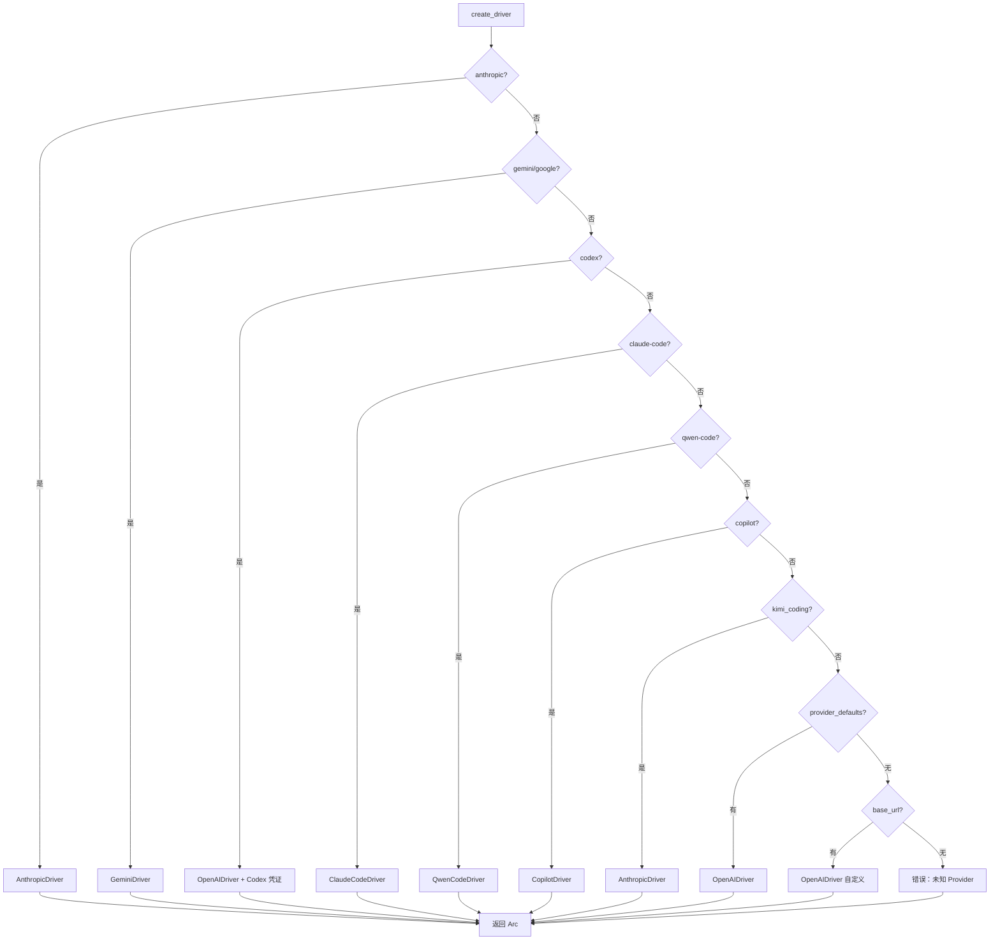

# 第 9 节：LLM Driver — 实现

> **版本**: v0.5.2 (2026-03-29)
> **核心文件**:
> - `crates/openfang-runtime/src/drivers/mod.rs`
> - `crates/openfang-runtime/src/drivers/anthropic.rs`
> - `crates/openfang-runtime/src/drivers/openai.rs`
> - `crates/openfang-runtime/src/drivers/vertex.rs` (v0.5.2 新增)
> - `crates/openfang-runtime/src/drivers/fallback.rs`

## 学习目标

- [ ] 掌握 27+ Provider 的配置和分类
- [ ] 理解 AnthropicDriver 的实现细节
- [ ] 理解 OpenAIDriver 的通用适配模式
- [ ] 掌握 FallbackDriver 的回退机制
- [ ] 了解特殊 Provider（Claude Code、Copilot）的实现
- [ ] 了解 Vertex AI 企业版驱动 (v0.5.2 新增)

---

## 1. Provider 总览

### 文件位置
`crates/openfang-runtime/src/drivers/mod.rs:36-225`

OpenFang 支持 **27+ Provider**，分为以下几类：

### 1.1 主流云服务商

| Provider | Base URL | API Key 环境变量 | 必需 |
|----------|----------|------------------|------|
| `anthropic` | `https://api.anthropic.com` | `ANTHROPIC_API_KEY` | ✅ |
| `openai` | `https://api.openai.com/v1` | `OPENAI_API_KEY` | ✅ |
| `gemini` / `google` | `https://generativelanguage.googleapis.com` | `GEMINI_API_KEY` | ✅ |
| `groq` | `https://api.groq.com/openai/v1` | `GROQ_API_KEY` | ✅ |

### 1.2 聚合平台

| Provider | Base URL | API Key 环境变量 | 必需 |
|----------|----------|------------------|------|
| `openrouter` | `https://openrouter.ai/api/v1` | `OPENROUTER_API_KEY` | ✅ |
| `together` | `https://api.together.xyz/v1` | `TOGETHER_API_KEY` | ✅ |
| `fireworks` | `https://api.fireworks.ai/inference/v1` | `FIREWORKS_API_KEY` | ✅ |
| `replicate` | `https://api.replicate.com/v1` | `REPLICATE_API_TOKEN` | ✅ |

### 1.3 高速推理服务

| Provider | Base URL | API Key 环境变量 | 必需 |
|----------|----------|------------------|------|
| `groq` | `https://api.groq.com/openai/v1` | `GROQ_API_KEY` | ✅ |
| `cerebras` | `https://api.cerebras.ai/v1` | `CEREBRAS_API_KEY` | ✅ |
| `chutes` | `https://chutes.ai/v1` | `CHUTES_API_KEY` | ✅ |

### 1.4 本地/自托管

| Provider | Base URL | API Key 环境变量 | 必需 |
|----------|----------|------------------|------|
| `ollama` | `http://localhost:11434` | `OLLAMA_API_KEY` | ❌ |
| `vllm` | `http://localhost:8000/v1` | `VLLM_API_KEY` | ❌ |
| `lmstudio` | `http://localhost:1234/v1` | `LMSTUDIO_API_KEY` | ❌ |
| `lemonade` | `http://localhost:8000/v1` | `LEMONADE_API_KEY` | ❌ |

### 1.5 中国服务商

| Provider | Base URL | API Key 环境变量 | 必需 |
|----------|----------|------------------|------|
| `deepseek` | `https://api.deepseek.com/v1` | `DEEPSEEK_API_KEY` | ✅ |
| `moonshot` / `kimi` | `https://api.moonshot.cn/v1` | `MOONSHOT_API_KEY` | ✅ |
| `kimi_coding` | `https://api.kimi.com/coding` | `KIMI_API_KEY` | ✅ |
| `qwen` / `dashscope` | `https://dashscope.aliyuncs.com/compatible-mode/v1` | `DASHSCOPE_API_KEY` | ✅ |
| `minimax` | `https://api.minimax.chat/v1` | `MINIMAX_API_KEY` | ✅ |
| `zhipu` / `glm` | `https://open.bigmodel.cn/api/paas/v4` | `ZHIPU_API_KEY` | ✅ |
| `zhipu_coding` / `codegeex` | `https://maas.aminer.cn/api/paas/v4` | `ZHIPU_API_KEY` | ✅ |
| `zai` / `z.ai` | `https://z.ai/api/paas/v4` | `ZHIPU_API_KEY` | ✅ |
| `qianfan` / `baidu` | `https://qianfan.baidubce.com/v2` | `QIANFAN_API_KEY` | ✅ |
| `volcengine` / `doubao` | `https://ark.cn-beijing.volces.com/api/v3` | `VOLCENGINE_API_KEY` | ✅ |

### 1.6 其他云服务商

| Provider | Base URL | API Key 环境变量 | 必需 |
|----------|----------|------------------|------|
| `mistral` | `https://api.mistral.ai/v1` | `MISTRAL_API_KEY` | ✅ |
| `cohere` | `https://api.cohere.com/v2` | `COHERE_API_KEY` | ✅ |
| `ai21` | `https://api.ai21.com/foundation/v1` | `AI21_API_KEY` | ✅ |
| `perplexity` | `https://api.perplexity.ai` | `PERPLEXITY_API_KEY` | ✅ |
| `xai` | `https://api.x.ai/v1` | `XAI_API_KEY` | ✅ |
| `sambanova` | `https://api.sambanova.io/v1` | `SAMBANOVA_API_KEY` | ✅ |
| `huggingface` | `https://api-inference.huggingface.co/v1` | `HF_API_KEY` | ✅ |
| `nvidia` / `nvidia-nim` | `https://integrate.api.nvidia.com/v1` | `NVIDIA_API_KEY` | ✅ |
| `venice` | `https://api.venice.ai/api/v1` | `VENICE_API_KEY` | ✅ |

### 1.7 特殊 Provider

| Provider | 类型 | 说明 |
|----------|------|------|
| `claude-code` | CLI | 调用本地 Claude Code CLI（无 API key） |
| `qwen-code` | CLI | 调用本地 Qwen Code CLI（OAuth 免费） |
| `github-copilot` / `copilot` | Token 交换 | GitHub PAT → Copilot API Token |
| `codex` / `openai-codex` | 凭证同步 | 复用 Codex CLI 的配置 |
| `vertex-ai` / `vertex` / `google-vertex` | OAuth | GCP 服务账号 OAuth (v0.5.2 新增) |

---

## 2. create_driver 工厂函数

### 文件位置
`crates/openfang-runtime/src/drivers/mod.rs:252-433`

```rust
pub fn create_driver(config: &DriverConfig) -> Result<Arc<dyn LlmDriver>, LlmError> {
    let provider = config.provider.as_str();

    // 1. Anthropic — 特殊 API 格式
    if provider == "anthropic" {
        let api_key = config.api_key.clone()
            .or_else(|| std::env::var("ANTHROPIC_API_KEY").ok())
            .ok_or_else(|| LlmError::MissingApiKey(...))?;
        let base_url = config.base_url.clone().unwrap_or(ANTHROPIC_BASE_URL);
        return Ok(Arc::new(anthropic::AnthropicDriver::new(api_key, base_url)));
    }

    // 2. Gemini — 特殊 API 格式
    if provider == "gemini" || provider == "google" {
        let api_key = config.api_key.clone()
            .or_else(|| std::env::var("GEMINI_API_KEY").ok())
            .or_else(|| std::env::var("GOOGLE_API_KEY").ok())
            .ok_or_else(|| LlmError::MissingApiKey(...))?;
        let base_url = config.base_url.clone().unwrap_or(GEMINI_BASE_URL);
        return Ok(Arc::new(gemini::GeminiDriver::new(api_key, base_url)));
    }

    // 3. Codex — 凭证同步
    if provider == "codex" || provider == "openai-codex" {
        let api_key = config.api_key.clone()
            .or_else(|| std::env::var("OPENAI_API_KEY").ok())
            .or_else(crate::model_catalog::read_codex_credential)
            .ok_or_else(|| LlmError::MissingApiKey(...))?;
        let base_url = config.base_url.clone().unwrap_or(OPENAI_BASE_URL);
        return Ok(Arc::new(openai::OpenAIDriver::new(api_key, base_url)));
    }

    // 4. Claude Code — CLI 调用
    if provider == "claude-code" {
        let cli_path = config.base_url.clone();
        return Ok(Arc::new(claude_code::ClaudeCodeDriver::new(
            cli_path, config.skip_permissions,
        )));
    }

    // 5. Qwen Code — CLI 调用
    if provider == "qwen-code" {
        let cli_path = config.base_url.clone();
        return Ok(Arc::new(qwen_code::QwenCodeDriver::new(
            cli_path, config.skip_permissions,
        )));
    }

    // 6. GitHub Copilot — Token 交换
    if provider == "github-copilot" || provider == "copilot" {
        let github_token = config.api_key.clone()
            .or_else(|| std::env::var("GITHUB_TOKEN").ok())
            .ok_or_else(|| LlmError::MissingApiKey(...))?;
        let base_url = config.base_url.clone().unwrap_or(GITHUB_COPILOT_BASE_URL);
        return Ok(Arc::new(copilot::CopilotDriver::new(github_token, base_url)));
    }

    // 7. Kimi for Code — Anthropic 兼容
    if provider == "kimi_coding" {
        let api_key = config.api_key.clone()
            .or_else(|| std::env::var("KIMI_API_KEY").ok())
            .ok_or_else(|| LlmError::MissingApiKey(...))?;
        let base_url = config.base_url.clone().unwrap_or(KIMI_CODING_BASE_URL);
        return Ok(Arc::new(anthropic::AnthropicDriver::new(api_key, base_url)));
    }

    // 8. 通用 OpenAI 兼容格式
    if let Some(defaults) = provider_defaults(provider) {
        let api_key = config.api_key.clone()
            .or_else(|| std::env::var(defaults.api_key_env).ok())
            .unwrap_or_default();
        if defaults.key_required && api_key.is_empty() {
            return Err(LlmError::MissingApiKey(...));
        }
        let base_url = config.base_url.clone()
            .unwrap_or_else(|| defaults.base_url.to_string());
        return Ok(Arc::new(openai::OpenAIDriver::new(api_key, base_url)));
    }

    // 9. 自定义 Provider（有 base_url）
    if let Some(ref base_url) = config.base_url {
        let api_key = config.api_key.clone().unwrap_or_else(|| {
            let env_var = format!("{}_API_KEY", provider.to_uppercase().replace('-', "_"));
            std::env::var(&env_var).unwrap_or_default()
        });
        return Ok(Arc::new(openai::OpenAIDriver::new(api_key, base_url.clone())));
    }

    // 10. 未知 Provider 错误
    Err(LlmError::Api {
        status: 0,
        message: format!("Unknown provider '{}'. Supported: ...", provider),
    })
}
```

### 处理流程



---

## 3. AnthropicDriver 实现

### 文件位置
`crates/openfang-runtime/src/drivers/anthropic.rs`

### 3.1 结构体定义

```rust
/// Anthropic Claude API driver.
pub struct AnthropicDriver {
    api_key: Zeroizing<String>,  // 安全：自动清零
    base_url: String,
    client: reqwest::Client,
}
```

### 3.2 API 请求结构

```rust
/// Anthropic Messages API request body.
#[derive(Debug, Serialize)]
struct ApiRequest {
    model: String,
    max_tokens: u32,
    #[serde(skip_serializing_if = "Option::is_none")]
    system: Option<String>,  // 系统提示单独传
    messages: Vec<ApiMessage>,
    #[serde(skip_serializing_if = "Vec::is_empty")]
    tools: Vec<ApiTool>,
    #[serde(skip_serializing_if = "Option::is_none")]
    temperature: Option<f32>,
    #[serde(skip_serializing_if = "std::ops::Not::not")]
    stream: bool,
}
```

### 3.3 complete() 实现

```rust
async fn complete(&self, request: CompletionRequest) -> Result<CompletionResponse, LlmError> {
    // 1. 提取系统提示
    let system = request.system.clone().or_else(|| {
        request.messages.iter().find_map(|m| {
            if m.role == Role::System {
                match &m.content {
                    MessageContent::Text(t) => Some(t.clone()),
                    _ => None,
                }
            } else { None }
        })
    });

    // 2. 转换消息格式
    let api_messages: Vec<ApiMessage> = request.messages
        .iter()
        .filter(|m| m.role != Role::System)  // 过滤系统消息
        .map(convert_message)
        .collect();

    // 3. 转换工具定义
    let api_tools: Vec<ApiTool> = request.tools
        .iter()
        .map(|t| ApiTool {
            name: t.name.clone(),
            description: t.description.clone(),
            input_schema: t.input_schema.clone(),
        })
        .collect();

    // 4. 构建 API 请求
    let api_request = ApiRequest {
        model: request.model,
        max_tokens: request.max_tokens,
        system,
        messages: api_messages,
        tools: api_tools,
        temperature: Some(request.temperature),
        stream: false,
    };

    // 5. 重试循环（429/529）
    let max_retries = 3;
    for attempt in 0..=max_retries {
        let url = format!("{}/v1/messages", self.base_url);
        let resp = self.client.post(&url)
            .header("x-api-key", self.api_key.as_str())
            .header("anthropic-version", "2023-06-01")
            .header("content-type", "application/json")
            .json(&api_request)
            .send()
            .await
            .map_err(|e| LlmError::Http(e.to_string()))?;

        let status = resp.status().as_u16();

        // 6. 处理速率限制
        if status == 429 || status == 529 {
            if attempt < max_retries {
                let retry_ms = (attempt + 1) as u64 * 2000;
                warn!(status, retry_ms, "Rate limited, retrying");
                tokio::time::sleep(std::time::Duration::from_millis(retry_ms)).await;
                continue;
            }
            return Err(if status == 429 {
                LlmError::RateLimited { retry_after_ms: 5000 }
            } else {
                LlmError::Overloaded { retry_after_ms: 5000 }
            });
        }

        // 7. 处理 HTTP 错误
        if !resp.status().is_success() {
            let body = resp.text().await.unwrap_or_default();
            let message = serde_json::from_str::<ApiErrorResponse>(&body)
                .map(|e| e.error.message)
                .unwrap_or(body);
            return Err(LlmError::Api { status, message });
        }

        // 8. 解析响应
        let body = resp.text().await.map_err(|e| LlmError::Http(e.to_string()))?;
        let api_response: ApiResponse = serde_json::from_str(&body)
            .map_err(|e| LlmError::Parse(e.to_string()))?;

        return Ok(convert_response(api_response));
    }

    Err(LlmError::Api { status: 0, message: "Max retries exceeded".to_string() })
}
```

### 3.4 流式实现

```rust
async fn stream(
    &self,
    request: CompletionRequest,
    tx: tokio::sync::mpsc::Sender<StreamEvent>,
) -> Result<CompletionResponse, LlmError> {
    // ... 构建请求（与 complete 类似，但 stream: true）

    // 1. 发送请求获取流
    let mut byte_stream = resp.bytes_stream();
    let mut buffer = String::new();
    let mut blocks: Vec<ContentBlockAccum> = Vec::new();
    let mut stop_reason = StopReason::EndTurn;
    let mut usage = TokenUsage::default();

    // 2. 解析 SSE 事件
    while let Some(chunk_result) = byte_stream.next().await {
        let chunk = chunk_result.map_err(|e| LlmError::Http(e.to_string()))?;
        buffer.push_str(&String::from_utf8_lossy(&chunk));

        // 3. 按 \n\n 分割事件
        while let Some(pos) = buffer.find("\n\n") {
            let event_text = buffer[..pos].to_string();
            buffer = buffer[pos + 2..].to_string();

            // 4. 解析 event: 和 data: 行
            let mut event_type = String::new();
            let mut data = String::new();
            for line in event_text.lines() {
                if let Some(et) = line.strip_prefix("event:") {
                    event_type = et.trim_start().to_string();
                } else if let Some(d) = line.strip_prefix("data:") {
                    data = d.trim_start().to_string();
                }
            }

            // 5. 根据事件类型处理
            match event_type.as_str() {
                "message_start" => { /* 提取 input_tokens */ }
                "content_block_start" => { /* 创建内容块 Accumulator */ }
                "content_block_delta" => { /* 发送 TextDelta/ToolInputDelta */ }
                "content_block_stop" => { /* 发送 ToolUseEnd */ }
                "message_delta" => { /* 提取 stop_reason 和 output_tokens */ }
                _ => {}
            }
        }
    }

    // 6. 构建最终响应
    Ok(CompletionResponse { content, stop_reason, tool_calls, usage })
}
```

### 3.5 消息转换

```rust
/// Convert an OpenFang Message to an Anthropic API message.
fn convert_message(msg: &Message) -> ApiMessage {
    let role = match msg.role {
        Role::User => "user",
        Role::Assistant => "assistant",
        Role::System => "user",  // 应被过滤，但防御性处理
    };

    let content = match &msg.content {
        MessageContent::Text(text) => ApiContent::Text(text.clone()),
        MessageContent::Blocks(blocks) => {
            let api_blocks: Vec<ApiContentBlock> = blocks.iter().filter_map(|block| {
                match block {
                    ContentBlock::Text { text, .. } => {
                        Some(ApiContentBlock::Text { text: text.clone() })
                    }
                    ContentBlock::Image { media_type, data } => {
                        Some(ApiContentBlock::Image {
                            source: ApiImageSource {
                                source_type: "base64".to_string(),
                                media_type: media_type.clone(),
                                data: data.clone(),
                            },
                        })
                    }
                    ContentBlock::ToolUse { id, name, input, .. } => {
                        Some(ApiContentBlock::ToolUse {
                            id: id.clone(),
                            name: name.clone(),
                            input: input.clone(),
                        })
                    }
                    ContentBlock::ToolResult { tool_use_id, content, is_error, .. } => {
                        Some(ApiContentBlock::ToolResult {
                            tool_use_id: tool_use_id.clone(),
                            content: content.clone(),
                            is_error: *is_error,
                        })
                    }
                    ContentBlock::Thinking { .. } => None,
                    ContentBlock::Unknown => None,
                }
            }).collect();
            ApiContent::Blocks(api_blocks)
        }
    };

    ApiMessage { role: role.to_string(), content }
}
```

---

## 4. OpenAIDriver 实现

### 文件位置
`crates/openfang-runtime/src/drivers/openai.rs`

### 4.1 设计模式：通用适配器

```rust
/// OpenAI-compatible API driver.
pub struct OpenAIDriver {
    api_key: Zeroizing<String>,
    base_url: String,
    client: reqwest::Client,
    extra_headers: Vec<(String, String)>,  // 支持自定义头
}
```

**复用性**：以下 Provider 都使用 `OpenAIDriver`：
- OpenAI、Groq、OpenRouter、DeepSeek、Together、Mistral、Fireworks
- Ollama、vLLM、LM Studio（本地）
- Perplexity、Cohere、AI21、Cerebras、SambaNova
- HuggingFace、xAI、Replicate、Chutes、Venice、NVIDIA
- Moonshot、Qwen、Minimax、Zhipu、ZAI、Qianfan、Volcengine

### 4.2 关键特性

```rust
impl OpenAIDriver {
    pub fn new(api_key: String, base_url: String) -> Self {
        Self {
            api_key: Zeroizing::new(api_key),
            base_url,
            client: reqwest::Client::builder()
                .user_agent(crate::USER_AGENT)
                .build()
                .unwrap_or_default(),
            extra_headers: Vec::new(),
        }
    }

    // Kimi for Code 特殊处理：需要 reasoning_content
    fn kimi_needs_reasoning_content(&self, model: &str) -> bool {
        self.base_url.contains("moonshot") || model.to_lowercase().contains("kimi")
    }

    // Copilot 需要额外头
    pub fn with_extra_headers(mut self, headers: Vec<(String, String)>) -> Self {
        self.extra_headers = headers;
        self
    }
}
```

### 4.3 流式实现（SSE 解析）

```rust
async fn stream(
    &self,
    request: CompletionRequest,
    tx: tokio::sync::mpsc::Sender<StreamEvent>,
) -> Result<CompletionResponse, LlmError> {
    // ... 构建请求，stream: true

    let mut byte_stream = resp.bytes_stream();
    let mut buffer = String::new();
    let mut content_blocks = Vec::new();
    let mut tool_calls = Vec::new();
    let mut stop_reason = StopReason::EndTurn;
    let mut usage = TokenUsage::default();

    while let Some(chunk) = byte_stream.next().await {
        let text = String::from_utf8_lossy(&chunk.map_err(|e| LlmError::Http(e.to_string()))?);
        buffer.push_str(&text);

        // OpenAI SSE 格式：data: {...}\n\n
        while let Some(line_end) = buffer.find("\n\n") {
            let line = &buffer[..line_end];
            buffer = buffer[line_end + 2..].to_string();

            if let Some(data) = line.strip_prefix("data: ") {
                if data.trim() == "[DONE]" {
                    break;
                }

                let json: serde_json::Value = serde_json::from_str(data)
                    .map_err(|e| LlmError::Parse(e.to_string()))?;

                // 解析 choice 数组
                if let Some(choices) = json["choices"].as_array() {
                    for choice in choices {
                        let delta = &choice["delta"];

                        // 文本增量
                        if let Some(text) = delta["content"].as_str() {
                            let _ = tx.send(StreamEvent::TextDelta { text: text.to_string() }).await;
                        }

                        // 工具调用
                        if let Some(tool_calls_arr) = delta["tool_calls"].as_array() {
                            for tc in tool_calls_arr {
                                // 解析 tool_call delta
                            }
                        }

                        // 停止原因
                        if let Some(finish_reason) = choice["finish_reason"].as_str() {
                            stop_reason = match finish_reason {
                                "stop" => StopReason::EndTurn,
                                "tool_calls" => StopReason::ToolUse,
                                "length" => StopReason::MaxTokens,
                                _ => StopReason::EndTurn,
                            };
                        }
                    }
                }

                // Token usage
                if let Some(usage_data) = json["usage"].as_object() {
                    if let Some(prompt) = usage_data["prompt_tokens"].as_u64() {
                        usage.input_tokens = prompt;
                    }
                    if let Some(completion) = usage_data["completion_tokens"].as_u64() {
                        usage.output_tokens = completion;
                    }
                }
            }
        }
    }

    Ok(CompletionResponse { content: content_blocks, stop_reason, tool_calls, usage })
}
```

---

## 5. FallbackDriver 实现

### 文件位置
`crates/openfang-runtime/src/drivers/fallback.rs`

### 5.1 结构体定义

```rust
/// A driver that wraps multiple LLM drivers and tries each in order.
pub struct FallbackDriver {
    drivers: Vec<(Arc<dyn LlmDriver>, String)>,  // (driver, model_name) pairs
}

impl FallbackDriver {
    /// 简单模式：所有 driver 使用请求中的 model 字段
    pub fn new(drivers: Vec<Arc<dyn LlmDriver>>) -> Self {
        Self {
            drivers: drivers.into_iter().map(|d| (d, String::new())).collect(),
        }
    }

    /// 显式模式：每个 driver 指定 model 名称
    pub fn with_models(drivers: Vec<(Arc<dyn LlmDriver>, String)>) -> Self {
        Self { drivers }
    }
}
```

### 5.2 complete() 实现

```rust
#[async_trait]
impl LlmDriver for FallbackDriver {
    async fn complete(&self, request: CompletionRequest) -> Result<CompletionResponse, LlmError> {
        let mut last_error = None;

        for (i, (driver, model_name)) in self.drivers.iter().enumerate() {
            let mut req = request.clone();

            // 如果指定了 model 名称，覆盖请求中的 model
            if !model_name.is_empty() {
                req.model = model_name.clone();
            }

            match driver.complete(req).await {
                Ok(response) => return Ok(response),  // 成功立即返回
                Err(e) => {
                    warn!(
                        driver_index = i,
                        model = %model_name,
                        error = %e,
                        "Fallback driver failed, trying next"
                    );
                    last_error = Some(e);
                    // 继续尝试下一个 driver
                }
            }
        }

        // 所有 driver 都失败，返回最后一个错误
        Err(last_error.unwrap_or_else(|| LlmError::Api {
            status: 0,
            message: "No drivers configured in fallback chain".to_string(),
        }))
    }

    // stream() 类似
}
```

### 5.3 回退行为

| 错误类型 | 是否回退 | 说明 |
|----------|----------|------|
| `RateLimited` | ✅ | 速率限制，尝试下一个 |
| `Overloaded` | ✅ | 模型过载，尝试下一个 |
| `Http` | ✅ | 网络错误，尝试下一个 |
| `Api` | ✅ | API 错误，尝试下一个 |
| `ModelNotFound` | ✅ | 模型不存在，尝试下一个 |
| `AuthenticationFailed` | ⚠️ | 认证失败（可能所有 driver 共享 key） |

### 5.4 使用场景

**场景 1：跨 Provider Fallback**
```
Primary: Anthropic (claude-sonnet-4)
  ↓ 失败
Fallback 1: OpenAI (gpt-4o)
  ↓ 失败
Fallback 2: Groq (llama-3.3-70b)
```

**场景 2：同 Provider 多 Model**
```
Primary: OpenAI (o1-pro)
  ↓ 配额耗尽
Fallback 1: OpenAI (o3-mini)
  ↓ 速率限制
Fallback 2: OpenAI (gpt-4o)
```

---

## 6. 特殊 Provider 实现

### 6.1 ClaudeCodeDriver — CLI 调用

**核心思路**：通过 subprocess 调用 `claude` CLI

```rust
// claude_code.rs
pub struct ClaudeCodeDriver {
    cli_path: Option<String>,  // claude CLI 路径
    skip_permissions: bool,    // 跳过权限确认
}

#[async_trait]
impl LlmDriver for ClaudeCodeDriver {
    async fn complete(&self, request: CompletionRequest) -> Result<CompletionResponse, LlmError> {
        // 构建 claude CLI 命令
        let mut cmd = Command::new(self.cli_path.as_deref().unwrap_or("claude"));

        if self.skip_permissions {
            cmd.arg("--dangerously-skip-permissions");
        }

        // 通过 stdin 传递提示词
        cmd.arg("--print").arg("--verbose");

        // 执行并解析输出
        let output = cmd.output().await.map_err(|e| LlmError::Http(e.to_string()))?;

        // 解析 Claude CLI 的输出格式
        parse_claude_cli_output(&output.stdout)
    }
}
```

### 6.2 CopilotDriver — Token 交换

**核心思路**：GitHub PAT → Copilot API Token

```rust
// copilot.rs
pub struct CopilotDriver {
    github_token: Zeroizing<String>,
    base_url: String,
    cached_token: RwLock<Option<Zeroizing<String>>>,  // 缓存 Copilot Token
}

impl CopilotDriver {
    // 交换 GitHub Token → Copilot API Token
    async fn exchange_token(&self) -> Result<String, LlmError> {
        // 1. 获取 GitHub 设备代码
        let device_resp = reqwest::Client::new()
            .get("https://api.github.com/copilot_internal/v2/token")
            .header("Authorization", format!("token {}", self.github_token))
            .send()
            .await
            .map_err(|e| LlmError::Http(e.to_string()))?;

        // 2. 提取 Copilot API Token
        let token_json: serde_json::Value = device_resp.json().await
            .map_err(|e| LlmError::Parse(e.to_string()))?;

        Ok(token_json["token"].as_str().unwrap().to_string())
    }
}
```

---

## 7. detect_available_provider 自动检测

### 文件位置
`crates/openfang-runtime/src/drivers/mod.rs:439-465`

```rust
/// Detect the first available provider by scanning environment variables.
pub fn detect_available_provider() -> Option<(&'static str, &'static str, &'static str)> {
    // 优先级顺序：流行云服务商 → 小众 → 本地
    const PROBE_ORDER: &[(&str, &str, &str)] = &[
        ("openai", "gpt-4o", "OPENAI_API_KEY"),
        ("anthropic", "claude-sonnet-4-20250514", "ANTHROPIC_API_KEY"),
        ("gemini", "gemini-2.5-flash", "GEMINI_API_KEY"),
        ("groq", "llama-3.3-70b-versatile", "GROQ_API_KEY"),
        ("deepseek", "deepseek-chat", "DEEPSEEK_API_KEY"),
        ("openrouter", "openrouter/google/gemini-2.5-flash", "OPENROUTER_API_KEY"),
        ("mistral", "mistral-large-latest", "MISTRAL_API_KEY"),
        ("together", "meta-llama/Llama-3-70b-chat-hf", "TOGETHER_API_KEY"),
        ("fireworks", "accounts/fireworks/models/llama-v3p1-70b-instruct", "FIREWORKS_API_KEY"),
        ("xai", "grok-2", "XAI_API_KEY"),
        ("perplexity", "llama-3.1-sonar-large-128k-online", "PERPLEXITY_API_KEY"),
        ("cohere", "command-r-plus", "COHERE_API_KEY"),
    ];

    for &(provider, model, env_var) in PROBE_ORDER {
        if std::env::var(env_var).ok().filter(|v| !v.is_empty()).is_some() {
            return Some((provider, model, env_var));
        }
    }

    // 检查 GOOGLE_API_KEY（Gemini 别名）
    if std::env::var("GOOGLE_API_KEY").ok().filter(|v| !v.is_empty()).is_some() {
        return Some(("gemini", "gemini-2.5-flash", "GOOGLE_API_KEY"));
    }

    None
}
```

**用途**：Kernel boot 时自动检测可用 Provider

---

## 8. 测试代码

### 8.1 Provider 默认配置测试

```rust
#[test]
fn test_provider_defaults_groq() {
    let d = provider_defaults("groq").unwrap();
    assert_eq!(d.base_url, "https://api.groq.com/openai/v1");
    assert_eq!(d.api_key_env, "GROQ_API_KEY");
    assert!(d.key_required);
}

#[test]
fn test_provider_defaults_ollama() {
    let d = provider_defaults("ollama").unwrap();
    assert!(!d.key_required);  // 本地模型不需要 key
}
```

### 8.2 自定义 Provider 测试

```rust
#[test]
fn test_custom_provider_with_base_url() {
    let config = DriverConfig {
        provider: "my-custom-llm".to_string(),
        api_key: Some("test".to_string()),
        base_url: Some("http://localhost:9999/v1".to_string()),
        skip_permissions: true,
    };
    let driver = create_driver(&config);
    assert!(driver.is_ok());  // 使用 OpenAIDriver
}
```

### 8.3 Fallback 测试

```rust
#[tokio::test]
async fn test_fallback_primary_fails_secondary_succeeds() {
    struct FailDriver;  // 总是失败
    struct OkDriver;    // 总是成功

    let driver = FallbackDriver::new(vec![
        Arc::new(FailDriver) as Arc<dyn LlmDriver>,
        Arc::new(OkDriver) as Arc<dyn LlmDriver>,
    ]);

    let result = driver.complete(test_request()).await;
    assert!(result.is_ok());  // Fallback 成功
}
```

---

## 9. 关键设计点

### 9.1 策略模式：统一接口，多实现

```
                     LlmDriver (trait)
                          ↑
        ┌─────────────────┼─────────────────┐
        │                 │                 │
   AnthropicDriver   OpenAIDriver   GeminiDriver
        ↑                 ↑                 ↑
   (特殊格式)      (OpenAI 兼容格式)   (特殊格式)
```

**优点**：
- Agent Loop 无需关心具体实现
- 新增 Provider 只需实现 trait
- 运行时可切换（Fallback）

### 9.2 工厂模式：create_driver

```
DriverConfig → create_driver() → Arc<dyn LlmDriver>
```

**职责**：
- 根据 provider 名称选择实现
- 处理 API Key 解析链
- 处理 Base URL 默认值
- 处理特殊 Provider（CLI、Token 交换）

### 9.3 适配器模式：OpenAIDriver

**复用范围**：27+ Provider 中 20+ 使用 OpenAIDriver

```
Provider                    Base URL
─────────────────────────────────────────────────────
OpenAI                      api.openai.com
Groq                        api.groq.com/openai/v1
OpenRouter                  openrouter.ai/api/v1
DeepSeek                    api.deepseek.com/v1
Ollama                      localhost:11434
vLLM                        localhost:8000/v1
... (20+)
```

**优势**：
- 代码复用率高
- 新增 provider 只需配置 base_url
- 测试覆盖充分

### 9.4 链式责任：FallbackDriver

```
Request → Driver 1 → 失败 → Driver 2 → 失败 → Driver 3 → 成功
                                    ↓                  ↓
                               记录日志              返回响应
```

**行为**：
- 按顺序尝试
- 非重试错误也回退（如 ModelNotFound）
- 所有失败才返回错误

---

## 8. VertexAIDriver — GCP 企业版 (v0.5.2 新增)

### 文件位置
`crates/openfang-runtime/src/drivers/vertex.rs` (794 行)

### 8.1 结构体定义

```rust
pub struct VertexAIDriver {
    project_id: String,                              // GCP 项目 ID
    region: String,                                  // GCP 区域（默认 us-central1）
    token_cache: Arc<RwLock<TokenCache>>,            // OAuth 令牌缓存
    client: reqwest::Client,
}

struct TokenCache {
    token: Option<Zeroizing<String>>,                // 零化令牌（内存安全）
    expires_at: Option<Instant>,                     // 过期时间
}
```

### 8.2 OAuth 认证机制

Vertex AI 使用 **OAuth 2.0 Bearer Token** 认证，与 Anthropic 的 `x-api-key` 和 Gemini 的 `x-goog-api-key` 完全不同。

**三级降级策略**（获取 access token）：

```rust
// vertex.rs:127-177
async fn fetch_access_token(&self) -> Result<String, LlmError> {
    // 1. 环境变量直接提供（测试用）
    if let Ok(token) = std::env::var("VERTEX_AI_ACCESS_TOKEN") {
        return Ok(token);
    }

    // 2. Application Default Credentials
    let output = Command::new("gcloud")
        .args(["auth", "application-default", "print-access-token"])
        .output().await?;

    // 3. 常规 gcloud auth
    if !output.status.success() {
        let output = Command::new("gcloud")
            .args(["auth", "print-access-token"])
            .output().await?;
    }
}
```

**令牌缓存**：
- 使用 `Arc<RwLock<TokenCache>>` 线程安全缓存
- `Zeroizing<String>` 确保 drop 时令牌被清零
- 缓存有效期 50 分钟（OAuth 令牌通常 1 小时过期）

**所需环境变量**：

| 环境变量 | 用途 | 必须 |
|----------|------|------|
| `GOOGLE_APPLICATION_CREDENTIALS` | 服务账号 JSON 文件路径 | 是 |
| `GOOGLE_CLOUD_PROJECT` | GCP 项目 ID | 否（可从 JSON 读取） |
| `GOOGLE_CLOUD_REGION` | GCP 区域 | 否（默认 `us-central1`） |
| `VERTEX_AI_ACCESS_TOKEN` | 预生成令牌 | 否（测试用） |

### 8.3 与 Gemini 驱动的对比

Vertex AI 本质上是 Gemini API 的企业版，但有几个关键差异：

| 维度 | Vertex AI | Gemini |
|------|-----------|--------|
| **认证** | OAuth 2.0 Bearer Token | API Key |
| **端点** | `{region}-aiplatform.googleapis.com/v1/projects/...` | `generativelanguage.googleapis.com/v1beta/models/...` |
| **Thinking 支持** | 不支持 | 支持（thought_signature） |
| **流式事件** | 仅 TextDelta + ContentComplete | 完整事件（ToolUseStart/InputDelta/End） |
| **ToolUse ID** | `call_{uuid前8位}` 自行生成 | API 返回原始 ID |
| **重试状态码** | 429, 503 | 同上 |

### 8.4 端点 URL 格式

```
非流式: https://{region}-aiplatform.googleapis.com/v1/projects/{project}/locations/{region}/publishers/google/models/{model}:generateContent
流式:   ...models/{model}:streamGenerateContent?alt=sse
```

### 8.5 工厂注册

```rust
// drivers/mod.rs:383-411
if provider == "vertex-ai" || provider == "vertex" || provider == "google-vertex" {
    let project_id = std::env::var("GOOGLE_CLOUD_PROJECT")
        .or_else(|_| std::env::var("GCLOUD_PROJECT"))
        .or_else(|_| { /* 从服务账号 JSON 读取 project_id */ })
        .map_err(|_| LlmError::MissingApiKey(...))?;

    let region = std::env::var("GOOGLE_CLOUD_REGION")
        .or_else(|_| std::env::var("VERTEX_AI_REGION"))
        .unwrap_or_else(|_| "us-central1".to_string());

    return Ok(Arc::new(vertex::VertexAIDriver::new(project_id, region)));
}
```

支持 3 个 provider 别名：`"vertex-ai"`, `"vertex"`, `"google-vertex"`。

### 8.6 配置示例

```toml
[default_model]
provider = "vertex-ai"
model = "gemini-2.0-flash"
```

### 9.5 安全设计

| 特性 | 实现 | 说明 |
|------|------|------|
| API Key 脱敏 | `Debug` 实现 | 日志中显示 `<redacted>` |
| 安全内存 | `Zeroizing<String>` | 退出时自动清零 |
| 凭证链 | Vault → Dotenv → EnvVar | 优先级明确 |

---

## 10. 健康检查机制

### 文件位置
`crates/openfang-kernel/src/kernel.rs` (推断自使用)

```rust
// 健康检查配置
pub struct HealthCheckConfig {
    /// 健康检查间隔（秒）
    pub interval_secs: u64,
    /// 超时阈值（毫秒）
    pub timeout_ms: u64,
    /// 连续失败次数触发断路器
    pub failure_threshold: u32,
}

impl HealthCheck {
    /// 定期探测 Provider 可用性
    pub async fn probe(&self, driver: &dyn LlmDriver) -> bool {
        let test_request = CompletionRequest {
            model: "test".to_string(),
            messages: vec![Message::user("Say 'OK' in 1 word.")],
            tools: vec![],
            max_tokens: 10,
            temperature: 0.0,
            system: None,
            thinking: None,
        };

        match tokio::time::timeout(
            Duration::from_millis(self.config.timeout_ms),
            driver.complete(test_request)
        ).await {
            Ok(Ok(_)) => true,
            _ => false,
        }
    }
}
```

**用途**：
- 定期探测 Provider 状态
- 提前发现故障切换到 Fallback
- Dashboard 显示健康状态

---

## 完成检查清单

- [ ] 掌握 27+ Provider 的配置和分类
- [ ] 理解 AnthropicDriver 的实现细节
- [ ] 理解 OpenAIDriver 的通用适配模式
- [ ] 掌握 FallbackDriver 的回退机制
- [ ] 了解特殊 Provider（Claude Code、Copilot）的实现
- [ ] 了解 Vertex AI 企业版驱动 (v0.5.2 新增)

---

## 下一步

前往 [第 10 节：工具执行 — 核心流程](./10-tool-execution-core.md)

---

*创建时间：2026-03-15 (更新于 2026-03-29 v0.5.2)*
*OpenFang v0.5.2*
