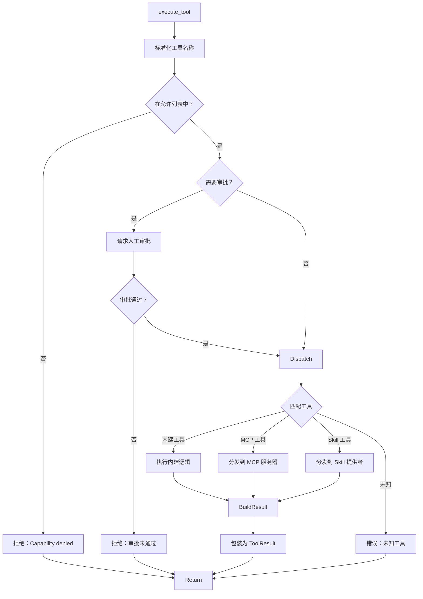

# 第 10 节：工具执行 — 核心流程

> **版本**: v0.4.4 (2026-03-15)
> **核心文件**:
> - `crates/openfang-runtime/src/tool_runner.rs`
> - `crates/openfang-types/src/tool.rs`

## 学习目标

- [ ] 理解 execute_tool 函数签名和参数
- [ ] 掌握工具定义和 ToolDefinition 结构
- [ ] 理解工具调用的 dispatch 机制
- [ ] 掌握 MCP 集成和 Skill 工具提供
- [ ] 理解 Schema 标准化处理

---

## 1. ToolDefinition — 工具定义

### 文件位置
`crates/openfang-types/src/tool.rs:5-14`

```rust
/// Definition of a tool that an agent can use.
#[derive(Debug, Clone, Serialize, Deserialize)]
pub struct ToolDefinition {
    /// Unique tool identifier.
    pub name: String,
    /// Human-readable description for the LLM.
    pub description: String,
    /// JSON Schema for the tool's input parameters.
    pub input_schema: serde_json::Value,
}
```

### 字段说明

| 字段 | 类型 | 说明 |
|------|------|------|
| `name` | `String` | 工具唯一标识符（如 `file_read`, `web_search`） |
| `description` | `String` | 人类可读描述，LLM 用于理解工具用途 |
| `input_schema` | `serde_json::Value` | JSON Schema 定义输入参数结构 |

### 示例

```rust
ToolDefinition {
    name: "web_search".to_string(),
    description: "Search the web using multiple providers...".to_string(),
    input_schema: serde_json::json!({
        "type": "object",
        "properties": {
            "query": { "type": "string", "description": "The search query" },
            "max_results": { "type": "integer", "description": "Maximum results" }
        },
        "required": ["query"]
    }),
}
```

---

## 2. ToolCall — 工具调用请求

### 文件位置
`crates/openfang-types/src/tool.rs:16-25`

```rust
/// A tool call requested by the LLM.
#[derive(Debug, Clone, Serialize, Deserialize)]
pub struct ToolCall {
    /// Unique ID for this tool use instance.
    pub id: String,
    /// Which tool to call.
    pub name: String,
    /// The input parameters.
    pub input: serde_json::Value,
}
```

### 来源

`ToolCall` 由 LLM 在响应中生成：

```rust
// LLM 响应示例
{
    "content": [...],
    "tool_calls": [
        {
            "id": "tool_123",
            "type": "function",
            "function": {
                "name": "web_search",
                "arguments": "{\"query\": \"Rust lang\"}"
            }
        }
    ]
}
```

Agent Loop 解析后转换为 `ToolCall` 结构。

---

## 3. ToolResult — 工具执行结果

### 文件位置
`crates/openfang-types/src/tool.rs:27-36`

```rust
/// Result of a tool execution.
#[derive(Debug, Clone, Serialize, Deserialize)]
pub struct ToolResult {
    /// The tool_use ID this result corresponds to.
    pub tool_use_id: String,
    /// The output content.
    pub content: String,
    /// Whether the tool execution resulted in an error.
    pub is_error: bool,
}
```

### 使用方式

```rust
// 成功结果
ToolResult {
    tool_use_id: "tool_123".to_string(),
    content: "Search results: ...".to_string(),
    is_error: false,
}

// 错误结果
ToolResult {
    tool_use_id: "tool_123".to_string(),
    content: "Error: Permission denied".to_string(),
    is_error: true,
}
```

---

## 4. execute_tool — 核心函数

### 文件位置
`crates/openfang-runtime/src/tool_runner.rs:108-510`

### 4.1 函数签名

```rust
pub async fn execute_tool(
    tool_use_id: &str,              // 工具调用唯一 ID
    tool_name: &str,                // 工具名称
    input: &serde_json::Value,      // 输入参数
    kernel: Option<&Arc<dyn KernelHandle>>,  // 内核句柄（inter-agent 工具）
    allowed_tools: Option<&[String]>,        // 允许的工具白名单
    caller_agent_id: Option<&str>,           // 调用者 Agent ID
    skill_registry: Option<&SkillRegistry>,  // 技能注册表
    mcp_connections: Option<&tokio::sync::Mutex<Vec<mcp::McpConnection>>>,
    web_ctx: Option<&WebToolsContext>,       // Web 搜索上下文
    browser_ctx: Option<&crate::browser::BrowserManager>,
    allowed_env_vars: Option<&[String]>,     // 允许的环境变量
    workspace_root: Option<&Path>,           // 工作空间根目录
    media_engine: Option<&crate::media_understanding::MediaEngine>,
    exec_policy: Option<&openfang_types::config::ExecPolicy>,
    tts_engine: Option<&crate::tts::TtsEngine>,
    docker_config: Option<&openfang_types::config::DockerSandboxConfig>,
    process_manager: Option<&crate::process_manager::ProcessManager>,
) -> ToolResult
```

### 4.2 执行流程



---

## 5. 工具分类与 Dispatch 机制

### 5.1 内建工具（Built-in Tools）

```rust
let result = match tool_name {
    // 文件系统工具
    "file_read" => tool_file_read(input, workspace_root).await,
    "file_write" => tool_file_write(input, workspace_root).await,
    "file_list" => tool_file_list(input, workspace_root).await,
    "apply_patch" => tool_apply_patch(input, workspace_root).await,

    // Web 工具
    "web_fetch" => { /* ... */ }
    "web_search" => { /* ... */ }

    // Shell 工具
    "shell_exec" => { /* ... */ }

    // Inter-agent 工具
    "agent_send" => tool_agent_send(input, kernel).await,
    "agent_spawn" => tool_agent_spawn(input, kernel, caller_agent_id).await,
    "agent_list" => tool_agent_list(kernel),
    "agent_kill" => tool_agent_kill(input, kernel),

    // 记忆工具
    "memory_store" => tool_memory_store(input, kernel),
    "memory_recall" => tool_memory_recall(input, kernel),

    // 协作工具
    "task_post" => tool_task_post(input, kernel, caller_agent_id).await,
    "task_claim" => tool_task_claim(kernel, caller_agent_id).await,
    "task_complete" => tool_task_complete(input, kernel).await,

    // 调度工具
    "schedule_create" => tool_schedule_create(input, kernel).await,
    "schedule_list" => tool_schedule_list(kernel).await,

    // 知识图谱工具
    "knowledge_add_entity" => tool_knowledge_add_entity(input, kernel).await,
    "knowledge_add_relation" => tool_knowledge_add_relation(input, kernel).await,
    "knowledge_query" => tool_knowledge_query(input, kernel).await,

    // 媒体工具
    "image_analyze" => tool_image_analyze(input).await,
    "media_describe" => tool_media_describe(input, media_engine).await,
    "media_transcribe" => tool_media_transcribe(input, media_engine).await,
    "image_generate" => tool_image_generate(input, workspace_root).await,

    // TTS/STT 工具
    "text_to_speech" => tool_text_to_speech(input, tts_engine, workspace_root).await,
    "speech_to_text" => tool_speech_to_text(input, media_engine, workspace_root).await,

    // Docker 工具
    "docker_exec" => tool_docker_exec(input, docker_config, ...).await,

    // 系统工具
    "location_get" => tool_location_get().await,
    "system_time" => Ok(tool_system_time()),

    // Cron 工具
    "cron_create" => tool_cron_create(input, kernel, caller_agent_id).await,
    "cron_list" => tool_cron_list(kernel, caller_agent_id).await,
    "cron_cancel" => tool_cron_cancel(input, kernel).await,

    // Channel 工具
    "channel_send" => tool_channel_send(input, kernel, workspace_root).await,

    // Process 工具
    "process_start" => tool_process_start(input, process_manager, ...).await,
    "process_poll" => tool_process_poll(input, process_manager).await,
    "process_write" => tool_process_write(input, process_manager).await,
    "process_kill" => tool_process_kill(input, process_manager).await,
    "process_list" => tool_process_list(process_manager, caller_agent_id).await,

    // Hand 工具
    "hand_list" => tool_hand_list(kernel).await,
    "hand_activate" => tool_hand_activate(input, kernel).await,
    "hand_status" => tool_hand_status(input, kernel).await,
    "hand_deactivate" => tool_hand_deactivate(input, kernel).await,

    // A2A 工具
    "a2a_discover" => tool_a2a_discover(input).await,
    "a2a_send" => tool_a2a_send(input, kernel).await,

    // Browser 工具
    "browser_navigate" => { /* ... */ }
    "browser_click" => { /* ... */ }
    "browser_type" => { /* ... */ }
    "browser_screenshot" => { /* ... */ }
    // ... 更多 browser 工具

    // Canvas 工具
    "canvas_present" => tool_canvas_present(input, workspace_root).await,
```

### 5.2 MCP 工具（Fallback 1）

```rust
other => {
    // Fallback 1: MCP tools (mcp_{server}_{tool} prefix)
    if mcp::is_mcp_tool(other) {
        if let Some(mcp_conns) = mcp_connections {
            if let Some(server_name) = mcp::extract_mcp_server(other) {
                let mut conns = mcp_conns.lock().await;
                if let Some(conn) = conns.iter_mut().find(|c| c.name() == server_name) {
                    debug!(tool = other, server = server_name, "Dispatching to MCP server");
                    match conn.call_tool(other, input).await {
                        Ok(content) => Ok(content),
                        Err(e) => Err(format!("MCP tool call failed: {e}")),
                    }
                } else {
                    Err(format!("MCP server '{server_name}' not connected"))
                }
            } else {
                Err(format!("Invalid MCP tool name: {other}"))
            }
        } else {
            Err(format!("MCP not available for tool: {other}"))
        }
    }
    // ...
}
```

**MCP 工具命名约定**：`mcp_{server}_{tool}`

### 5.3 Skill 工具（Fallback 2）

```rust
// Fallback 2: Skill registry tool providers
else if let Some(registry) = skill_registry {
    if let Some(skill) = registry.find_tool_provider(other) {
        debug!(tool = other, skill = %skill.manifest.skill.name, "Dispatching to skill");
        match openfang_skills::loader::execute_skill_tool(
            &skill.manifest,
            &skill.path,
            other,
            input,
        ).await {
            Ok(skill_result) => {
                let content = serde_json::to_string(&skill_result.output)
                    .unwrap_or_else(|_| skill_result.output.to_string());
                if skill_result.is_error {
                    Err(content)
                } else {
                    Ok(content)
                }
            }
            Err(e) => Err(format!("Skill execution failed: {e}")),
        }
    } else {
        Err(format!("Unknown tool: {other}"))
    }
}
```

---

## 6. 安全机制

### 6.1 能力检查（Capability Enforcement）

```rust
// Capability enforcement: reject tools not in the allowed list
if let Some(allowed) = allowed_tools {
    if !allowed.iter().any(|t| t == tool_name) {
        warn!(tool_name, "Capability denied: tool not in allowed list");
        return ToolResult {
            tool_use_id: tool_use_id.to_string(),
            content: format!("Permission denied: agent does not have capability to use tool '{tool_name}'"),
            is_error: true,
        };
    }
}
```

**用途**：防止 LLM 幻觉出不存在的工具或越权调用。

### 6.2 审批门（Approval Gate）

```rust
// Approval gate: check if this tool requires human approval before execution
if let Some(kh) = kernel {
    if kh.requires_approval(tool_name) {
        let agent_id_str = caller_agent_id.unwrap_or("unknown");
        let input_str = input.to_string();
        let summary = format!("{}: {}", tool_name, openfang_types::truncate_str(&input_str, 200));

        match kh.request_approval(agent_id_str, tool_name, &summary).await {
            Ok(true) => { /* 审批通过，继续执行 */ }
            Ok(false) => {
                return ToolResult {
                    tool_use_id: tool_use_id.to_string(),
                    content: format!("Execution denied: '{}' requires human approval and was denied.", tool_name),
                    is_error: true,
                };
            }
            Err(e) => {
                return ToolResult {
                    tool_use_id: tool_use_id.to_string(),
                    content: format!("Approval system error: {e}"),
                    is_error: true,
                };
            }
        }
    }
}
```

### 6.3 污点追踪（Taint Tracking）

#### shell_exec 污点检查

```rust
"shell_exec" => {
    let command = input["command"].as_str().unwrap_or("");

    // Layer 1: 检查 shell 元字符（命令注入）
    if let Some(reason) = crate::subprocess_sandbox::contains_shell_metacharacters(command) {
        return ToolResult {
            tool_use_id: tool_use_id.to_string(),
            content: format!("shell_exec blocked: command contains {reason}"),
            is_error: true,
        };
    }

    // Layer 2: Exec 策略检查
    if let Some(policy) = exec_policy {
        if let Err(reason) = crate::subprocess_sandbox::validate_command_allowlist(command, policy) {
            return ToolResult {
                tool_use_id: tool_use_id.to_string(),
                content: format!("shell_exec blocked: {reason}"),
                is_error: true,
            };
        }
    }

    // Layer 3: 启发式污点模式检查
    let is_full_exec = exec_policy.is_some_and(|p| p.mode == ExecSecurityMode::Full);
    if !is_full_exec {
        if let Some(violation) = check_taint_shell_exec(command) {
            return ToolResult {
                tool_use_id: tool_use_id.to_string(),
                content: format!("Taint violation: {violation}"),
                is_error: true,
            };
        }
    }

    tool_shell_exec(input, allowed_env_vars, workspace_root, exec_policy).await
}
```

#### web_fetch 污点检查

```rust
"web_fetch" => {
    // Taint check: block URLs containing secrets/PII from being exfiltrated
    let url = input["url"].as_str().unwrap_or("");
    if let Some(violation) = check_taint_net_fetch(url) {
        return ToolResult {
            tool_use_id: tool_use_id.to_string(),
            content: format!("Taint violation: {violation}"),
            is_error: true,
        };
    }
    // ...
}
```

### 6.4 check_taint_shell_exec 实现

```rust
fn check_taint_shell_exec(command: &str) -> Option<String> {
    // Layer 1: Shell 元字符注入
    if let Some(reason) = crate::subprocess_sandbox::contains_shell_metacharacters(command) {
        return Some(format!("Shell metacharacter injection blocked: {reason}"));
    }

    // Layer 2: 启发式可疑模式
    let suspicious_patterns = [
        "curl ", "wget ", "| sh", "| bash",
        "base64 -d", "eval ",
    ];
    for pattern in &suspicious_patterns {
        if command.contains(pattern) {
            let mut labels = HashSet::new();
            labels.insert(TaintLabel::ExternalNetwork);
            let tainted = TaintedValue::new(command, labels, "llm_tool_call");
            if let Err(violation) = tainted.check_sink(&TaintSink::shell_exec()) {
                return Some(violation.to_string());
            }
        }
    }
    None
}
```

### 6.5 check_taint_net_fetch 实现

```rust
fn check_taint_net_fetch(url: &str) -> Option<String> {
    // 阻止潜在的敏感信息外泄
    let exfil_patterns = [
        "api_key=", "apikey=", "token=", "secret=",
        "password=", "Authorization:",
    ];
    for pattern in &exfil_patterns {
        if url.to_lowercase().contains(&pattern.to_lowercase()) {
            let mut labels = HashSet::new();
            labels.insert(TaintLabel::Secret);
            let tainted = TaintedValue::new(url, labels, "llm_tool_call");
            if let Err(violation) = tainted.check_sink(&TaintSink::net_fetch()) {
                return Some(violation.to_string());
            }
        }
    }
    None
}
```

---

## 7. Schema 标准化

### 文件位置
`crates/openfang-runtime/src/tool_runner.rs:38-656`

### 7.1 问题背景

不同 Provider 对工具 Schema 的接受程度不同：
- **Anthropic**: 接受 `anyOf`, `$defs`, `$ref`, `const`, `format` 等高级特性
- **Gemini/Groq**: 拒绝 `anyOf`, `$schema`, `$defs`, `$ref`, `const`, `format`, `title`, `default`, `additionalProperties`

### 7.2 normalize_schema_for_provider 函数

```rust
pub fn normalize_schema_for_provider(
    schema: &serde_json::Value,
    provider: &str,
) -> serde_json::Value {
    // Anthropic 原生支持 anyOf，无需处理
    if provider == "anthropic" {
        return schema.clone();
    }
    normalize_schema_recursive(schema)
}
```

### 7.3 标准化处理内容

| 处理项 | 操作 | 影响 Provider |
|--------|------|--------------|
| `$schema` | 删除 | 所有非 Anthropic |
| `$defs` | 删除（内联 `$ref`） | Gemini, Groq 等 |
| `$ref` | 内联引用定义 | Gemini, Groq 等 |
| `anyOf` | 尝试扁平化，否则删除 | Gemini, Groq 等 |
| `oneOf` | 尝试扁平化，否则删除 | Gemini, Groq 等 |
| `const` | 删除 | Gemini, Groq 等 |
| `format` | 删除 | Gemini, Groq 等 |
| `title` | 删除 | Gemini, Groq 等 |
| `default` | 删除 | Gemini, Groq 等 |
| `additionalProperties` | 删除 | Gemini, Groq 等 |
| `examples` | 删除 | Gemini, Groq 等 |
| `$id` | 删除 | Gemini, Groq 等 |
| `$comment` | 删除 | Gemini, Groq 等 |
| `type: ["string", "null"]` | 扁平化为 `type: "string" + nullable: true` | Gemini, Groq 等 |

### 7.4 扁平化 anyOf/oneOf

```rust
fn try_flatten_any_of(any_of: &serde_json::Value) -> Option<Vec<(String, serde_json::Value)>> {
    let items = any_of.as_array()?;

    // 检查是否为 nullable 模式
    let mut has_null = false;
    let mut non_null_type = None;

    for item in items {
        let obj = item.as_object()?;
        let type_val = obj.get("type")?.as_str()?;

        if type_val == "null" {
            has_null = true;
        } else {
            non_null_type = Some(type_val.to_string());
        }
    }

    // nullable 模式：["string", "null"] → type: "string", nullable: true
    if has_null && non_null_type.is_some() {
        let mut result = vec![(
            "type".to_string(),
            serde_json::Value::String(non_null_type.unwrap()),
        )];
        result.push(("nullable".to_string(), serde_json::Value::Bool(true)));
        return Some(result);
    }

    // 无法扁平化 — 返回 None，调用者将删除该字段
    None
}
```

### 7.5 内联 $ref 引用

```rust
fn resolve_refs(obj: &serde_json::Map<String, serde_json::Value>) -> serde_json::Value {
    let defs = match obj.get("$defs").and_then(|d| d.as_object()) {
        Some(d) => d.clone(),
        None => return serde_json::Value::Object(obj.clone()),
    };

    let mut result = obj.clone();
    result.remove("$defs");  // 删除 $defs

    fn inline_refs(val: &mut serde_json::Value, defs: &serde_json::Map<String, serde_json::Value>) {
        match val {
            serde_json::Value::Object(map) => {
                // 替换 $ref 为实际定义
                if let Some(ref_val) = map.get("$ref").and_then(|r| r.as_str()) {
                    let ref_name = ref_val.strip_prefix("#/$defs/");
                    if let Some(name) = ref_name {
                        if let Some(def) = defs.get(name) {
                            *val = def.clone();
                            inline_refs(val, defs);  // 递归内联
                            return;
                        }
                    }
                }
                for v in map.values_mut() {
                    inline_refs(v, defs);
                }
            }
            serde_json::Value::Array(arr) => {
                for item in arr.iter_mut() {
                    inline_refs(item, defs);
                }
            }
            _ => {}
        }
    }

    let mut resolved = serde_json::Value::Object(result);
    inline_refs(&mut resolved, &defs);
    resolved
}
```

---

## 8. 内置工具列表

### 8.1 文件系统工具（4 个）

| 工具名 | 说明 | 输入参数 |
|--------|------|----------|
| `file_read` | 读取文件内容 | `path: string` |
| `file_write` | 写入文件内容 | `path: string`, `content: string` |
| `file_list` | 列出目录内容 | `path: string` |
| `apply_patch` | 应用 diff 补丁 | `patch: string` |

### 8.2 Web 工具（2 个）

| 工具名 | 说明 | 输入参数 |
|--------|------|----------|
| `web_fetch` | 获取 URL（SSRF 保护） | `url: string`, `method?: string`, `headers?: object`, `body?: string` |
| `web_search` | 多 Provider 搜索 | `query: string`, `max_results?: integer` |

### 8.3 Shell 工具（1 个）

| 工具名 | 说明 | 输入参数 |
|--------|------|----------|
| `shell_exec` | 执行 Shell 命令 | `command: string`, `timeout_seconds?: integer` |

### 8.4 Inter-agent 工具（4 个）

| 工具名 | 说明 | 输入参数 |
|--------|------|----------|
| `agent_send` | 发送消息给其他 Agent | `agent_id: string`, `message: string` |
| `agent_spawn` | 创建新 Agent | `manifest_toml: string` |
| `agent_list` | 列出所有 Agent | - |
| `agent_kill` | 终止 Agent | `agent_id: string` |

### 8.5 记忆工具（2 个）

| 工具名 | 说明 | 输入参数 |
|--------|------|----------|
| `memory_store` | 存储共享记忆 | `key: string`, `value: string` |
| `memory_recall` | 回忆共享记忆 | `key: string` |

### 8.6 协作工具（6 个）

| 工具名 | 说明 | 输入参数 |
|--------|------|----------|
| `agent_find` | 发现 Agent | `query: string` |
| `task_post` | 发布任务 | `title: string`, `description: string`, `assigned_to?: string` |
| `task_claim` | 认领任务 | - |
| `task_complete` | 完成任务 | `task_id: string` |
| `task_list` | 列出任务 | - |
| `event_publish` | 发布事件 | `event: string`, `data?: any` |

### 8.7 调度工具（3 个）

| 工具名 | 说明 | 输入参数 |
|--------|------|----------|
| `schedule_create` | 创建调度任务 | `cron: string`, `task: string` |
| `schedule_list` | 列出调度任务 | - |
| `schedule_delete` | 删除调度任务 | `schedule_id: string` |

### 8.8 知识图谱工具（3 个）

| 工具名 | 说明 | 输入参数 |
|--------|------|----------|
| `knowledge_add_entity` | 添加实体 | `entity: string`, `type: string`, `attributes?: object` |
| `knowledge_add_relation` | 添加关系 | `from: string`, `to: string`, `relation: string` |
| `knowledge_query` | 查询知识图谱 | `query: string` |

### 8.9 媒体工具（5 个）

| 工具名 | 说明 | 输入参数 |
|--------|------|----------|
| `image_analyze` | 分析图片 | `path: string` |
| `media_describe` | 描述媒体 | `path: string` |
| `media_transcribe` | 转录媒体 | `path: string` |
| `image_generate` | 生成图片 | `prompt: string`, `output_path?: string` |
| `canvas_present` | Canvas 展示 | `content: string`, `format?: string` |

### 8.10 TTS/STT 工具（2 个）

| 工具名 | 说明 | 输入参数 |
|--------|------|----------|
| `text_to_speech` | 文本转语音 | `text: string`, `output_path?: string` |
| `speech_to_text` | 语音转文本 | `path: string` |

### 8.11 系统工具（2 个）

| 工具名 | 说明 | 输入参数 |
|--------|------|----------|
| `location_get` | 获取位置 | - |
| `system_time` | 获取系统时间 | - |

### 8.12 Cron 工具（3 个）

| 工具名 | 说明 | 输入参数 |
|--------|------|----------|
| `cron_create` | 创建 Cron 任务 | `cron: string`, `task: string` |
| `cron_list` | 列出 Cron 任务 | - |
| `cron_cancel` | 取消 Cron 任务 | `cron_id: string` |

### 8.13 Process 工具（5 个）

| 工具名 | 说明 | 输入参数 |
|--------|------|----------|
| `process_start` | 启动持久进程 | `command: string` |
| `process_poll` | 轮询进程输出 | `process_id: string` |
| `process_write` | 写入进程输入 | `process_id: string`, `input: string` |
| `process_kill` | 终止进程 | `process_id: string` |
| `process_list` | 列出进程 | - |

### 8.14 Hand 工具（4 个）

| 工具名 | 说明 | 输入参数 |
|--------|------|----------|
| `hand_list` | 列出 Hands | - |
| `hand_activate` | 激活 Hand | `hand_name: string` |
| `hand_status` | 查看 Hand 状态 | `hand_id: string` |
| `hand_deactivate` | 停用 Hand | `hand_id: string` |

### 8.15 A2A 工具（2 个）

| 工具名 | 说明 | 输入参数 |
|--------|------|----------|
| `a2a_discover` | 发现 A2A Agent | `url: string` |
| `a2a_send` | 发送 A2A 任务 | `agent_url: string`, `task: string` |

### 8.16 Browser 工具（11 个）

| 工具名 | 说明 | 输入参数 |
|--------|------|----------|
| `browser_navigate` | 导航到 URL | `url: string` |
| `browser_click` | 点击元素 | `selector: string` |
| `browser_type` | 输入文本 | `selector: string`, `text: string` |
| `browser_screenshot` | 截图 | `output_path?: string` |
| `browser_read_page` | 读取页面内容 | - |
| `browser_close` | 关闭浏览器 | - |
| `browser_scroll` | 滚动页面 | `direction: string`, `amount?: integer` |
| `browser_wait` | 等待 | `ms: integer` |
| `browser_run_js` | 执行 JS | `script: string` |
| `browser_back` | 返回上一页 | - |
| `browser_scroll` | 滚动 | `direction: string` |

### 8.17 Channel 工具（1 个）

| 工具名 | 说明 | 输入参数 |
|--------|------|----------|
| `channel_send` | 发送渠道消息 | `channel: string`, `message: string` |

### 8.18 Docker 工具（1 个）

| 工具名 | 说明 | 输入参数 |
|--------|------|----------|
| `docker_exec` | Docker 容器执行 | `container: string`, `command: string` |

---

## 9. 测试结果验证

### 9.1 Schema 标准化测试

```rust
#[test]
fn test_normalize_schema_strips_dollar_schema() {
    let schema = serde_json::json!({
        "$schema": "http://json-schema.org/draft-07/schema#",
        "type": "object",
        "properties": { "name": { "type": "string" } }
    });
    let result = normalize_schema_for_provider(&schema, "gemini");
    assert!(result.get("$schema").is_none());
}

#[test]
fn test_normalize_schema_flattens_anyof_nullable() {
    let schema = serde_json::json!({
        "type": "object",
        "properties": {
            "value": {
                "anyOf": [
                    { "type": "string" },
                    { "type": "null" }
                ]
            }
        }
    });
    let result = normalize_schema_for_provider(&schema, "gemini");
    assert_eq!(result["properties"]["value"]["type"], "string");
    assert_eq!(result["properties"]["value"]["nullable"], true);
    assert!(result["properties"]["value"].get("anyOf").is_none());
}

#[test]
fn test_normalize_schema_anthropic_passthrough() {
    let schema = serde_json::json!({
        "$schema": "http://json-schema.org/draft-07/schema#",
        "anyOf": [{"type": "string"}]
    });
    let result = normalize_schema_for_provider(&schema, "anthropic");
    // Anthropic 接收原始 schema
    assert!(result.get("$schema").is_some());
}
```

### 9.2 工具定义序列化测试

```rust
#[test]
fn test_tool_definition_serialization() {
    let tool = ToolDefinition {
        name: "web_search".to_string(),
        description: "Search the web".to_string(),
        input_schema: serde_json::json!({
            "type": "object",
            "properties": {
                "query": { "type": "string", "description": "Search query" }
            },
            "required": ["query"]
        }),
    };
    let json = serde_json::to_string(&tool).unwrap();
    assert!(json.contains("web_search"));
}
```

---

## 10. 关键设计点

### 10.1 分层 Dispatch 架构

```
                    execute_tool()
                         ↓
              ┌─────────────────────┐
              │   1. 能力检查        │
              │   2. 审批门          │
              │   3. 污点检查        │
              └─────────────────────┘
                         ↓
              ┌─────────────────────┐
              │   内建工具匹配       │
              │   (match tool_name) │
              └─────────────────────┘
                         ↓ 未匹配
              ┌─────────────────────┐
              │   MCP 工具 (Fallback 1) │
              │   mcp_{server}_{tool} │
              └─────────────────────┘
                         ↓ 未匹配
              ┌─────────────────────┐
              │   Skill 工具 (Fallback 2)│
              │   registry.find_tool_provider │
              └─────────────────────┘
                         ↓ 未匹配
                    错误：未知工具
```

### 10.2 安全纵深防御

| 层级 | 检查点 | 拦截内容 |
|------|--------|----------|
| **Layer 1** | 能力检查 | 白名单外工具 |
| **Layer 2** | 审批门 | 需人工审批的操作 |
| **Layer 3** | Shell 元字符 | 命令注入 |
| **Layer 4** | Exec 策略 | 非允许命令 |
| **Layer 5** | 污点追踪 | 可疑模式/外泄 |

### 10.3 Schema 标准化策略

```
原始 Schema
    ↓
Anthropic? → 直接返回（完整支持）
    ↓ No
normalize_schema_recursive()
    ↓
1. 解析字符串 Schema → Object
2. 删除不支持的字段（$schema, $defs, const, format, ...）
3. 内联 $ref 引用
4. 扁平化 anyOf/oneOf → type + nullable
5. 扁平化 type 数组 → 单一 type + nullable
6. 递归处理 properties/items
    ↓
Provider 兼容 Schema
```

### 10.4 工具结果统一包装

```rust
match result {
    Ok(content) => ToolResult {
        tool_use_id: tool_use_id.to_string(),
        content,
        is_error: false,
    },
    Err(err) => ToolResult {
        tool_use_id: tool_use_id.to_string(),
        content: format!("Error: {err}"),
        is_error: true,
    },
}
```

**统一格式**：所有工具执行结果都包装为 `ToolResult`，Agent Loop 统一处理。

---

## 完成检查清单

- [ ] 理解 execute_tool 函数签名和参数
- [ ] 掌握工具定义和 ToolDefinition 结构
- [ ] 理解工具调用的 dispatch 机制
- [ ] 掌握 MCP 集成和 Skill 工具提供
- [ ] 理解 Schema 标准化处理

---

## 下一步

前往 [第 11 节：工具执行 — 安全系统](./11-tool-execution-security.md)

---

*创建时间：2026-03-15*
*OpenFang v0.4.4*
