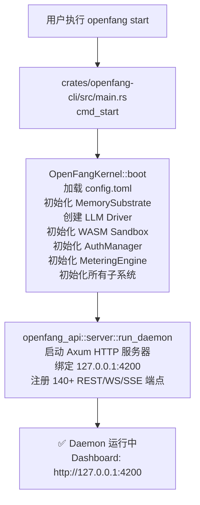

# 第 1 节：环境验证与代码探索

## 学习目标

- [x] 验证 Rust 环境
- [x] 确认 Daemon 运行状态
- [x] 测试 API Endpoint
- [x] 理解启动流程
- [x] 建立代码 - 功能映射

---

## 环境状态检查

### Rust 版本

```bash
rustc --version
# rustc 1.94.0 (4a4ef493e 2026-03-02)

cargo --version
# cargo 1.94.0 (85eff7c80 2026-01-15)
```

### Daemon 状态

```bash
# 检查进程
tasklist | findstr -i openfang
# openfang.exe  24544  Console  2  47,736 K

# 检查 API 健康
curl -s http://127.0.0.1:4200/api/health
# {"status":"ok","version":"0.4.9"}
```

### 可用 Endpoints 验证

```bash
# 获取 agents 列表
curl -s http://127.0.0.1:4200/api/agents
# Agents: 2
#   - assistant (3cb0487c...)
#   - Code Helper (689e5b67...)

# 获取 budget 状态
curl -s http://127.0.0.1:4200/api/budget
# {"alert_threshold":0.8,"daily_limit":0.0,"daily_spend":0.0,...}

# 重启崩溃/卡住的 Agent (v0.4.9 新增)
curl -s -X POST http://127.0.0.1:4200/api/agents/{id}/restart
# {"success": true, "restarted": true}

# 获取配置 Schema (v0.4.9 新增)
curl -s http://127.0.0.1:4200/api/config/schema
# 返回 TOML 格式的配置文件结构

# 热更新 Hands 配置 (v0.4.9 新增)
curl -s -X POST http://127.0.0.1:4200/api/hands/upsert \
  -H "Content-Type: application/json" \
  -d '{"hand_id": "...", "config": {...}}'

# 获取事件流 (SSE, v0.4.9 新增)
curl -s http://127.0.0.1:4200/api/comms/events/stream
```

---

## 14 Crates 总览

```
D:\Rust\openfang\crates\
├── openfang-types      # 核心类型定义（基础数据结构）
├── openfang-memory     # SQLite 持久化、向量数据库
├── openfang-runtime    # Agent 循环、LLM 驱动、工具、WASM 沙箱
├── openfang-skills     # 60 个内置技能
├── openfang-hands      # 7 个自主 Hands
├── openfang-channels   # 42+ 消息渠道适配器 (v0.4.9 新增企业微信、钉钉流式)
├── openfang-extensions # MCP、OAuth2、凭证管理
├── openfang-wire       # OFP P2P 协议
├── openfang-kernel     # 编排、调度、预算、RBAC
├── openfang-api        # 140+ REST/WS/SSE 端点 (v0.4.9 新增重启 Agent 等)
├── openfang-cli        # CLI 工具
├── openfang-migrate    # 从 OpenClaw 等迁移
└── openfang-desktop    # Tauri 桌面应用 (v0.4.9 支持 PWA)
```

---

## 启动流程解析

### 流程图



### 核心代码位置

| 组件 | 文件路径 | 关键函数 |
|------|----------|----------|
| CLI 入口 | `crates/openfang-cli/src/main.rs` | `fn main()` |
| Start 命令 | `crates/openfang-cli/src/main.rs` | `fn cmd_start()` |
| 内核启动 | `crates/openfang-kernel/src/kernel.rs` | `fn boot()` |
| API 服务器 | `crates/openfang-api/src/server.rs` | `fn run_daemon()` |

### 关键代码片段

#### 1. CLI 入口 (main.rs:843)

```rust
fn main() {
    // 加载 ~/.openfang/.env 到环境变量
    dotenv::load_dotenv();

    let cli = Cli::parse();

    // 判断是否启动 TUI 模式
    let is_tui_mode = ...;

    if is_tui_mode {
        init_tracing_file();
    } else {
        install_ctrlc_handler();
        init_tracing_stderr();
    }

    match cli.command {
        Some(Commands::Start) => cmd_start(cli.config),
        // ... 其他命令
    }
}
```

#### 2. Start 命令 (main.rs:1434)

```rust
fn cmd_start(config: Option<PathBuf>) {
    // 检查是否已有 daemon 在运行
    if let Some(base) = find_daemon() {
        ui::error_with_fix("Daemon already running", ...);
        std::process::exit(1);
    }

    ui::banner();

    let rt = tokio::runtime::Runtime::new().unwrap();
    rt.block_on(async {
        // 启动内核
        let kernel = match OpenFangKernel::boot(config.as_deref()) {
            Ok(k) => k,
            Err(e) => { boot_kernel_error(&e); std::process::exit(1); }
        };

        // 获取配置信息
        let listen_addr = kernel.config.api_listen.clone();
        let provider = kernel.config.default_model.provider.clone();
        let model = kernel.config.default_model.model.clone();

        ui::success(&format!("Kernel booted ({provider}/{model})"));

        // 启动 API 服务器
        openfang_api::server::run_daemon(kernel, &listen_addr, ...)
    });
}
```

#### 3. 内核启动 (kernel.rs:503)

```rust
impl OpenFangKernel {
    pub fn boot(config_path: Option<&Path>) -> KernelResult<Self> {
        let config = load_config(config_path);
        Self::boot_with_config(config)
    }

    pub fn boot_with_config(mut config: KernelConfig) -> KernelResult<Self> {
        // 1. 环境变量覆盖配置
        if let Ok(listen) = std::env::var("OPENFANG_LISTEN") {
            config.api_listen = listen;
        }

        // 2. 加载 API Key
        if config.api_key.trim().is_empty() {
            if let Ok(key) = std::env::var("OPENFANG_API_KEY") {
                config.api_key = key.trim().to_string();
            }
        }

        // 3. 参数范围检查
        config.clamp_bounds();

        // 4. 确保数据目录存在
        std::fs::create_dir_all(&config.data_dir);

        // 5. 初始化 Memory Substrate (SQLite)
        let db_path = config.memory.sqlite_path.clone()
            .unwrap_or_else(|| config.data_dir.join("openfang.db"));
        let memory = Arc::new(MemorySubstrate::open(&db_path, ...)?);

        // 6. 创建 LLM Driver (支持 auto-detect 和 fallback)
        let driver = drivers::create_driver(&driver_config);

        // 7. 初始化 Metering Engine
        let metering = Arc::new(MeteringEngine::new(...));

        // 8. 初始化 WASM Sandbox
        let wasm_sandbox = WasmSandbox::new()?;

        // 9. 初始化 RBAC Auth Manager
        let auth = AuthManager::new(&config.users);

        // ... 更多子系统初始化

        Ok(kernel)
    }
}
```

---

## 关键 API Endpoints

| Endpoint | Method | 说明 |
|----------|--------|------|
| `/api/health` | GET | 健康检查 |
| `/api/agents` | GET | 获取所有 agents |
| `/api/agents/{id}/restart` | POST | 重启崩溃/卡住的 Agent (v0.4.9 新增) |
| `/api/agents/{id}/model` | PUT | 切换 Agent 的 Provider/模型 |
| `/api/budget` | GET/PUT | 获取/更新预算状态 |
| `/api/budget/agents` | GET | 按 agent 的成本排名 |
| `/api/hands/upsert` | POST | 热更新 Hands 配置 (v0.4.9 新增) |
| `/api/config/schema` | GET | 返回配置 TOML schema (v0.4.9 新增) |
| `/api/comms/events/stream` | GET | SSE 流式事件推送 (v0.4.9 新增) |

---

## 配置文件位置

| 文件 | 路径 | 说明 |
|------|------|------|
| Config | `~/.openfang/config.toml` | 主配置文件 |
| .env | `~/.openfang/.env` | 环境变量 |
| Database | `~/.openfang/data/openfang.db` | SQLite 数据库 |
| Daemon Info | `~/.openfang/daemon.json` | Daemon 运行信息 |

---

## 完成检查清单

- [x] Rust 环境已验证
- [x] Daemon 正在运行 (PID 24544)
- [x] API 健康检查通过 (v0.4.9)
- [x] 2 个 agents 可用
- [x] Dashboard 可访问 (http://127.0.0.1:4200)
- [x] 理解启动流程
- [x] 知道核心代码位置
- [x] 了解 v0.4.9 新增功能：
  - [ ] 企业微信、钉钉渠道适配器
  - [ ] Agent 重启接口
  - [ ] PWA 离线支持
  - [ ] 图片处理流水线

---

## 下一步

前往 [第 2 节：14 Crates 架构解析](./02-architecture-analysis.md)

---

## v0.4.9 新增功能速览

### 1. 企业微信渠道适配器

```rust
// crates/openfang-channels/src/wecom.rs
// 691 行完整实现，支持:
// - 消息收发
// - Token 自动刷新
// - AES-CBC 解密
// -  webhook 接收

// 配置示例 (~/.openfang/config.toml)
[wecom]
corp_id = "your_corp_id"
agent_id = "1000001"
secret = "your_secret"
token = "webhook_token"
encoding_aes_key = "your_aes_key"
```

### 2. 钉钉流式适配器

```rust
// crates/openfang-channels/src/dingtalk_stream.rs
// 600 行实现，支持:
// - 卡片消息流式处理
// - 交互式按钮
// - 消息状态回调
```

### 3. Agent 重启接口

```bash
# 重启崩溃或卡住的 Agent
curl -X POST http://127.0.0.1:4200/api/agents/{id}/restart

# 前端调用 (agents.js)
async restartAgent() {
  await OpenFangAPI.post(`/api/agents/${this.agent.id}/restart`);
  OpenFangToast.success('Agent restarted');
}
```

### 4. PWA 离线支持

```json
// crates/openfang-api/static/manifest.json
{
  "name": "OpenFang Dashboard",
  "short_name": "OpenFang",
  "start_url": "/",
  "display": "standalone",
  "theme_color": "#10b981",
  "background_color": "#1f2937"
}
```

```javascript
// crates/openfang-api/static/sw.js
// Service Worker 缓存关键资源:
// - index.html
// - js/i18n.js
// - js/app.js
// - css styles
```

### 5. 图片处理流水线

```rust
// ContentBlock::Image 增强
pub enum ContentBlock {
    Image {
        data: Vec<u8>,
        mime_type: String, // image/png, image/jpeg, image/gif, image/webp
        base64_inline: bool,
    },
    // ...
}

// 临时目录存储
const UPLOADS_DIR: &str = "/tmp/openfang_uploads";
```

### 6. 前端国际化

```javascript
// js/i18n.js - 完整中英文双语
const i18n = {
  'zh-CN': {
    'chat': {
      'select_agent': '选择智能体开始对话',
      'type_placeholder': '输入消息... (/ 触发命令)'
    }
  },
  'en-US': {
    'chat': {
      'select_agent': 'Select an agent to start chatting',
      'type_placeholder': 'Message OpenFang... (/ for commands)'
    }
  }
};
```

---

*创建时间：2026-03-14 (更新于 2026-03-19 v0.4.9)*
*OpenFang v0.5.2*
