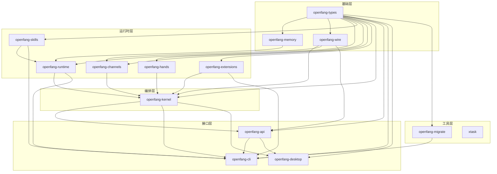
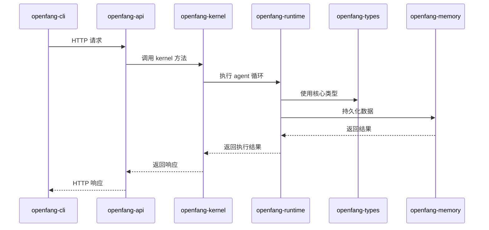

# 第 2 节：14 Crates 架构解析

## 学习目标

- [x] 理解各 crate 的职责
- [x] 绘制依赖关系图
- [x] 理解 `KernelHandle` trait 解耦设计
- [x] 掌握数据流方向

---

## 14 Crates 职责详解

### 核心层（Foundation Layer）

| Crate | 职责 | 依赖 |
|-------|------|------|
| **openfang-types** | 核心类型定义：Agent、Message、Tool、Capability 等 | 仅 workspace 依赖 |
| **openfang-memory** | SQLite 持久化、向量数据库、会话管理 | openfang-types |
| **openfang-wire** | OFP P2P 协议：HMAC-SHA256 双向认证 | openfang-types |

### 运行时层（Runtime Layer）

| Crate | 职责 | 依赖 |
|-------|------|------|
| **openfang-runtime** | Agent 循环、3 个 LLM 驱动、53 个工具、WASM 沙箱、MCP、A2A | types, memory, skills |
| **openfang-skills** | 60 个内置技能、SKILL.md 解析器、FangHub 市场 | types |
| **openfang-hands** | 7 个自主 Hands、HAND.toml 解析器、生命周期管理 | types |
| **openfang-channels** | 40 个消息渠道适配器（Telegram、Discord 等） | types |
| **openfang-extensions** | 25 个 MCP 模板、AES-256-GCM 凭证库、OAuth2 PKCE | types |

### 编排层（Orchestration Layer）

| Crate | 职责 | 依赖 |
|-------|------|------|
| **openfang-kernel** | 编排、工作流、计量、RBAC、调度器、预算跟踪 | types, memory, runtime, skills, hands, extensions, wire, channels |

### 接口层（Interface Layer）

| Crate | 职责 | 依赖 |
|-------|------|------|
| **openfang-api** | 140+ REST/WS/SSE 端点、OpenAI 兼容 API、Dashboard | types, kernel, runtime, memory, channels, wire, skills, hands, extensions, migrate |
| **openfang-cli** | CLI 工具、守护进程管理、TUI Dashboard、MCP 服务器模式 | types, kernel, api, migrate, skills, extensions, runtime |
| **openfang-desktop** | Tauri 2.0 原生应用（系统托盘、通知、全局快捷键） | types, kernel, api |

### 工具层（Tooling Layer）

| Crate | 职责 | 依赖 |
|-------|------|------|
| **openfang-migrate** | OpenClaw、LangChain、AutoGPT 迁移引擎 | types |
| **xtask** | 构建自动化 | 无 |

---

## 依赖关系图



---

## 关键设计模式

### 1. KernelHandle Trait — 避免循环依赖

**问题**：`openfang-runtime` 需要调用 kernel 的方法来 spawn agent、send message，但如果在 runtime 中直接依赖 kernel，会形成循环依赖。

**解决方案**：使用 trait  inversion，在 runtime 中定义 `KernelHandle` trait，由 kernel 来实现。

```rust
// crates/openfang-runtime/src/kernel_handle.rs
#[async_trait]
pub trait KernelHandle: Send + Sync {
    async fn spawn_agent(&self, manifest_toml: &str, parent_id: Option<&str>)
        -> Result<(String, String), String>;

    async fn send_to_agent(&self, agent_id: &str, message: &str)
        -> Result<String, String>;

    fn list_agents(&self) -> Vec<AgentInfo>;
    fn kill_agent(&self, agent_id: &str) -> Result<(), String>;

    // ... 更多方法
}
```

**依赖方向**：
```
openfang-runtime (定义 KernelHandle trait)
       ▲
       │
openfang-kernel (实现 KernelHandle trait)
```

这样 `runtime` 不需要知道 `kernel` 的存在，只是调用 trait 方法，而 `kernel` 依赖 `runtime` 并实现 trait。

### 2. 分层架构

```
┌─────────────────────────────────────────────┐
│            接口层 (Interface)               │
│  CLI / API Server / Desktop App             │
└─────────────────────────────────────────────┘
                    ▼
┌─────────────────────────────────────────────┐
│            编排层 (Orchestration)           │
│  Kernel - 协调所有子系统                     │
└─────────────────────────────────────────────┘
                    ▼
┌─────────────────────────────────────────────┐
│            运行时层 (Runtime)               │
│  Agent Loop / LLM Drivers / Tools / WASM    │
└─────────────────────────────────────────────┘
                    ▼
┌─────────────────────────────────────────────┐
│            基础层 (Foundation)              │
│  Types / Memory / Wire Protocol             │
└─────────────────────────────────────────────┘
```

### 3. 数据流方向



---

## 关键代码位置

### KernelHandle 实现位置

```rust
// crates/openfang-kernel/src/kernel.rs
#[async_trait]
impl KernelHandle for OpenFangKernel {
    async fn spawn_agent(&self, manifest_toml: &str, parent_id: Option<&str>)
        -> Result<(String, String), String> {
        // 实现细节...
    }

    async fn send_to_agent(&self, agent_id: &str, message: &str)
        -> Result<String, String> {
        // 实现细节...
    }

    // ... 其他方法
}
```

### Runtime 使用 KernelHandle

```rust
// crates/openfang-runtime/src/agent_loop.rs
pub async fn run_agent_loop(
    kernel_handle: Arc<dyn KernelHandle>,
    // ...
) {
    // 当 agent 需要 spawn 新 agent 时
    let (new_id, new_name) = kernel_handle.spawn_agent(manifest, Some(&agent_id)).await?;

    // 当 agent 需要发送消息给其他 agent 时
    let response = kernel_handle.send_to_agent(&target_id, &message).await?;
}
```

---

## Cargo.toml 依赖分析

### openfang-types (最底层)

```toml
[dependencies]
# 仅 workspace 依赖，无内部 crate 依赖
serde, serde_json, chrono, uuid, thiserror, dirs, toml, async-trait,
ed25519-dalek, sha2, hex, rand
```

### openfang-kernel (编排层)

```toml
[dependencies]
openfang-types = { path = "../openfang-types" }
openfang-memory = { path = "../openfang-memory" }
openfang-runtime = { path = "../openfang-runtime" }
openfang-skills = { path = "../openfang-skills" }
openfang-hands = { path = "../openfang-hands" }
openfang-extensions = { path = "../openfang-extensions" }
openfang-wire = { path = "../openfang-wire" }
openfang-channels = { path = "../openfang-channels" }
# + workspace 依赖
```

### openfang-api (接口层)

```toml
[dependencies]
openfang-types = { path = "../openfang-types" }
openfang-kernel = { path = "../openfang-kernel" }
openfang-runtime = { path = "../openfang-runtime" }
openfang-memory = { path = "../openfang-memory" }
openfang-channels = { path = "../openfang-channels" }
openfang-wire = { path = "../openfang-wire" }
openfang-skills = { path = "../openfang-skills" }
openfang-hands = { path = "../openfang-hands" }
openfang-extensions = { path = "../openfang-extensions" }
openfang-migrate = { path = "../openfang-migrate" }
# + workspace 依赖
```

---

## 完成检查清单

- [x] 理解各 crate 职责
- [x] 绘制依赖关系图 (Mermaid)
- [x] 理解 KernelHandle trait 解耦设计
- [x] 掌握数据流方向

---

## 下一步

前往 [第 3 节：核心类型系统](./03-type-system.md)

---

*创建时间：2026-03-14*
*OpenFang v0.5.2*
