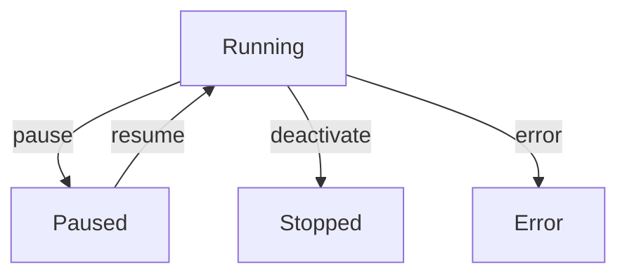

# 第 15 节：Hands 系统 — 生命周期管理

> **版本**: v0.5.2 (2026-03-29)
> **核心文件**: `crates/openfang-hands/src/registry.rs`, `crates/openfang-hands/src/lib.rs`

---

## 学习目标

- [ ] 掌握 HandRegistry 的实现和状态管理
- [ ] 理解 Hand 实例的状态流转
- [ ] 掌握状态持久化机制和恢复流程
- [ ] 理解 Dashboard Metrics 的采集和展示

---

## 1. HandRegistry 注册表

### 1.1 架构设计

**文件**: `crates/openfang-hands/src/registry.rs`

```rust
/// Hands 注册表 — 跟踪所有 Hand 定义和实例
pub struct HandRegistry {
    /// 所有已知的 Hand 定义，按 hand_id 索引
    definitions: DashMap<String, HandDefinition>,
    /// 活跃的 Hand 实例，按实例 UUID 索引
    instances: DashMap<Uuid, HandInstance>,
}

/// Hand 实例运行时状态
pub struct HandInstance {
    /// 实例唯一标识符
    pub instance_id: Uuid,
    /// 对应的 Hand 定义 ID
    pub hand_id: String,
    /// 运行状态
    pub status: HandStatus,
    /// 关联的 Agent ID
    pub agent_id: Option<AgentId>,
    /// Agent 名称（显示用）
    pub agent_name: String,
    /// 用户提供的配置覆盖
    pub config: HashMap<String, serde_json::Value>,
    /// 激活时间
    pub activated_at: DateTime<Utc>,
    /// 最后更新时间
    pub updated_at: DateTime<Utc>,
}
```

### 1.2 状态枚举

```rust
#[derive(Clone, Debug, Serialize, Deserialize)]
pub enum HandStatus {
    /// 活跃运行中
    Active,
    /// 已暂停
    Paused,
    /// 已停止
    Stopped,
    /// 错误状态
    Error { message: String },
}
```

**状态流转**：



---

## 2. 状态持久化

### 2.1 存储结构

**文件**: `~/.openfang/hands/state.json`

> **v0.5.2 更新**：持久化使用简单 JSON 序列化，而非 MessagePack+ZSTD 压缩。

```rust
// 实际代码使用 serde_json::to_string_pretty 直接序列化
// registry.rs:56-74
async fn save_state(&self) -> Result<(), HandError> {
    let instances: Vec<_> = self.instances
        .iter()
        .map(|r| r.value().clone())
        .collect();

    let json = serde_json::to_string_pretty(&instances)
        .map_err(|e| HandError::Internal(format!("Serialize error: {e}")))?;

    tokio::fs::write(&self.state_path, &json).await
        .map_err(|e| HandError::Internal(format!("Write error: {e}")))?;

    Ok(())
}
```

### 2.2 恢复流程

```rust
// registry.rs:76-95
async fn load_state(&self) -> Result<Vec<HandInstance>, HandError> {
    if !self.state_path.exists() {
        return Ok(Vec::new());
    }

    let json = tokio::fs::read_to_string(&self.state_path).await
        .map_err(|e| HandError::Internal(format!("Read error: {e}")))?;

    let instances: Vec<HandInstance> = serde_json::from_str(&json)
        .map_err(|e| HandError::Internal(format!("Deserialize error: {e}")))?;

    Ok(instances)
}
```
        let instance = HandInstance {
            id: state_data.id.clone(),
            state: HandState::Paused,  // 恢复时为暂停状态
            agent_id: AgentId::new(),
            started_at: Instant::now(),
            metrics: state_data.metrics_snapshot,
            agent_history: decompress_messages(&state_data.session_history),
            collected_memories: state_data.memory_ids,
        };

        self.instances.insert(hand_id.clone(), instance);

        tracing::info!("Restored hand {} from iteration {}",
            hand_id, state_data.iteration);

        Ok(())
    }
}
```

---

## 3. Dashboard Metrics

### 3.1 指标类型

**文件**: `crates/openfang-types/src/hand.rs`

```rust
/// Dashboard 指标定义
#[derive(Clone, Debug, Serialize, Deserialize)]
pub struct MetricDefinition {
    /// 指标名称
    pub name: String,
    /// 指标类型
    pub kind: MetricKind,
    /// 单位（可选）
    pub unit: Option<String>,
}

#[derive(Clone, Debug, Serialize, Deserialize)]
pub enum MetricKind {
    /// 计数器（只增不减）
    Counter,
    /// 仪表盘（可增可减）
    Gauge,
    /// 时间戳
    Timestamp,
    /// 字符串状态
    Status,
}
```

> **v0.5.2 更新**：实际代码中 `HandMetric` 使用更简单的结构（仅 `label`, `memory_key`, `format` 三个字段），没有 `MetricKind`/`MetricValue` 类型。以上为设计参考。实际实现中，指标通过 `MemorySubstrate` 的 key-value 存储来追踪。

**实际的 HandMetric 定义** (`lib.rs:139-147`):
```rust
pub struct HandMetric {
    pub label: String,
    pub memory_key: String,
    #[serde(default = "default_format")]
    pub format: String,  // e.g. "number", "duration", "bytes"; 默认 "number"
}

pub struct HandDashboard {
    pub metrics: Vec<HandMetric>,
}
```

### 3.2 各 Hand 的指标

| Hand | 指标 1 | 指标 2 | 指标 3 | 指标 4 |
|------|--------|--------|--------|--------|
| **Clip** | videos_processed | clips_generated | total_duration | last_processed |
| **Lead** | leads_discovered | leads_qualified | avg_score | last_scan |
| **Collector** | intel_items | knowledge_nodes | alerts_sent | graph_size |
| **Predictor** | predictions_made | brier_score | active_forecasts | last_update |
| **Researcher** | reports_generated | sources_consulted | avg_quality | last_run |
| **Twitter** | posts_created | engagement_rate | followers_change | last_post |
| **Browser** | sessions_completed | forms_filled | purchases_pending | last_action |
| **Trader** | trades_analyzed | signals_detected | pnl_total | last_trade |

### 3.3 指标采集

```rust
/// 更新 Dashboard 指标
impl HandInstance {
    pub fn increment_counter(&mut self, metric_name: &str, delta: u64) {
        if let Some(metric) = self.metrics.get_mut(metric_name) {
            if let MetricValue::Counter(ref mut value) = metric.value {
                *value += delta;
            }
        }
    }

    pub fn set_gauge(&mut self, metric_name: &str, value: f64) {
        if let Some(metric) = self.metrics.get_mut(metric_name) {
            if let MetricValue::Gauge(ref mut val) = metric.value {
                *val = value;
            }
        }
    }

    pub fn set_timestamp(&mut self, metric_name: &str) {
        if let Some(metric) = self.metrics.get_mut(metric_name) {
            if let MetricValue::Timestamp(ref mut ts) = metric.value {
                *ts = std::time::SystemTime::now()
                    .duration_since(std::time::UNIX_EPOCH)
                    .unwrap()
                    .as_secs();
            }
        }
    }
}
```

---

## 4. 生命周期事件

### 4.1 事件类型

> **v0.5.2 更新**：`events.rs` 文件尚未在代码库中实现。以下 `HandEvent` 为设计规划。

**文件**: `crates/openfang-hands/src/events.rs`（设计规划中）

```rust
/// Hand 生命周期事件
#[derive(Clone, Debug, Serialize)]
pub enum HandEvent {
    /// Hand 已激活
    Activated { id: HandId, agent_id: AgentId },
    /// Hand 已暂停
    Paused { id: HandId },
    /// Hand 已恢复
    Resumed { id: HandId },
    /// Hand 已停止
    Stopped { id: HandId },
    /// Hand 发生错误
    Error { id: HandId, error: String },
    /// 指标更新
    MetricsUpdated { id: HandId, metric: String, value: f64 },
    /// 迭代完成
    IterationComplete { id: HandId, iteration: u32, result: String },
}
```

### 4.2 事件订阅

```rust
// 订阅 Hand 事件
let mut rx = kernel.subscribe_to_hand_events();

tokio::spawn(async move {
    while let Ok(event) = rx.recv().await {
        match event {
            HandEvent::Activated { id, .. } => {
                tracing::info!("Hand {} activated", id);
            }
            HandEvent::MetricsUpdated { id, metric, value } => {
                tracing::debug!("Hand {} metric {}: {}", id, metric, value);
            }
            HandEvent::IterationComplete { id, iteration, result } => {
                tracing::info!("Hand {} completed iteration {}: {}", id, iteration, result);
            }
            _ => {}
        }
    }
});
```

---

## 5. CLI 命令详解

### 5.1 列出所有 Hands

```bash
openfang hand list
```

**输出**：
```
Available Hands (8 bundled):
  ● clip          - YouTube video to shorts converter
  ● lead          - Lead discovery and qualification
  ● collector     - OSINT intelligence collector
  ● predictor     - Superforecasting engine
  ● researcher    - Deep autonomous researcher
  ● twitter       - Autonomous Twitter manager
  ● browser       - Web automation agent
  ● trader        - Trading analysis agent

Active instances:
  researcher (running, iteration 42, uptime 2h 15m)
  lead (paused, iteration 17)
```

### 5.2 激活 Hand

```bash
openfang hand activate researcher
```

**执行流程**：
1. 查找 bundled Hands
2. 解析 HAND.toml
3. 检查依赖（工具、模型、渠道）
4. 创建 Agent 实例
5. 注册到 HandRegistry
6. 发送 `HandEvent::Activated`
7. 开始 Agent Loop

### 5.3 查看状态

```bash
openfang hand status researcher --json
```

**JSON 输出**：
```json
{
  "id": "researcher",
  "state": "running",
  "agent_id": "a1b2c3d4-...",
  "iteration": 42,
  "started_at": "2026-03-15T08:30:00Z",
  "uptime_secs": 8100,
  "metrics": {
    "reports_generated": 12,
    "sources_consulted": 847,
    "avg_report_quality": 0.89,
    "last_run": "2026-03-16T06:00:00Z"
  }
}
```

### 5.4 暂停/恢复

```bash
# 暂停（保留状态）
openfang hand pause researcher

# 恢复
openfang hand resume researcher
```

### 5.5 停止

```bash
openfang hand deactivate researcher
```

**效果**：
- 停止 Agent Loop
- 清除运行状态
- 保留 Dashboard 指标历史
- 发送 `HandEvent::Stopped`

---

## 6. 并发与锁

### 6.1 线程安全

`HandRegistry` 使用 `DashMap` 实现并发安全的实例管理：

```rust
pub struct HandRegistry {
    // DashMap 提供细粒度锁（每 key 独立锁）
    instances: DashMap<HandId, HandInstance>,
    ...
}

// 安全并发访问
let instance = registry.instances.get(&hand_id);
// 自动持有读锁， Drop 时释放
```

### 6.2 状态一致性

```rust
impl HandRegistry {
    /// 原子性状态转换
    pub fn transition_state(
        &self,
        hand_id: &HandId,
        from: HandState,
        to: HandState,
    ) -> Result<(), HandError> {
        let mut instance = self.instances.get_mut(hand_id)
            .ok_or(HandError::NotFound)?;

        // 检查当前状态
        if instance.state != from {
            return Err(HandError::InvalidStateTransition {
                expected: from,
                actual: instance.state.clone(),
            });
        }

        // 原子性转换
        instance.state = to;

        // 持久化
        self.persist_state(hand_id)?;

        Ok(())
    }
}
```

---

## 完成检查清单

- [ ] 掌握 HandRegistry 的实现和状态管理
- [ ] 理解 Hand 实例的状态流转
- [ ] 掌握状态持久化机制和恢复流程
- [ ] 理解 Dashboard Metrics 的采集和展示

---

## 下一步

前往 [第 16 节：Channel 系统 — 消息渠道](./16-channels-bridge.md)

---

*创建时间：2026-03-16*
*OpenFang v0.5.2*
