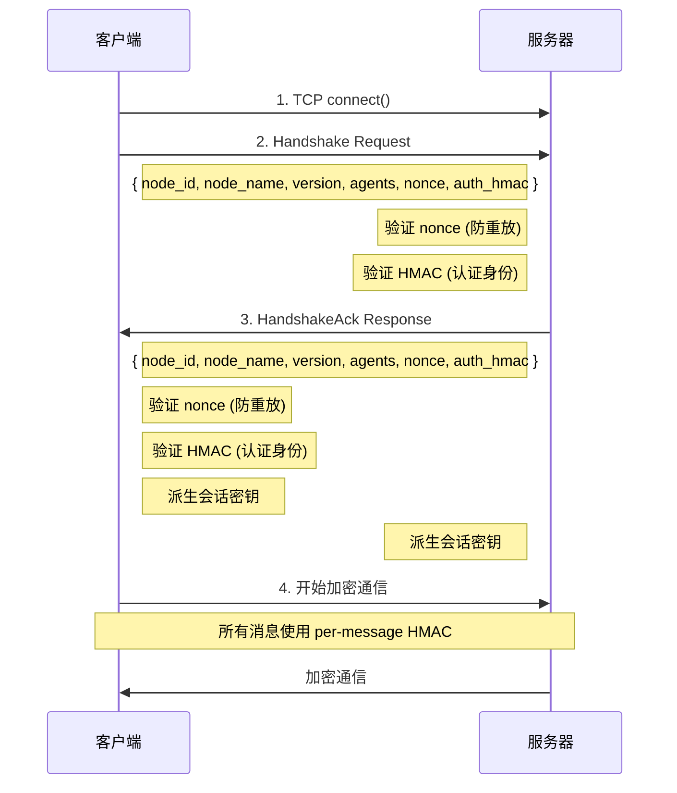

# 第 18 节：OFP 协议 — P2P 通信

> **版本**: v0.5.2 (2026-03-29)
> **核心文件**:
> - `crates/openfang-wire/src/peer.rs`
> - `crates/openfang-wire/src/message.rs`
> - `crates/openfang-wire/src/registry.rs`

## 学习目标

- [ ] 理解 OFP 协议架构和设计目标
- [ ] 掌握 HMAC-SHA256 双向认证机制
- [ ] 掌握 PeerRegistry 的结构和操作
- [ ] 理解握手流程和非ce 防重放攻击
- [ ] 掌握会话密钥派生和消息认证
- [ ] 理解 Agent 发现和消息路由机制

---

## 1. OFP 协议概览

### 协议目标

OpenFang Wire Protocol (OFP) 是 OpenFang 内核之间的点对点通信协议，提供：

| 目标 | 说明 |
|------|------|
| **跨机器发现** | 自动发现和注册远程 Agent |
| **双向认证** | HMAC-SHA256 确保双方身份可信 |
| **消息加密** | 每会话密钥派生，防止窃听 |
| **防重放攻击** | Nonce 追踪和时间窗口验证 |
| **JSON-RPC 风格** | 易调试、易扩展的消息格式 |

### 协议版本

```rust
// message.rs:152
pub const PROTOCOL_VERSION: u32 = 1;
```

### 消息类型

```rust
// message.rs:19-31
pub enum WireMessageKind {
    Request(WireRequest),      // 请求
    Response(WireResponse),    // 响应
    Notification(WireNotification), // 通知（单向）
}
```

---

## 2. WireMessage — 协议消息信封

### 文件位置
`crates/openfang-wire/src/message.rs:8-16`

```rust
/// A wire protocol message (envelope).
#[derive(Debug, Clone, Serialize, Deserialize)]
pub struct WireMessage {
    /// Unique message ID.
    pub id: String,
    /// Message variant.
    #[serde(flatten)]
    pub kind: WireMessageKind,
}
```

### 字段说明

| 字段 | 类型 | 说明 |
|------|------|------|
| `id` | `String` | 唯一消息 ID（UUID） |
| `kind` | `WireMessageKind` | 消息变体（Request/Response/Notification） |

### 编码格式

```rust
// message.rs:154-162
pub fn encode_message(msg: &WireMessage) -> Result<Vec<u8>, serde_json::Error> {
    let json = serde_json::to_vec(msg)?;
    let len = json.len() as u32;
    let mut bytes = Vec::with_capacity(4 + json.len());
    bytes.extend_from_slice(&len.to_be_bytes());  // 4 字节大端长度
    bytes.extend_from_slice(&json);                // JSON 负载
    Ok(bytes)
}
```

**帧格式**：
```
┌──────────────┬─────────────────────────┐
│ 4-byte len   │ JSON body               │
│ (big-endian) │                         │
└──────────────┴─────────────────────────┘
```

---

## 3. WireRequest — 请求消息

### 文件位置
`crates/openfang-wire/src/message.rs:33-74`

```rust
#[derive(Debug, Clone, Serialize, Deserialize)]
#[serde(tag = "method")]
pub enum WireRequest {
    /// Handshake: exchange peer identity.
    #[serde(rename = "handshake")]
    Handshake {
        node_id: String,
        node_name: String,
        protocol_version: u32,
        agents: Vec<RemoteAgentInfo>,
        nonce: String,
        auth_hmac: String,
    },
    /// Discover agents matching a query.
    #[serde(rename = "discover")]
    Discover { query: String },
    /// Send a message to a specific agent.
    #[serde(rename = "agent_message")]
    AgentMessage {
        agent: String,
        message: String,
        sender: Option<String>,
    },
    /// Ping to check if the peer is alive.
    #[serde(rename = "ping")]
    Ping,
}
```

### 请求类型

| 方法 | 用途 | 响应 |
|------|------|------|
| `handshake` | 建立连接，交换身份 | `handshake_ack` |
| `discover` | 发现远程 Agent | `discover_result` |
| `agent_message` | 发送消息给远程 Agent | `agent_response` |
| `ping` | 心跳检测 | `pong` |

---

## 4. WireResponse — 响应消息

### 文件位置
`crates/openfang-wire/src/message.rs:76-117`

```rust
#[derive(Debug, Clone, Serialize, Deserialize)]
#[serde(tag = "method")]
pub enum WireResponse {
    #[serde(rename = "handshake_ack")]
    HandshakeAck {
        node_id: String,
        node_name: String,
        protocol_version: u32,
        agents: Vec<RemoteAgentInfo>,
        nonce: String,
        auth_hmac: String,
    },
    #[serde(rename = "discover_result")]
    DiscoverResult { agents: Vec<RemoteAgentInfo> },
    #[serde(rename = "agent_response")]
    AgentResponse { text: String },
    #[serde(rename = "pong")]
    Pong { uptime_secs: u64 },
    #[serde(rename = "error")]
    Error { code: i32, message: String },
}
```

### 响应类型

| 方法 | 用途 | 字段 |
|------|------|------|
| `handshake_ack` | 握手确认 | 节点信息 +  Agents + HMAC |
| `discover_result` | 发现结果 | Agent 列表 |
| `agent_response` | Agent 响应 | 响应文本 |
| `pong` | 心跳响应 | 运行时间（秒） |
| `error` | 错误响应 | 错误码 + 消息 |

---

## 5. RemoteAgentInfo — 远程 Agent 信息

### 文件位置
`crates/openfang-wire/src/message.rs:134-149`

```rust
/// Information about a remote agent.
#[derive(Debug, Clone, Serialize, Deserialize)]
pub struct RemoteAgentInfo {
    /// Agent ID (UUID string).
    pub id: String,
    /// Human-readable name.
    pub name: String,
    /// Description of what the agent does.
    pub description: String,
    /// Tags for categorization/discovery.
    pub tags: Vec<String>,
    /// Available tools.
    pub tools: Vec<String>,
    /// Current state.
    pub state: String,
}
```

### 字段说明

| 字段 | 类型 | 说明 | 示例 |
|------|------|------|------|
| `id` | `String` | Agent 唯一标识 | `"agent-abc123"` |
| `name` | `String` | 人类可读名称 | `"coder"` |
| `description` | `String` | 功能描述 | `"A coding agent"` |
| `tags` | `Vec<String>` | 分类标签 | `["code", "rust"]` |
| `tools` | `Vec<String>` | 可用工具 | `["file_read", "web_search"]` |
| `state` | `String` | 当前状态 | `"running"` |

---

## 6. PeerConfig — 节点配置

### 文件位置
`crates/openfang-wire/src/peer.rs:106-129`

```rust
/// Configuration for a PeerNode.
#[derive(Debug, Clone)]
pub struct PeerConfig {
    /// Address to bind the listener on.
    pub listen_addr: SocketAddr,
    /// This node's unique ID.
    pub node_id: String,
    /// This node's human-readable name.
    pub node_name: String,
    /// Pre-shared key for HMAC-SHA256 authentication.
    /// Required — OFP refuses to start without it.
    pub shared_secret: String,
}

impl Default for PeerConfig {
    fn default() -> Self {
        Self {
            listen_addr: "127.0.0.1:0".parse().unwrap(),
            node_id: uuid::Uuid::new_v4().to_string(),
            node_name: "openfang-node".to_string(),
            shared_secret: String::new(),
        }
    }
}
```

### 字段说明

| 字段 | 类型 | 说明 | 默认值 |
|------|------|------|--------|
| `listen_addr` | `SocketAddr` | 监听地址 | `127.0.0.1:0`（随机端口） |
| `node_id` | `String` | 节点唯一标识 | 随机 UUID |
| `node_name` | `String` | 人类可读名称 | `"openfang-node"` |
| `shared_secret` | `String` | 预共享密钥（必需） | 空（拒绝启动） |

### 安全要求

```rust
// peer.rs:179-184
if config.shared_secret.is_empty() {
    return Err(WireError::HandshakeFailed(
        "OFP requires shared_secret. Set [network] shared_secret in config.toml".into(),
    ));
}
```

**OFP 拒绝在没有配置 `shared_secret` 的情况下启动**。

---

## 7. PeerRegistry — 对等体注册表

### 文件位置
`crates/openfang-wire/src/registry.rs:50-206`

```rust
/// Thread-safe registry of all known peers.
#[derive(Debug, Clone)]
pub struct PeerRegistry {
    peers: Arc<RwLock<HashMap<String, PeerEntry>>>,
}
```

### PeerEntry — 对等体条目

```rust
// registry.rs:31-48
#[derive(Debug, Clone)]
pub struct PeerEntry {
    pub node_id: String,
    pub node_name: String,
    pub address: SocketAddr,
    pub agents: Vec<RemoteAgentInfo>,
    pub state: PeerState,
    pub connected_at: DateTime<Utc>,
    pub protocol_version: u32,
}
```

### PeerState — 连接状态

```rust
// registry.rs:22-29
pub enum PeerState {
    Connected,    // 握手完成，完全连接
    Disconnected, // 连接丢失但未删除（可重连）
}
```

### 核心方法

| 方法 | 用途 |
|------|------|
| `add_peer()` | 注册/更新对等体 |
| `remove_peer()` | 删除对等体 |
| `mark_disconnected()` | 标记为断开（保留条目） |
| `mark_connected()` | 标记为连接 |
| `get_peer()` | 获取特定对等体快照 |
| `connected_peers()` | 获取所有连接中的对等体 |
| `all_peers()` | 获取所有对等体（包括断开的） |
| `update_agents()` | 更新对等体的 Agent 列表 |
| `add_agent()` | 添加单个 Agent |
| `remove_agent()` | 删除单个 Agent |
| `find_agents()` | 搜索匹配的远程 Agent |
| `all_remote_agents()` | 获取所有远程 Agent |

### 搜索功能

```rust
// registry.rs:143-170
pub fn find_agents(&self, query: &str) -> Vec<RemoteAgent> {
    let query_lower = query.to_lowercase();
    let mut results = Vec::new();

    for peer in peers.values() {
        if peer.state != PeerState::Connected {
            continue;  // 跳过断开的对等体
        }
        for agent in &peer.agents {
            let matches = agent.name.to_lowercase().contains(&query_lower)
                || agent.description.to_lowercase().contains(&query_lower)
                || agent.tags.iter().any(|t| t.to_lowercase().contains(&query_lower));
            if matches {
                results.push(RemoteAgent {
                    peer_node_id: peer.node_id.clone(),
                    info: agent.clone(),
                });
            }
        }
    }
    results
}
```

**支持搜索**：Agent 名称、描述、标签

---

## 8. NonceTracker — 防重放攻击

### 文件位置
`crates/openfang-wire/src/peer.rs:28-71`

```rust
/// SECURITY: Time-windowed nonce tracker to prevent OFP handshake replay attacks.
#[derive(Clone)]
pub struct NonceTracker {
    seen: Arc<DashMap<String, Instant>>,
    window: Duration,
}

impl NonceTracker {
    pub fn new() -> Self {
        Self {
            seen: Arc::new(DashMap::new()),
            window: Duration::from_secs(300), // 5 分钟
        }
    }

    pub fn check_and_record(&self, nonce: &str) -> Result<(), String> {
        let now = Instant::now();

        // 垃圾回收过期 nonce
        self.seen.retain(|_, ts| now.duration_since(*ts) < self.window);

        // 检查是否重放
        if self.seen.contains_key(nonce) {
            return Err(format!("Nonce replay detected: {}", truncate_str(nonce, 16)));
        }

        // 记录 nonce
        self.seen.insert(nonce.to_string(), now);
        Ok(())
    }
}
```

### 安全设计

| 机制 | 说明 |
|------|------|
| **5 分钟窗口** | 仅接受 5 分钟内的 nonce |
| **DashMap** | 并发安全的哈希表 |
| **自动 GC** | 定期清理过期 nonce |
| **单次使用** | 重复的 nonce 被拒绝 |

---

## 9. HMAC-SHA256 认证

### 文件位置
`crates/openfang-wire/src/peer.rs:73-84`

```rust
type HmacSha256 = Hmac<Sha256>;

/// Generate HMAC-SHA256 signature for message authentication.
fn hmac_sign(secret: &str, data: &[u8]) -> String {
    let mut mac = HmacSha256::new_from_slice(secret.as_bytes())
        .expect("HMAC accepts任何大小的密钥");
    mac.update(data);
    hex::encode(mac.finalize().into_bytes())
}

/// Verify HMAC-SHA256 signature using constant-time comparison.
fn hmac_verify(secret: &str, data: &[u8], signature: &str) -> bool {
    let expected = hmac_sign(secret, data);
    subtle::ConstantTimeEq::ct_eq(expected.as_bytes(), signature.as_bytes()).into()
}
```

### 认证数据格式

```rust
// 握手请求：nonce + node_id
let auth_data = format!("{}{}", nonce, node_id);
let auth_hmac = hmac_sign(&shared_secret, auth_data.as_bytes());
```

### 常量时间比较

使用 `subtle::ConstantTimeEq` 防止时序攻击：
- 普通比较可能提前返回（泄露信息）
- 常量时间比较始终执行相同操作

---

## 10. 会话密钥派生

### 文件位置
`crates/openfang-wire/src/peer.rs`（推断自代码使用）

```rust
/// SECURITY: Derive per-session key from nonces and shared secret.
fn derive_session_key(shared_secret: &str, nonce_a: &str, nonce_b: &str) -> String {
    // HKDF-like derivation: HMAC(shared_secret, nonce_a || nonce_b)
    let input = format!("{}||{}", nonce_a, nonce_b);
    hmac_sign(shared_secret, input.as_bytes())
}
```

### 密钥派生流程

```
Client Nonce (nonce_a)
       ↓
Server Nonce (nonce_b)
       ↓
┌─────────────────────────────────┐
│  derive_session_key()           │
│  input = nonce_a || "||" || nonce_b │
│  key = HMAC-SHA256(secret, input)  │
└─────────────────────────────────┘
       ↓
Session Key (hex 字符串)
```

### 用途

派生的会话密钥用于：
1. 加密所有后续消息
2. 每条消息的 HMAC 认证
3. 防止中间人窃听

---

## 11. 握手流程详解

### 文件位置
`crates/openfang-wire/src/peer.rs:226-344`（客户端）
`crates/openfang-wire/src/peer.rs:483-633`（服务端）

### 流程图



### 客户端握手代码

```rust
// peer.rs:236-251
let our_nonce = uuid::Uuid::new_v4().to_string();
let auth_data = format!("{}{}", our_nonce, self.config.node_id);
let auth_hmac = hmac_sign(&self.config.shared_secret, auth_data.as_bytes());

let handshake = WireMessage {
    id: uuid::Uuid::new_v4().to_string(),
    kind: WireMessageKind::Request(WireRequest::Handshake {
        node_id: self.config.node_id.clone(),
        node_name: self.config.node_name.clone(),
        protocol_version: PROTOCOL_VERSION,
        agents: handle.local_agents(),
        nonce: our_nonce.clone(),
        auth_hmac,
    }),
};
write_message(&mut writer, &handshake).await?;
```

### 服务端握手验证

```rust
// peer.rs:522-553
// 检查 nonce 重放
if let Err(replay_err) = node.nonce_tracker.check_and_record(nonce) {
    return Err(WireError::HandshakeFailed(replay_err));
}

// 验证 HMAC
let expected_data = format!("{}{}", nonce, node_id);
if !hmac_verify(&node.config.shared_secret, expected_data.as_bytes(), auth_hmac) {
    return Err(WireError::HandshakeFailed(
        "HMAC verification failed".into(),
    ));
}

// 发送响应
let ack_nonce = uuid::Uuid::new_v4().to_string();
let ack_auth_data = format!("{}{}", ack_nonce, node.config.node_id);
let ack_hmac = hmac_sign(&node.config.shared_secret, ack_auth_data.as_bytes());

let ack = WireMessage {
    id: msg.id.clone(),
    kind: WireMessageKind::Response(WireResponse::HandshakeAck {
        node_id: node.config.node_id.clone(),
        node_name: node.config.node_name.clone(),
        protocol_version: PROTOCOL_VERSION,
        agents: handle.local_agents(),
        nonce: ack_nonce.clone(),
        auth_hmac: ack_hmac,
    }),
};
write_message(&mut writer, &ack).await?;
```

---

## 12. 消息循环与认证

### 文件位置
`crates/openfang-wire/src/peer.rs:686-750`

```rust
/// Read/write message loop for an established connection.
async fn connection_loop(
    reader: &mut OwnedReadHalf,
    writer: &mut OwnedWriteHalf,
    peer_node_id: &str,
    registry: &PeerRegistry,
    handle: &dyn PeerHandle,
    session_key: Option<&str>,
) -> Result<(), WireError> {
    loop {
        let msg = match if let Some(key) = session_key {
            read_message_authenticated(reader, key).await
        } else {
            read_message(reader).await
        }?;

        let response = handle_request(&msg, handle, node).await;

        // 发送响应（同样需要认证）
        if let Some(key) = session_key {
            write_message_authenticated(writer, &response, key).await?;
        } else {
            write_message(writer, &response).await?;
        }
    }
}
```

### 认证读写

```rust
/// Read a message and verify HMAC.
async fn read_message_authenticated(
    reader: &mut OwnedReadHalf,
    session_key: &str,
) -> Result<WireMessage, WireError> {
    // 读取长度前缀
    let mut len_buf = [0u8; 4];
    reader.read_exact(&mut len_buf).await?;
    let len = decode_length(&len_buf);

    // 读取负载（包含 msg_json + hmac）
    let mut body = vec![0u8; len as usize];
    reader.read_exact(&mut body).await?;

    // 分离 JSON 和 HMAC
    let json_len = body.len() - 64;  // HMAC-SHA256 输出 64 字节
    let msg_json = &body[..json_len];
    let msg_hmac = &body[json_len..];

    // 验证 HMAC
    let expected_hmac = hmac_sign(session_key, msg_json);
    if !hmac_verify(session_key, msg_json, &hex::encode(msg_hmac)) {
        return Err(WireError::HandshakeFailed("Message HMAC failed".into()));
    }

    // 解析 JSON
    Ok(serde_json::from_slice(msg_json)?)
}

/// Write a message with HMAC authentication.
async fn write_message_authenticated(
    writer: &mut OwnedWriteHalf,
    msg: &WireMessage,
    session_key: &str,
) -> Result<(), WireError> {
    let json = serde_json::to_vec(msg)?;

    // 计算 HMAC
    let msg_hmac = hmac_sign(session_key, &json);

    // 拼接 JSON + HMAC
    let mut body = json;
    body.extend_from_slice(msg_hmac.as_bytes());

    // 写入长度前缀 + 负载
    let len = body.len() as u32;
    writer.write_all(&len.to_be_bytes()).await?;
    writer.write_all(&body).await?;
    writer.flush().await?;

    Ok(())
}
```

---

## 13. PeerHandle — 内核接口

### 文件位置
`crates/openfang-wire/src/peer.rs:131-154`

```rust
/// Trait for the kernel to handle incoming remote requests.
#[async_trait]
pub trait PeerHandle: Send + Sync + 'static {
    /// List local agents as RemoteAgentInfo.
    fn local_agents(&self) -> Vec<RemoteAgentInfo>;

    /// Send a message to a local agent and get the response.
    async fn handle_agent_message(
        &self,
        agent: &str,
        message: &str,
        sender: Option<&str>,
    ) -> Result<String, String>;

    /// Find local agents matching a query.
    fn discover_agents(&self, query: &str) -> Vec<RemoteAgentInfo>;

    /// Return the uptime of the local node in seconds.
    fn uptime_secs(&self) -> u64;
}
```

### 方法说明

| 方法 | 用途 | 触发请求 |
|------|------|----------|
| `local_agents()` | 获取本地 Agent 列表 | Handshake |
| `handle_agent_message()` | 发送消息给本地 Agent | AgentMessage |
| `discover_agents()` | 搜索本地 Agent | Discover |
| `uptime_secs()` | 获取运行时间 | Ping |

---

## 14. WireError — 错误类型

### 文件位置
`crates/openfang-wire/src/peer.rs:86-101`

```rust
#[derive(Debug, Error)]
pub enum WireError {
    #[error("IO error: {0}")]
    Io(#[from] std::io::Error),
    #[error("JSON error: {0}")]
    Json(#[from] serde_json::Error),
    #[error("Handshake failed: {0}")]
    HandshakeFailed(String),
    #[error("Connection closed")]
    ConnectionClosed,
    #[error("Message too large: {size} bytes (max {max})")]
    MessageTooLarge { size: u32, max: u32 },
    #[error("Protocol version mismatch: local={local}, remote={remote}")]
    VersionMismatch { local: u32, remote: u32 },
}
```

### 错误分类

| 错误 | 可恢复 | 处理方式 |
|------|--------|----------|
| `Io` | 是 | 网络波动，尝试重连 |
| `Json` | 否 | 协议错误，记录日志 |
| `HandshakeFailed` | 否 | 认证失败，关闭连接 |
| `ConnectionClosed` | 是 | 对端关闭，清理状态 |
| `MessageTooLarge` | 否 | 拒绝消息，记录警告 |
| `VersionMismatch` | 否 | 协议不兼容，拒绝连接 |

### 消息大小限制

```rust
// peer.rs:103
pub const MAX_MESSAGE_SIZE: u32 = 16 * 1024 * 1024; // 16 MB
```

---

## 15. 测试用例

### 文件位置
`crates/openfang-wire/src/message.rs:174-292`
`crates/openfang-wire/src/registry.rs:214-351`

### 消息编码测试

```rust
// message.rs:178-190
#[test]
fn test_encode_decode_roundtrip() {
    let msg = WireMessage {
        id: "msg-1".to_string(),
        kind: WireMessageKind::Request(WireRequest::Ping),
    };
    let bytes = encode_message(&msg).unwrap();
    let len = decode_length(&[bytes[0], bytes[1], bytes[2], bytes[3]]);
    assert_eq!(len as usize, bytes.len() - 4);
    let decoded = decode_message(&bytes[4..]).unwrap();
    assert_eq!(decoded.id, "msg-1");
}
```

### PeerRegistry 测试

```rust
// registry.rs:241-251
#[test]
fn test_add_and_get_peer() {
    let registry = PeerRegistry::new();
    let peer = make_peer("node-1", vec![make_agent("a1", "coder", &["code"])]);
    registry.add_peer(peer);

    let retrieved = registry.get_peer("node-1").unwrap();
    assert_eq!(retrieved.node_id, "node-1");
    assert_eq!(retrieved.agents.len(), 1);
    assert_eq!(retrieved.agents[0].name, "coder");
}

#[test]
fn test_find_agents_by_name() {
    let registry = PeerRegistry::new();
    registry.add_peer(make_peer(
        "node-1",
        vec![
            make_agent("a1", "coder", &["code"]),
            make_agent("a2", "researcher", &["research"]),
        ],
    ));
    registry.add_peer(make_peer(
        "node-2",
        vec![make_agent("a3", "code-reviewer", &["code", "review"])],
    ));

    let results = registry.find_agents("code");
    assert_eq!(results.len(), 2); // "coder" 和 "code-reviewer"
}
```

### NonceTracker 测试（推断）

```rust
#[test]
fn test_nonce_replay_rejected() {
    let tracker = NonceTracker::new();
    let nonce = uuid::Uuid::new_v4().to_string();

    // 第一次使用 nonce 应该成功
    assert!(tracker.check_and_record(&nonce).is_ok());

    // 重放同一个 nonce 应该失败
    assert!(tracker.check_and_record(&nonce).is_err());
}

#[test]
fn test_nonce_expires() {
    let tracker = NonceTracker {
        seen: Arc::new(DashMap::new()),
        window: Duration::from_millis(100),  // 超短窗口用于测试
    };
    let nonce = uuid::Uuid::new_v4().to_string();

    assert!(tracker.check_and_record(&nonce).is_ok());

    // 等待窗口过期
    std::thread::sleep(Duration::from_millis(150));

    // GC 后 nonce 应该被清理
    // 注意：实际测试需要触发 GC 逻辑
}
```

---

## 16. 关键设计点

### 16.1 双向认证

```
Client → Server: HMAC(nonce_c + node_id_c)
Server → Client: HMAC(nonce_s + node_id_s)

双方都验证对方知道 shared_secret
```

**优势**：
- 防止中间人攻击
- 确保双方都是可信节点

### 16.2 每会话密钥

```
session_key = HMAC(secret, nonce_c || "||" || nonce_s)
```

**优势**：
- 每次握手产生不同的会话密钥
- 即使长期密钥泄露，历史会话仍安全
- 前向安全性（PFS）

### 16.3 Nonce 防重放

```rust
// 5 分钟窗口
window: Duration::from_secs(300),

// 检查 + 记录
check_and_record(nonce) -> Result<(), String>
```

**优势**：
- 阻止攻击者重放旧消息
- 时间窗口限制减少内存占用
- 自动 GC 过期 nonce

### 16.4 消息认证

```
每条消息：HMAC(session_key, json_body)
接收方验证 HMAC 后才处理
```

**优势**：
- 防止消息篡改
- 确保消息来源可信
- 常量时间比较防止时序攻击

---

## 17. 与前后文的关联

### 与第 17 节（EventBus）的关联

```
OFP 收到远程消息
       ↓
PeerNode.handle_agent_message()
       ↓
EventBus.publish(Event { payload: Message(...) })
       ↓
本地 Agent Loop 接收
```

### 与第 19 节（A2A 协议）的关联

```
OFP 是底层传输协议
       ↓
A2A 是上层应用协议
       ↓
A2A 消息通过 OFP 传输
```

---

## 完成检查清单

- [ ] 理解 OFP 协议架构和设计目标
- [ ] 掌握 HMAC-SHA256 双向认证机制
- [ ] 掌握 PeerRegistry 的结构和操作
- [ ] 理解握手流程和非ce 防重放攻击
- [ ] 掌握会话密钥派生和消息认证
- [ ] 理解 Agent 发现和消息路由机制

---

## 下一步

前往 [第 19 节：A2A 协议 — Agent 间通信](./19-a2a-protocol.md)

---

*创建时间：2026-03-15*
*OpenFang v0.5.2*
