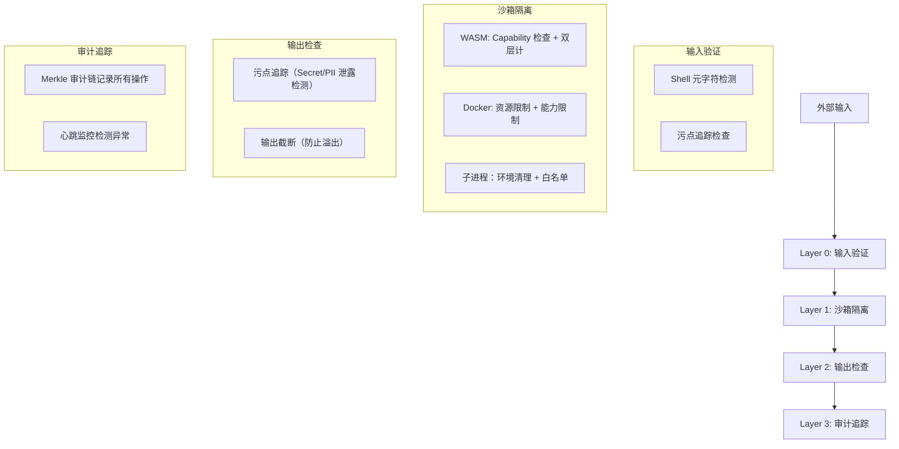

# 第 21 节：安全系统 — 沙箱隔离

> **版本**: v0.5.2 (2026-03-29)
> **核心文件**:
> - `crates/openfang-runtime/src/sandbox.rs` (WASM 沙箱)
> - `crates/openfang-runtime/src/docker_sandbox.rs` (Docker 沙箱)
> - `crates/openfang-runtime/src/subprocess_sandbox.rs` (子进程沙箱)

---

## 学习目标

- [ ] 理解 WASM 沙箱的双层计机制
- [ ] 掌握 Docker 沙箱的资源限制和隔离配置
- [ ] 理解子进程沙箱的环境清理和命令白名单
- [ ] 掌握 Shell 元字符检测的全面策略
- [ ] 理解三层沙箱的协同工作模式

---

## 1. 沙箱隔离系统概述

### 1.1 为什么需要沙箱

**问题**：Agent 执行不可信代码时的安全风险

| 风险类型 | 攻击场景 | 后果 |
|----------|----------|------|
| **凭证泄露** | LLM 被诱导读取 `~/.aws/credentials` | 云资源被盗用 |
| **恶意代码执行** | Agent 执行 `rm -rf /` 或挖矿脚本 | 系统损坏/资源滥用 |
| **网络攻击** | Agent 发起 DDoS 或内网渗透 | 法律责任 |
| **数据 exfiltration** | 敏感数据被发送到外部服务器 | 隐私/商业机密泄露 |

### 1.2 OpenFang 的三层沙箱架构

```mermaid
flowchart TD
    subgraph SandboxStack[OpenFang 沙箱栈]
        subgraph Layer1[Layer 1: WASM 沙箱]
            L1a[双层次计 (Fuel + Epoch)]
            L1b[Capability 权限检查]
            L1c[无文件系统/网络/环境变量]
            L1d[适用场景：Skills、插件、可信计算]
        end

        subgraph Layer2[Layer 2: Docker 沙箱]
            L2a[操作系统级隔离]
            L2b[资源限制 (CPU/内存/PID)]
            L2c[网络隔离 (none/internal)]
            L2d[能力限制 (drop ALL + add specific)]
            L2e[适用场景：不可信代码、第三方脚本]
        end

        subgraph Layer3[Layer 3: 子进程沙箱]
            L3a[环境变量清理]
            L3b[Shell 元字符检测]
            L3c[命令白名单验证]
            L3d[进程树 Kill]
            L3e[适用场景：系统工具调用]
        end
    end
```

### 1.3 沙箱选择策略

| 场景 | 推荐沙箱 | 安全级别 | 性能开销 |
|------|----------|----------|----------|
| Skills 执行 | WASM | 高 | 低 |
| 第三方插件 | WASM | 高 | 低 |
| Python 脚本 | Docker | 极高 | 中 |
| Shell 命令 | 子进程 | 中 | 极低 |
| 不可信 Agent | Docker | 极高 | 中 |

---

## 2. WASM 沙箱

### 2.1 沙箱配置结构

**文件位置**: `crates/openfang-runtime/src/sandbox.rs:33-56`

```rust
/// Configuration for a WASM sandbox instance.
#[derive(Debug, Clone)]
pub struct SandboxConfig {
    /// Maximum fuel (CPU instruction budget). 0 = unlimited.
    pub fuel_limit: u64,
    /// Maximum WASM linear memory in bytes (reserved for future enforcement).
    pub max_memory_bytes: usize,
    /// Capabilities granted to this sandbox instance.
    pub capabilities: Vec<Capability>,
    /// Wall-clock timeout in seconds for epoch-based interruption.
    /// Defaults to 30 seconds if None.
    pub timeout_secs: Option<u64>,
}

impl Default for SandboxConfig {
    fn default() -> Self {
        Self {
            fuel_limit: 1_000_000,
            max_memory_bytes: 16 * 1024 * 1024,
            capabilities: Vec::new(),
            timeout_secs: None,
        }
    }
}
```

### 2.2 配置字段说明

| 字段 | 默认值 | 说明 |
|------|--------|------|
| `fuel_limit` | 1,000,000 | Fuel 计单元预算（约 1 亿条指令） |
| `max_memory_bytes` | 16MB | 线性内存上限 |
| `capabilities` | `[]` | 授予的能力列表（deny-by-default） |
| `timeout_secs` | 30s | 墙钟超时时间 |

### 2.3 Guest State

**文件位置**: `crates/openfang-runtime/src/sandbox.rs:58-68`

```rust
/// State carried in each WASM Store, accessible by host functions.
pub struct GuestState {
    /// Capabilities granted to this guest — checked before every host call.
    pub capabilities: Vec<Capability>,
    /// Handle to kernel for inter-agent operations.
    pub kernel: Option<Arc<dyn KernelHandle>>,
    /// Agent ID of the calling agent.
    pub agent_id: String,
    /// Tokio runtime handle for async operations in sync host functions.
    pub tokio_handle: tokio::runtime::Handle,
}
```

**设计要点**：
- `capabilities`：每次 host_call 都检查权限
- `kernel`：用于跨 Agent 操作
- `agent_id`：审计追踪用
- `tokio_handle`：同步函数中执行异步操作

### 2.4 双层计机制

**文件位置**: `crates/openfang-runtime/src/sandbox.rs:170-184`

```rust
// Set fuel budget (deterministic metering)
if config.fuel_limit > 0 {
    store
        .set_fuel(config.fuel_limit)
        .map_err(|e| SandboxError::Execution(e.to_string()))?;
}

// Set epoch deadline (wall-clock metering)
store.set_epoch_deadline(1);
let engine_clone = engine.clone();
let timeout = config.timeout_secs.unwrap_or(30);
let _watchdog = std::thread::spawn(move || {
    std::thread::sleep(std::time::Duration::from_secs(timeout));
    engine_clone.increment_epoch();
});
```

**双层设计**：
| 计层 | 机制 | 检测目标 | 精度 |
|------|------|----------|------|
| **Fuel** | Wasmtime 内置 Fuel 计 | CPU 密集型循环 | 指令级 |
| **Epoch** | 外部 Watchdog 线程 | 死锁/等待 | 秒级 |

**为什么需要双层**：
- Fuel 计无法检测 I/O 等待死锁
- Epoch 可以强制中断任何超时操作
- 两者结合确保任何情况都能终止

### 2.5 Execute 函数调用流程

**文件位置**: `crates/openfang-runtime/src/sandbox.rs:212-247`

```rust
// Serialize input JSON → bytes
let input_bytes = serde_json::to_vec(&input)...;

// Allocate space in guest memory for input
let input_ptr = alloc_fn.call(&mut store, input_bytes.len() as i32)...;

// Write input into guest memory
let mem_data = memory.data_mut(&mut store);
mem_data[start..end].copy_from_slice(&input_bytes);

// Call guest execute
let packed = match execute_fn.call(&mut store, (input_ptr, input_bytes.len() as i32)) {
    Ok(v) => v,
    Err(e) => {
        // Check for fuel exhaustion via trap code
        if let Some(Trap::OutOfFuel) = e.downcast_ref::<Trap>() {
            return Err(SandboxError::FuelExhausted);
        }
        // Check for epoch deadline (wall-clock timeout)
        if let Some(Trap::Interrupt) = e.downcast_ref::<Trap>() {
            return Err(SandboxError::Execution(format!(
                "WASM execution timed out after {}s (epoch interrupt)",
                timeout
            )));
        }
        return Err(SandboxError::Execution(e.to_string()));
    }
};
```

**调用流程**：
```
1. JSON 输入 → 序列化字节
2. 调用 alloc() 在 Guest 内存中分配空间
3. 复制字节到 Guest 内存
4. 调用 execute(input_ptr, input_len)
5. 返回 packed i64: (result_ptr << 32) | result_len
6. 从 Guest 内存读取结果字节
7. 反序列化为 JSON 输出
```

### 2.6 Host 函数注册

**文件位置**: `crates/openfang-runtime/src/sandbox.rs:278-348`

```rust
linker.func_wrap("openfang", "host_call",
    |mut caller: Caller<'_, GuestState>,
     request_ptr: i32, request_len: i32|
     -> Result<i64, anyhow::Error> {
        // Read request from guest memory
        let memory = caller.get_export("memory")...;
        let data = memory.data(&caller);
        let request_bytes = data[start..end].to_vec();

        // Parse request
        let request: serde_json::Value = serde_json::from_slice(&request_bytes)?;
        let method = request.get("method")...;
        let params = request.get("params")...;

        // Dispatch to capability-checked handler
        let response = host_functions::dispatch(caller.data(), &method, &params);

        // Serialize response JSON
        let response_bytes = serde_json::to_vec(&response)?;

        // Allocate space in guest for response
        let alloc_typed = alloc_fn.call(&mut caller, len)?;

        // Write response into guest memory
        mem_data[dest_start..dest_end].copy_from_slice(&response_bytes);

        // Pack (ptr, len) into i64
        Ok(((ptr as i64) << 32) | (len as i64))
    }
)?;
```

**Capability 检查**：
```rust
// host_functions::dispatch 内部检查
if !guest_state.capabilities.contains(&required_cap) {
    return json!({"error": "capability denied"});
}
```

### 2.7 Guest ABI 要求

WASM 模块必须导出：

| 函数 | 签名 | 说明 |
|------|------|------|
| `memory` | 线性内存 | 共享内存空间 |
| `alloc` | `i32 → i32` | 分配 size 字节，返回指针 |
| `execute` | `(i32, i32) → i64` | 主入口点，返回 packed (ptr, len) |

**Host 导入**：
| 函数 | 签名 | 说明 |
|------|------|------|
| `openfang:host_call` | `(i32, i32) → i64` | RPC 分发 |
| `openfang:host_log` | `(i32, i32, i32) → ()` | 日志记录 |

### 2.8 测试用例

#### 2.8.1 Echo 模块测试

**文件位置**: `crates/openfang-runtime/src/sandbox.rs:395-496`

```rust
const ECHO_WAT: &str = r#"
    (module
        (memory (export "memory") 1)
        (global $bump (mut i32) (i32.const 1024))

        (func (export "alloc") (param $size i32) (result i32)
            (local $ptr i32)
            (local.set $ptr (global.get $bump))
            (global.set $bump (i32.add (global.get $bump) (local.get $size)))
            (local.get $ptr)
        )

        (func (export "execute") (param $ptr i32) (param $len i32) (result i64)
            ;; Echo: return the input as-is
            (i64.or
                (i64.shl (i64.extend_i32_u (local.get $ptr)) (i64.const 32))
                (i64.extend_i32_u (local.get $len))
            )
        )
    )
"#;

#[tokio::test]
async fn test_echo_module() {
    let sandbox = WasmSandbox::new().unwrap();
    let input = serde_json::json!({"hello": "world", "num": 42});
    let config = SandboxConfig::default();

    let result = sandbox.execute(ECHO_WAT.as_bytes(), input.clone(), config, None, "test-agent").await.unwrap();

    assert_eq!(result.output, input);
    assert!(result.fuel_consumed > 0);
}
```

#### 2.8.2 Fuel 耗尽测试

**文件位置**: `crates/openfang-runtime/src/sandbox.rs:420-522`

```rust
const INFINITE_LOOP_WAT: &str = r#"
    (module
        ...
        (func (export "execute") ...
            (loop $inf (br $inf))  ;; Infinite loop
            (i64.const 0)
        )
    )
"#;

#[tokio::test]
async fn test_fuel_exhaustion() {
    let sandbox = WasmSandbox::new().unwrap();
    let config = SandboxConfig { fuel_limit: 10_000, ..Default::default() };

    let err = sandbox.execute(INFINITE_LOOP_WAT.as_bytes(), input, config, None, "test-agent").await.unwrap_err();

    assert!(matches!(err, SandboxError::FuelExhausted));
}
```

#### 2.8.3 Capability 拒绝测试

**文件位置**: `crates/openfang-runtime/src/sandbox.rs:552-582`

```rust
#[tokio::test]
async fn test_host_call_capability_denied() {
    let sandbox = WasmSandbox::new().unwrap();
    let input = serde_json::json!({
        "method": "fs_read",
        "params": {"path": "/etc/passwd"}
    });
    let config = SandboxConfig { capabilities: vec![], .. };  // No capabilities!

    let result = sandbox.execute(HOST_CALL_PROXY_WAT.as_bytes(), input, config, None, "test-agent").await.unwrap();

    // Response should be {"error": "denied"}
    assert!(result.output["error"].as_str().unwrap().contains("denied"));
}
```

---

## 3. Docker 沙箱

### 3.1 沙箱容器结构

**文件位置**: `crates/openfang-runtime/src/docker_sandbox.rs:11-25`

```rust
/// A running sandbox container.
#[derive(Debug, Clone)]
pub struct SandboxContainer {
    pub container_id: String,
    pub agent_id: String,
    pub created_at: chrono::DateTime<chrono::Utc>,
}

/// Result of executing a command in the sandbox.
#[derive(Debug, Clone)]
pub struct ExecResult {
    pub stdout: String,
    pub stderr: String,
    pub exit_code: i32,
}
```

### 3.2 配置验证函数

#### 3.2.1 容器名称 sanitization

**文件位置**: `crates/openfang-runtime/src/docker_sandbox.rs:27-46`

```rust
fn sanitize_container_name(name: &str) -> Result<String, String> {
    let sanitized: String = name
        .chars()
        .map(|c| {
            if c.is_alphanumeric() || c == '-' {
                c
            } else {
                '-'  // Replace invalid chars with dash
            }
        })
        .collect();
    if sanitized.is_empty() {
        return Err("Container name cannot be empty".into());
    }
    if sanitized.len() > 63 {
        return Err("Container name too long (max 63 chars)".into());
    }
    Ok(sanitized)
}
```

#### 3.2.2 镜像名称验证

**文件位置**: `crates/openfang-runtime/src/docker_sandbox.rs:48-61`

```rust
fn validate_image_name(image: &str) -> Result<(), String> {
    if image.is_empty() {
        return Err("Docker image name cannot be empty".into());
    }
    // Allow: alphanumeric, dots, colons, slashes, dashes, underscores
    if !image.chars().all(|c| c.is_alphanumeric() || ".:/-_".contains(c)) {
        return Err(format!("Invalid Docker image name: {image}"));
    }
    Ok(())
}
```

#### 3.2.3 命令验证

**文件位置**: `crates/openfang-runtime/src/docker_sandbox.rs:63-75`

```rust
fn validate_command(command: &str) -> Result<(), String> {
    if command.is_empty() {
        return Err("Command cannot be empty".into());
    }
    if let Some(reason) = crate::subprocess_sandbox::contains_shell_metacharacters(command) {
        return Err(format!(
            "Command blocked: contains {reason} — potential injection"
        ));
    }
    Ok(())
}
```

### 3.3 创建沙箱容器

**文件位置**: `crates/openfang-runtime/src/docker_sandbox.rs:93-173`

```rust
pub async fn create_sandbox(
    config: &DockerSandboxConfig,
    agent_id: &str,
    workspace: &Path,
) -> Result<SandboxContainer, String> {
    validate_image_name(&config.image)?;
    let container_name = sanitize_container_name(&format!(
        "{}-{}", config.container_prefix, crate::str_utils::safe_truncate_str(agent_id, 8)
    ))?;

    let mut cmd = tokio::process::Command::new("docker");
    cmd.arg("run").arg("-d").arg("--name").arg(&container_name);

    // Resource limits
    cmd.arg("--memory").arg(&config.memory_limit);
    cmd.arg("--cpus").arg(config.cpu_limit.to_string());
    cmd.arg("--pids-limit").arg(config.pids_limit.to_string());

    // Security: drop ALL capabilities, prevent privilege escalation
    cmd.arg("--cap-drop").arg("ALL");
    cmd.arg("--security-opt").arg("no-new-privileges");

    // Add back specific capabilities if configured
    for cap in &config.cap_add {
        if cap.chars().all(|c| c.is_alphanumeric() || c == '_') {
            cmd.arg("--cap-add").arg(cap);
        } else {
            warn!("Skipping invalid capability: {cap}");
        }
    }

    // Read-only root filesystem
    if config.read_only_root {
        cmd.arg("--read-only");
    }

    // Network isolation
    cmd.arg("--network").arg(&config.network);

    // tmpfs mounts
    for tmpfs_mount in &config.tmpfs {
        cmd.arg("--tmpfs").arg(tmpfs_mount);
    }

    // Mount workspace read-only
    let ws_str = workspace.display().to_string();
    cmd.arg("-v").arg(format!("{ws_str}:{}:ro", config.workdir));

    // Working directory
    cmd.arg("-w").arg(&config.workdir);

    // Image + command to keep container alive
    cmd.arg(&config.image).arg("sleep").arg("infinity");

    let output = cmd.output().await...;
    let container_id = String::from_utf8_lossy(&output.stdout).trim().to_string();

    Ok(SandboxContainer { container_id, agent_id: agent_id.to_string(), ... })
}
```

### 3.4 安全配置选项

| 配置项 | 默认值 | 说明 |
|--------|--------|------|
| `--memory` | `512m` | 内存限制 |
| `--cpus` | `1.0` | CPU 核心数限制 |
| `--pids-limit` | `100` | 进程数限制 |
| `--cap-drop ALL` | 启用 | 移除所有能力 |
| `--security-opt no-new-privileges` | 启用 | 禁止提权 |
| `--read-only` | 启用 | 只读根文件系统 |
| `--network none` | 启用 | 网络隔离 |
| `--tmpfs /tmp:size=64m` | 启用 | 临时文件系统 |

### 3.5 容器池（Container Pool）

**文件位置**: `crates/openfang-runtime/src/docker_sandbox.rs:272-343`

```rust
pub struct ContainerPool {
    entries: Arc<DashMap<String, PoolEntry>>,
}

struct PoolEntry {
    container: SandboxContainer,
    config_hash: u64,
    last_used: std::time::Instant,
    created: std::time::Instant,
}

impl ContainerPool {
    /// Acquire a container from the pool matching the config hash
    pub fn acquire(&self, config_hash: u64, cool_secs: u64) -> Option<SandboxContainer> {
        for entry in self.entries.iter() {
            if entry.config_hash == config_hash && entry.last_used.elapsed().as_secs() >= cool_secs {
                return Some(entry.container.clone());
            }
        }
        None
    }

    /// Release a container back to the pool
    pub fn release(&self, container: SandboxContainer, config_hash: u64) {
        self.entries.insert(container.container_id.clone(), PoolEntry { ... });
    }

    /// Cleanup containers older than max_age or idle longer than idle_timeout
    pub async fn cleanup(&self, idle_timeout_secs: u64, max_age_secs: u64) {
        let to_remove: Vec<_> = self.entries.iter()
            .filter(|e| e.last_used.elapsed().as_secs() > idle_timeout_secs
                   || e.created.elapsed().as_secs() > max_age_secs)
            .map(|e| (e.key().clone(), e.container.clone()))
            .collect();
        for (key, container) in to_remove {
            let _ = destroy_sandbox(&container).await;
            self.entries.remove(&key);
        }
    }
}
```

**容器池优势**：
1. **减少启动延迟**：复用已拉取的镜像
2. **降低资源消耗**：避免重复创建容器
3. **冷隔离**：acquire 时要求 cooldown 时间

### 3.6 Bind Mount 验证

**文件位置**: `crates/openfang-runtime/src/docker_sandbox.rs:355-426`

```rust
const BLOCKED_MOUNT_PATHS: &[&str] = &[
    "/etc", "/proc", "/sys", "/dev", "/var/run/docker.sock", "/root", "/boot",
];

pub fn validate_bind_mount(path: &str, blocked: &[String]) -> Result<(), String> {
    let p = std::path::Path::new(path);

    // Must be absolute
    if !p.is_absolute() && !path.starts_with('/') {
        return Err(format!("Bind mount path must be absolute: {path}"));
    }

    // Check for path traversal
    for component in p.components() {
        if let std::path::Component::ParentDir = component {
            return Err(format!("Bind mount path contains '..': {path}"));
        }
    }

    // Check default blocked paths
    for blocked_path in BLOCKED_MOUNT_PATHS {
        if path.starts_with(blocked_path) {
            return Err(format!("Bind mount to '{blocked_path}' is blocked for security"));
        }
    }

    // Check user-configured blocked paths
    for bp in blocked {
        if path.starts_with(bp.as_str()) {
            return Err(format!("Bind mount to '{bp}' is blocked by configuration"));
        }
    }

    // Check for symlink escape (best-effort)
    if p.exists() {
        match p.canonicalize() {
            Ok(canonical) => {
                let canonical_str = canonical.to_string_lossy();
                for blocked_path in BLOCKED_MOUNT_PATHS {
                    if canonical_str.starts_with(blocked_path) {
                        return Err(format!(
                            "Bind mount resolves to blocked path via symlink: {} → {}",
                            path, canonical_str
                        ));
                    }
                }
            }
            Err(_) => { /* Path doesn't exist yet, allow */ }
        }
    }

    Ok(())
}
```

**阻断的路径**：
| 路径 | 原因 |
|------|------|
| `/etc` | 系统配置文件 |
| `/proc` | 进程信息泄露 |
| `/sys` | 内核参数泄露 |
| `/dev` | 设备访问 |
| `/var/run/docker.sock` | Docker 逃逸 |
| `/root` | 管理员家目录 |
| `/boot` | 引导文件 |

---

## 4. 子进程沙箱

### 4.1 环境变量清理

**文件位置**: `crates/openfang-runtime/src/subprocess_sandbox.rs:30-64`

```rust
pub const SAFE_ENV_VARS: &[&str] = &[
    "PATH", "HOME", "TMPDIR", "TMP", "TEMP", "LANG", "LC_ALL", "TERM",
];

#[cfg(windows)]
pub const SAFE_ENV_VARS_WINDOWS: &[&str] = &[
    "USERPROFILE", "SYSTEMROOT", "APPDATA", "LOCALAPPDATA",
    "COMSPEC", "WINDIR", "PATHEXT",
];

pub fn sandbox_command(cmd: &mut tokio::process::Command, allowed_env_vars: &[String]) {
    cmd.env_clear();  // Clear ALL environment

    // Re-add platform-independent safe vars
    for var in SAFE_ENV_VARS {
        if let Ok(val) = std::env::var(var) {
            cmd.env(var, val);
        }
    }

    // Re-add Windows-specific safe vars
    #[cfg(windows)]
    for var in SAFE_ENV_VARS_WINDOWS {
        if let Ok(val) = std::env::var(var) {
            cmd.env(var, val);
        }
    }

    // Re-add caller-specified allowed vars
    for var in allowed_env_vars {
        if let Ok(val) = std::env::var(var) {
            cmd.env(var, val);
        }
    }
}
```

**清理策略**：
1. `env_clear()` 清除所有继承的环境变量
2. 只重新添加预定义的安全变量
3. 调用者可以额外指定允许的变量

### 4.2 Shell 元字符全面检测

**文件位置**: `crates/openfang-runtime/src/subprocess_sandbox.rs:96-149`

```rust
pub fn contains_shell_metacharacters(command: &str) -> Option<String> {
    // ── Command substitution ──────────────────────────────────────────
    // Backtick substitution: `cmd`
    if command.contains('`') {
        return Some("backtick command substitution".to_string());
    }
    // Dollar-paren substitution: $(cmd)
    if command.contains("$(") {
        return Some("$() command substitution".to_string());
    }
    // Dollar-brace expansion: ${VAR}
    if command.contains("${") {
        return Some("${} variable expansion".to_string());
    }

    // ── Command chaining ──────────────────────────────────────────────
    // Semicolons: cmd1;cmd2
    if command.contains(';') {
        return Some("semicolon command chaining".to_string());
    }
    // Pipes: cmd1|cmd2 (data exfiltration + arbitrary command)
    if command.contains('|') {
        return Some("pipe operator".to_string());
    }

    // ── I/O redirection ───────────────────────────────────────────────
    // Output/input/append redirect: >, <, >>
    if command.contains('>') || command.contains('<') {
        return Some("I/O redirection".to_string());
    }

    // ── Expansion and globbing ────────────────────────────────────────
    // Brace expansion: {cmd1,cmd2} or {1..10}
    if command.contains('{') || command.contains('}') {
        return Some("brace expansion".to_string());
    }

    // ── Embedded newlines ─────────────────────────────────────────────
    if command.contains('\n') || command.contains('\r') {
        return Some("embedded newline".to_string());
    }
    // Null bytes (can truncate strings in C-based shells)
    if command.contains('\0') {
        return Some("null byte".to_string());
    }

    // ── Background execution and logical chaining ──────────────────────
    // Both & (background) and && (logical AND) are dangerous
    if command.contains('&') {
        return Some("ampersand operator".to_string());
    }

    None  // All checks passed
}
```

**检测分类**：

| 分类 | 字符/模式 | 攻击场景 |
|------|----------|----------|
| **命令替换** | `` ` `` `$(` `${` | 执行任意命令 |
| **命令链接** | `;` `\|` `&` `&&` `\|\|` | 链接恶意命令 |
| **I/O 重定向** | `>` `<` `>>` `<<<` | 写入敏感文件/读取秘密 |
| **变量扩展** | `${}` `{}` | 泄露环境变量 |
| **特殊字符** | 换行 `\0` | 截断/绕过检测 |

### 4.3 命令白名单验证

**文件位置**: `crates/openfang-runtime/src/subprocess_sandbox.rs:200-241`

```rust
pub fn validate_command_allowlist(command: &str, policy: &ExecPolicy) -> Result<(), String> {
    match policy.mode {
        ExecSecurityMode::Deny => {
            Err("Shell execution is disabled (exec_policy.mode = deny)".to_string())
        }
        ExecSecurityMode::Full => {
            tracing::warn!("Shell exec in full mode — no restrictions");
            Ok(())
        }
        ExecSecurityMode::Allowlist => {
            // SECURITY: Check for shell metacharacters BEFORE base-command extraction
            if let Some(reason) = contains_shell_metacharacters(command) {
                return Err(format!(
                    "Command blocked: contains {reason}. Shell metacharacters are not allowed in Allowlist mode."
                ));
            }

            let base_commands = extract_all_commands(command);
            for base in &base_commands {
                // Check safe_bins first
                if policy.safe_bins.iter().any(|sb| sb == base) {
                    continue;
                }
                // Check allowed_commands
                if policy.allowed_commands.iter().any(|ac| ac == base) {
                    continue;
                }
                return Err(format!(
                    "Command '{}' is not in the exec allowlist", base
                ));
            }
            Ok(())
        }
    }
}
```

**执行模式**：
| 模式 | 行为 | 适用场景 |
|------|------|----------|
| `Deny` | 完全禁用 | 高安全环境 |
| `Full` | 无限制（仅日志警告） | 开发/调试 |
| `Allowlist` | 严格白名单 | 生产环境 |

### 4.4 进程树 Kill

**文件位置**: `crates/openfang-runtime/src/subprocess_sandbox.rs:253-300+`

```rust
pub async fn kill_process_tree(pid: u32, grace_ms: u64) -> Result<bool, String> {
    let grace = grace_ms.min(MAX_GRACE_MS);

    #[cfg(unix)]
    {
        kill_tree_unix(pid, grace).await
    }

    #[cfg(windows)]
    {
        kill_tree_windows(pid, grace).await
    }
}

#[cfg(unix)]
async fn kill_tree_unix(pid: u32, grace_ms: u64) -> Result<bool, String> {
    // Try to kill the process group first (negative PID)
    let group_kill = Command::new("kill")
        .args(["-TERM", &format!("-{pid}")])
        .output().await;

    if group_kill.is_err() {
        // Fallback: kill just the process
        let _ = Command::new("kill").args(["-TERM", &pid.to_string()]).output().await;
    }

    // Wait for grace period
    tokio::time::sleep(std::time::Duration::from_millis(grace_ms)).await;

    // Check if still alive, then force kill
    // ...
}
```

**Kill 流程**：
1. 发送 SIGTERM（优雅终止）
2. 等待 grace_ms（默认 3 秒）
3. 如果仍存活，发送 SIGKILL（强制终止）
4. Unix 使用进程组 Kill（负 PID）杀死所有子进程

---

## 5. 三层沙箱协同工作

### 5.1 工具执行中的沙箱选择

**文件位置**: `crates/openfang-runtime/src/tool_runner.rs`

```rust
match tool_name {
    // WASM Skill 执行
    "wasm_skill" => {
        let sandbox = WasmSandbox::new()?;
        let result = sandbox.execute(wasm_bytes, input, config, kernel, agent_id).await?;
        // ...
    }

    // Docker 沙箱执行
    "docker_exec" => {
        let container = create_sandbox(&config, agent_id, workspace).await?;
        let result = exec_in_sandbox(&container, command, timeout).await?;
        // ...
    }

    // 子进程沙箱执行
    "shell_exec" => {
        // Layer 1: Shell metacharacter check
        if let Some(reason) = contains_shell_metacharacters(command) {
            return ToolResult { is_error: true, content: reason };
        }

        // Layer 2: Allowlist check
        if let Err(reason) = validate_command_allowlist(command, policy) {
            return ToolResult { is_error: true, content: reason };
        }

        // Layer 3: Environment sandboxing
        let mut cmd = Command::new(shell);
        sandbox_command(&mut cmd, &[]);
        // ...
    }
}
```

### 5.2 安全层级对比

| 特性 | WASM 沙箱 | Docker 沙箱 | 子进程沙箱 |
|------|----------|------------|-----------|
| **隔离级别** | 指令级 | OS 级 | 进程级 |
| **启动延迟** | <10ms | ~1s | <1ms |
| **性能开销** | 5-10% | 10-20% | <1% |
| **文件系统** | 无 | 隔离/只读 | 继承（受限） |
| **网络** | 无 | 隔离/none | 继承 |
| **环境** | 无 | 隔离 | 清理 |
| **适用场景** | Skills/插件 | 不可信代码 | 系统工具 |

### 5.3 纵深防御策略



---

## 6. 测试用例

### 6.1 Docker 沙箱测试

**文件位置**: `crates/openfang-runtime/src/docker_sandbox.rs:443-643`

```rust
#[test]
fn test_sanitize_container_name_valid() {
    let result = sanitize_container_name("openfang-sandbox-abc123").unwrap();
    assert_eq!(result, "openfang-sandbox-abc123");
}

#[test]
fn test_sanitize_container_name_special_chars() {
    let result = sanitize_container_name("test;rm -rf /").unwrap();
    assert!(!result.contains(';'));
    assert!(!result.contains(' '));
}

#[test]
fn test_validate_command_pipe_blocked() {
    assert!(validate_command("echo hello | grep h").is_err());
}

#[test]
fn test_validate_bind_mount_blocked_paths() {
    assert!(validate_bind_mount("/etc/passwd", &[]).is_err());
    assert!(validate_bind_mount("/proc/self", &[]).is_err());
    assert!(validate_bind_mount("/var/run/docker.sock", &[]).is_err());
}

#[test]
fn test_container_pool_release_acquire() {
    let pool = ContainerPool::new();
    let container = SandboxContainer { container_id: "test123".to_string(), ... };
    pool.release(container, 12345);
    assert_eq!(pool.len(), 1);

    let acquired = pool.acquire(12345, 0);
    assert!(acquired.is_some());
    assert_eq!(acquired.unwrap().container_id, "test123");
}
```

### 6.2 子进程沙箱测试

**文件位置**: `crates/openfang-runtime/src/subprocess_sandbox.rs:760+`

```rust
#[test]
fn test_contains_shell_metacharacters_backticks() {
    assert!(contains_shell_metacharacters("echo `whoami`").is_some());
}

#[test]
fn test_contains_shell_metacharacters_dollar_paren() {
    assert!(contains_shell_metacharacters("echo $(id)").is_some());
}

#[test]
fn test_contains_shell_metacharacters_pipe() {
    assert!(contains_shell_metacharacters("sort data.csv | head -5").is_some());
}

#[test]
fn test_contains_shell_metacharacters_safe() {
    assert!(contains_shell_metacharacters("ls -la").is_none());
    assert!(contains_shell_metacharacters("cat file.txt").is_none());
}
```

---

## 完成检查清单

- [ ] 理解 WASM 沙箱的双层计机制
- [ ] 掌握 Docker 沙箱的资源限制和隔离配置
- [ ] 理解子进程沙箱的环境清理和命令白名单
- [ ] 掌握 Shell 元字符检测的全面策略
- [ ] 理解三层沙箱的协同工作模式

---

## 下一步

前往 [第 22 节：Skills 系统 — 技能市场](./22-skills-system.md)

---

*创建时间：2026-03-15*
*OpenFang v0.5.2*
